# chap11 弯曲应力

## chap11 弯曲应力

### 基本介绍

在上一章说明了一般情况下，梁内同时存在剪力和弯矩；因此在梁的横截面上，将同时存在切应力和正应力。

只有切向微内力 $\tau \mathrm{d}A$ 可能构成剪力；只有法向微内力 $\sigma \mathrm{d}A$ 才可能构成弯矩；对应的，梁弯曲时横截面上的切应力和正应力，分别称为 **弯曲切应力** 和 **弯曲正应力**

前面介绍，弯曲、扭转和轴向拉压是杆件变形的三种基本形式。

在机械工程中，最常见的梁往往至少具有一个纵向对称面，外力则作用在该对称面内；这种情况下，梁的变形对称于纵向对称面=>对称弯曲

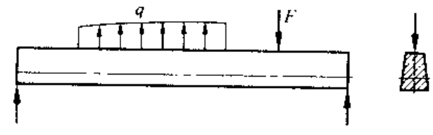

### 对称弯曲正应力

#### 基本假设

取一根对称截面梁，在其侧表面画上纵线和横线；在梁两端纵向对称面内，施加一对方向相反，力偶矩均为 M 的力偶，使得梁处于纯弯曲状态。实验中观察到：

- 梁侧表面的横线仍为直线，且与纵线正交，只是横线之间做相对转动
- 纵线变为弧线，并且在靠近梁顶面的纵线缩短时，靠近梁地面的纵线伸长
- 在纵线伸长区，梁的宽度减小；反之亦然

根据上面现象，对梁内受力和变形做下面假设：

- 变形后，横截面仍保持平面，且和纵线正交：**弯曲平面假设**
- 梁内各个纵向“纤维”仅仅承受轴向拉应力或者压应力：**单向受力假设**

根据平面假设，可以发现，在纵向“纤维”伸长和缩短区域存在一个长度不变的过渡层：**中性层**

中性层和截面的交线是中性轴；纯弯曲时梁的所有横截面仍然保持平面，且绕着中性轴做相对转动；所有纵向纤维均处于单向受力状态

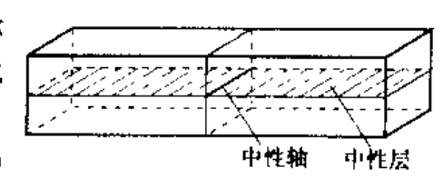

#### 弯曲应力分析

为了建立应力分析方程，从几何、物理、静力学三方面进行分析

##### 几何方面

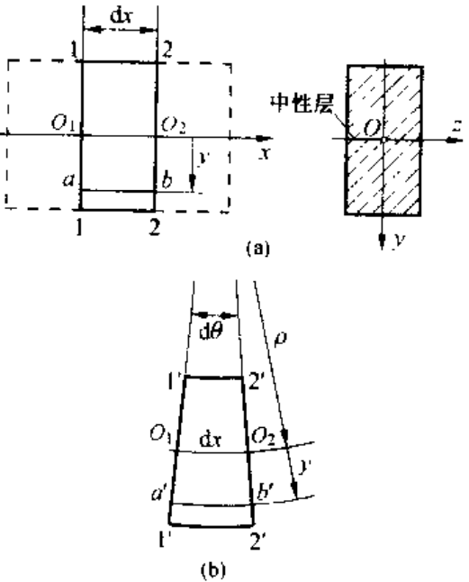

首先分析纵向“纤维”的变形；如上图建立坐标系。

纵线 ab 的正应变为：

$$

\varepsilon =\frac{a'b'-ab}{ab}=\frac{y\mathrm{d}\theta}{\rho \mathrm{d}\theta}=\frac{y}{\rho}

$$

这表明了，距离中心层纵坐标 y 的任一纤维的正应变

##### 物理方面

由于上面假设有单项受力条件，因此，在正应力不超过材料的比例极限时，可以使用胡克定律有：

$$

\sigma =E\varepsilon =E\frac{y}{\rho}

$$

##### 静力学方面

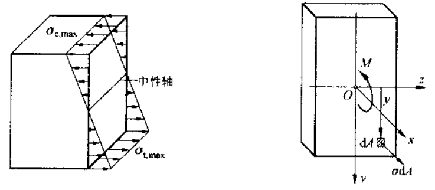

考虑静力学条件，建立静力学方程有：

- 横截面无轴力
- 横截面仅存在 x-y 平面的弯矩

$$

\left\{ \begin{array}{c}
	\int_A{\sigma \mathrm{d}A}=0\\
	\int_A{y\sigma \mathrm{d}A}=M\\
\end{array} \right. \Rightarrow \left\{ \begin{array}{c}
	\int_A{E\frac{y}{\rho}\mathrm{d}A}=0\\
	\int_A{yE\frac{y}{\rho}\mathrm{d}A}=M\\
\end{array} \right.

$$

根据形心的定义，截面形心 C 的纵坐标为：

$$

y_c=\frac{\int_A{y\mathrm{d}A}}{A}=0

$$

因此中性轴通过截面形心。

此外，定义类似极惯性矩有，定义惯性矩 $I_z$ 为截面对 z 轴的惯性矩 (这里 z 轴是中性轴)

$$

I_z=\int_A{y^2\mathrm{d}A}

$$

因此对弯矩方程有：

$$

\frac{E}{\rho}\int_A{y^2\mathrm{d}A}=\frac{E}{\rho}I_z=M
\\
\Rightarrow \frac{1}{\rho}=\frac{M}{EI_z}

$$

注意到，中性层的曲率 $1/\rho$ 和弯矩 M 成正比，与 $EI_z$ 成反比；其中 $EI_z$ 被称为 **弯曲刚度**。进一步可以得到，截面 y 上的正应力为：

$$

\sigma =E\varepsilon =E\frac{y}{\rho}=\frac{My}{I_z}

$$

使用上面正应力公式，可知在横截面上距离中心轴最远的点有最大的弯曲正应力，定义：

$$

W_z=\frac{I_z}{y_{\max}}

$$

为 **抗弯截面系数**。

### 惯性矩和平行轴定理

#### 基本截面惯性矩

| 截面类型   | 截面形状                                                     | 惯性矩                                                       |
| ---------- | ------------------------------------------------------------ | ------------------------------------------------------------ |
| 矩形截面   | 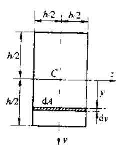 | $I_z=\frac{bh^3}{12}, W_z=\frac{bh^2}{6}$                    |
| 圆形截面   | 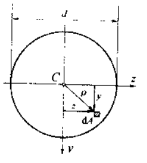 | $I_z=\frac{\pi d^4}{64}, W_z=\frac{\pi d^3}{32}$             |
| 空心圆截面 | NA                                                           | $I_z=\frac{\pi D^4}{64}\left( 1-\alpha ^4 \right) , W_z=\frac{\pi D^3}{32}\left( 1-\alpha ^4 \right)$ |

#### 平行轴定理

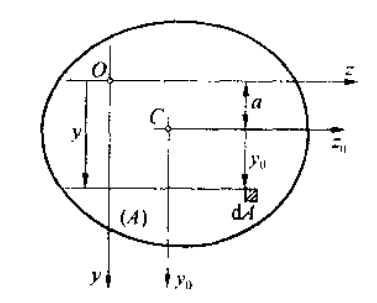

z0 轴是形心轴，z 和 z0 轴平行，相距为 a，截面对 z 轴的惯性矩为：

$$

I_z=\int_A{{y_0}^2\mathrm{d}A}+2a\int_A{y_0\mathrm{d}A}+Aa^2=I_{z_{0}}+Aa^2

$$

其中 z0 是形心轴保证第二项为 0.

### 对称弯曲切应力

当梁非纯弯曲时，横截面上除了正应力，还存在切应力，也就是 **弯曲切应力**。

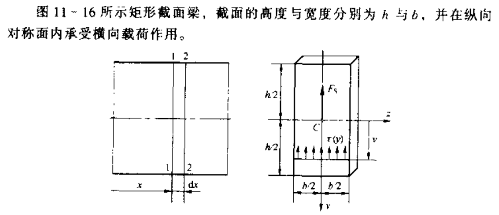

- 考虑到切应力互等定理，在梁表面没有轴向切应力 (y 轴方向)，那么横截面边缘不存在垂直于截面边缘的切应力 (z 轴方向)，因此截面切应力应该平行于截面周边。

- 如果界面是窄高的，可以认为在截面的宽度方向，切应力的大小和方向不显著变化

因此可以得到下面假设：

横截面上个点的切应力，均平行于剪力或者截面侧边，且沿着截面宽度均匀分布

使用微元法分析切应力关系：

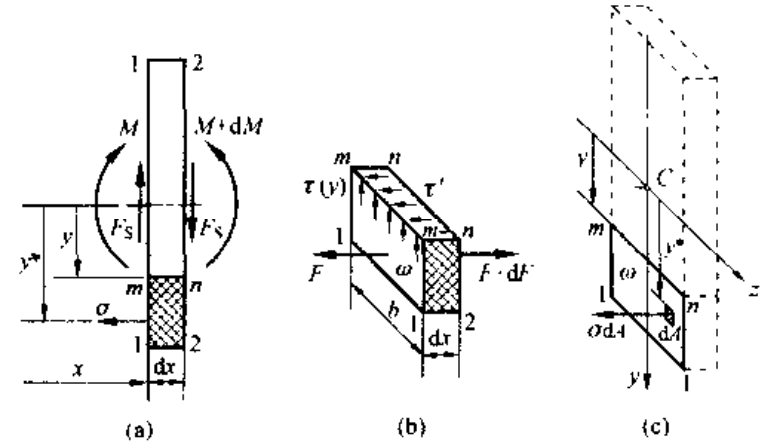

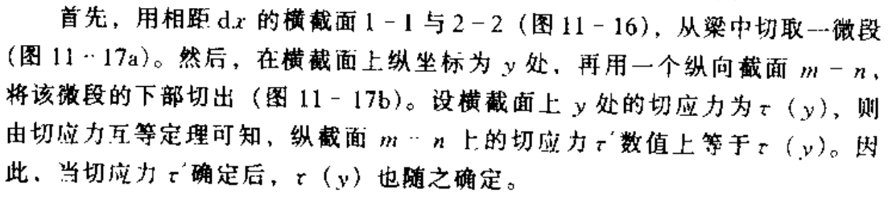

建立力平衡方程：

$$

\tau \left( y \right) b\mathrm{d}x=\mathrm{d}F\Rightarrow \tau \left( y \right) =\frac{1}{b}\frac{\mathrm{d}F}{\mathrm{d}x}

$$

注意到：

$$

F=\int_{\omega}{\sigma \mathrm{d}A}=\int_{\omega}{\frac{My}{I_z}\mathrm{d}A}=\frac{MS_x\left( \omega \right)}{I_z}

$$

其中 $S_x\left( \omega \right) =\int_{\omega}{y\mathrm{d}A}$，代表截面 w 对 z 轴的静矩。带入有：

$$

\tau \left( y \right) =\frac{1}{b}\frac{\mathrm{d}F}{\mathrm{d}x}=\frac{1}{b}\frac{S_x\left( \omega \right)}{I_z}F_S

$$

其中对一个矩形截面，有：

$$

I_z=\frac{bh^3}{12},S_x\left( \omega \right) =\frac{b}{2}\left( \frac{h^2}{4}-y^2 \right)

$$

得到的剪力分布为：

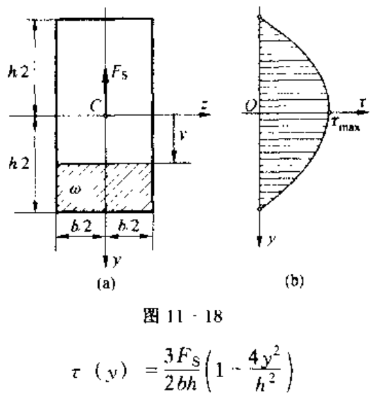

这表明：矩形截面梁的弯曲切应力沿着截面高度的分布是非均匀的，从而切应变沿着截面高度分布也不均匀。

对于工字钢的切应力分布计算，可以参考书 P226

---

注意到，对弯曲正应力和弯曲切应力，一下图为例：

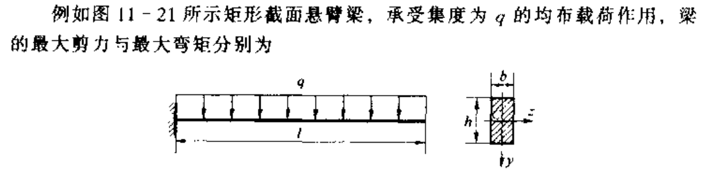

其最大剪力和最大弯矩分比为：

$$

F_{S,\max}=ql,|M|_{\max}=\frac{ql^2}{2}

$$

从而最大弯曲正应力和最大弯曲切应力为：

$$

\sigma _{\max}=\frac{|M|_{\max}}{W_z}=\frac{3ql^2}{bh^2}
\\
\tau _{\max}=\frac{3F_{S,\max}}{2A}=\frac{3ql}{2bh}

$$

因此二者比值为：

$$

\frac{\sigma _{\max}}{\tau _{\max}}=2\frac{l}{h}

$$

当梁的跨度 l 远大于截面高度 h 时，梁的最大弯曲正应力远大于最大弯曲切应力

类似于拉压杆和扭转杆，梁也有定义强度条件：

- 弯曲正应力强度条件：$\sigma _{\max}=\left( \frac{M}{W_z} \right) _{\max}\leqslant \left[ \sigma \right]$
- 弯曲切应力强度条件：$\tau _{\max}=\left( \frac{F_SS_x}{I_z\delta} \right) _{\max}\leqslant \left[ \tau \right]$

### 非对称弯曲

Too complicated...Ref to 《弹性力学》
