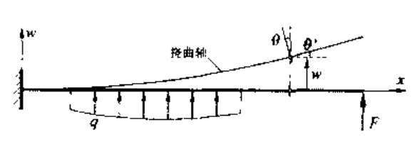
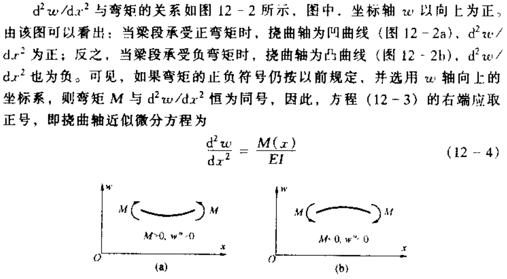

# chap12 弯曲变形

## chap12 弯曲变形

### 基本介绍

在外力作用下，梁的轴线由直线变为曲线。变弯的梁轴称为 **挠曲轴**

对于细长梁，剪力对其变形的影响一般忽略不计，认为变形后各个横截面保持平面。

- 定义横截面的形心在垂直于梁轴方向的位移为 **挠度**，使用 $\omega$ 表示

- 定义横截面的角位移为 **转角**，使用 $\theta$ 表示

  - 由于忽略了剪力，梁弯曲时横截面保持平面并和挠曲轴正交

  - 由于一般转角很小，因此有：

  - 
$$

	\theta \approx \tan \theta =\frac{\mathrm{d}\omega}{\mathrm{d}x}
	
$$

### 挠曲轴近似微分方程

注意到前面纯弯梁正应力公式有：

$$

\frac{1}{\rho}=\frac{M}{EI}

$$

因此忽略剪力情况下，方程在这里也成立：

$$

\pm \frac{\frac{\mathrm{d}^2\omega}{\mathrm{d}x^2}}{\left( 1+\left( \frac{\mathrm{d}\omega}{\mathrm{d}x} \right) ^2 \right) ^{\frac{3}{2}}}=\frac{1}{\rho \left( x \right)}=\frac{M\left( x \right)}{EI}

$$

上面使用了曲率的公式。由于转角一般很小，因此 $\left( \frac{\mathrm{d}\omega}{\mathrm{d}x} \right) ^2$ 可以忽略不计，从而有：

$$

\frac{\mathrm{d}^2\omega}{\mathrm{d}x^2}=\pm \frac{M\left( x \right)}{EI}

$$

定义正负方向有：

需要注意，这里坐标轴 x 的方向不影响弯矩的正负以及曲率的正负，从而式子也适用于左手坐标系 (x 轴向左)

总之可以得到下面的变型方程：

$$

\frac{\mathrm{d}^2\omega}{\mathrm{d}x^2}=\frac{M\left( x \right)}{EI}
\\
\theta =\frac{\mathrm{d}\omega}{\mathrm{d}x}

$$

从而：

$$

\theta =\int{\frac{M}{EI}\mathrm{d}x}+C
\\
\omega =\iint{\frac{M}{EI}\mathrm{d}x\mathrm{d}x}+Cx+D

$$

结合边界条件可以得到变形结果
