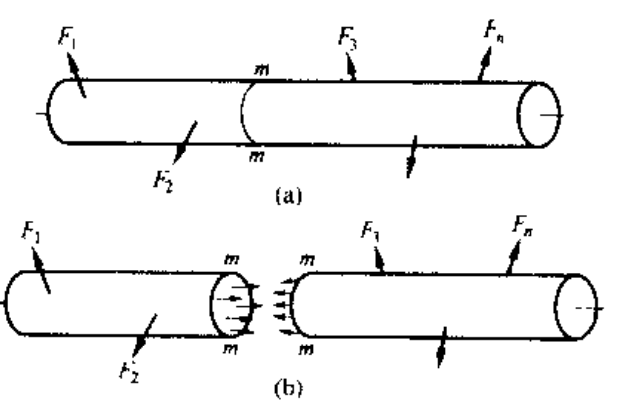
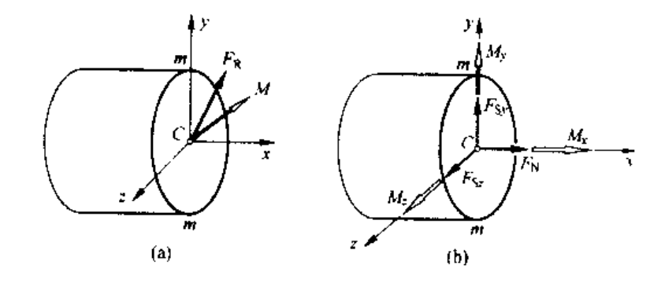
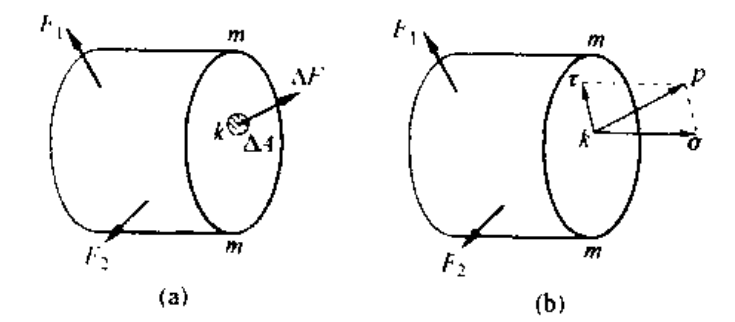
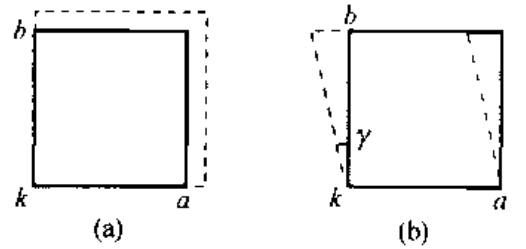

# chap7 材料力学绪论

## chap7 材料力学绪论

材料力学一般研究杆 + 形状受力简单的板与壳，复杂的杆系与板壳问题参考结构力学和弹性力学

### 一些基本假设

1. 连续性假设
   1. 假定构件的空间中毫无空隙的充满了物质，**构件中的一些力学量（例如各点的位移）可以使用坐标的连续函数表示，并可以采用无限小的数学分析方法**
   2. 连续性假设不仅适用于构件变性前，也适用于变形后，因此构件变形前相邻近的点仍保持临近，不产生新的缺陷或空洞，也不出现重叠
2. 均匀性假设
   1. 材料在外力作用下所表现得性能，称为材料的力学性能或机械性能。假设 **材料的力学性能与其在构件中的位置无关，认为其是均匀的**
3. 各向同性假设
   1. 假定 **材料在各个方向具有相同的力学性能**

---

### 内力与截面法

使用连续性假设，内力是作用在切开界面上的连续分布力

应用力系简化理论，分布力向横截面的形心 C 简化，得到主矢和 $F_R$ 主矩 $M$，进一步沿着坐标轴分解：

- 沿轴线内力分量 $F_N$：轴力
- 作用线是横切面的内力分量 $F_{Sy},F_{sx}$：剪力
- 矢量沿轴线的内力偶矩分量 $M_x$：扭矩
- 矢量位于所切横截面的内力偶矩分量 $M_x,M_y$：弯矩

### 正应力与切应力

取：

$$

p=\underset{\varDelta A\rightarrow 0}{\lim}\frac{\varDelta F}{\varDelta A}

$$

- 沿截面法向应力分量：正应力 $\sigma$
- 沿截面切向应力分量：切应力 $\tau$

### 正应变与切应变

在外力作用下，构件发生变形，同时出现应力。为了研究构件的变形以及内部的应力分布，需要了解构件内部各点的变形，假想将构建分割为许多细小的单元体。

- 棱边长度改变量 $\Delta u$，棱边原长 $\Delta s$，正应变：$\varepsilon =\underset{\varDelta s\rightarrow 0}{\lim}\frac{\varDelta u}{\varDelta s}$
- 棱边所夹直角的改变量 $\gamma$：切应变
