# chap8 轴向拉伸与伸缩

## chap8 轴向拉伸与伸缩

### 轴力与轴力图

轴力：拉力为正，压力为负

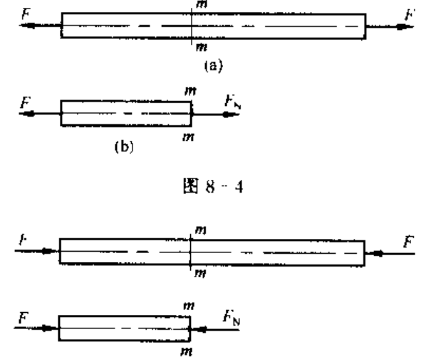

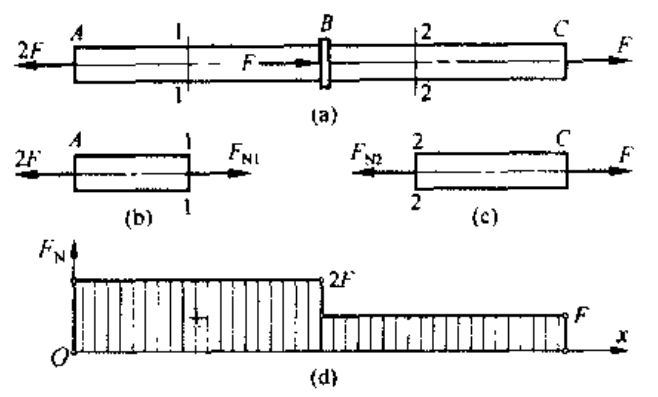

### 拉压杆的应力与圣维南原理

对拉压杆变形做下面假设 (平面假设)：

- 变形后横截面仍保持平面
- 变形后横截面仍杆轴垂直

根据假设有：

$$

\sigma =\frac{F_N}{A}

$$

斜截面情况下：

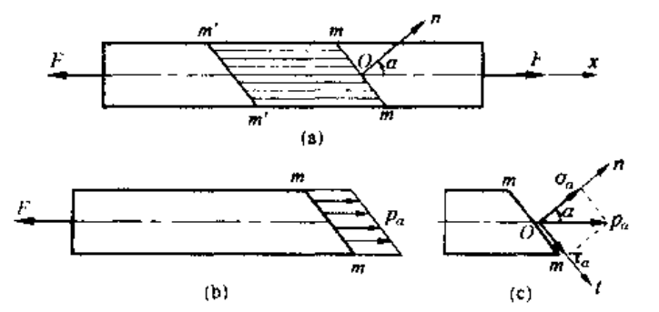

$\alpha$ 截面应力为：

$$

p_{\alpha}\frac{A}{\cos \alpha}=F\Rightarrow p_{\alpha}=\frac{F}{A}\cos \alpha =\sigma _0\cos \alpha

$$

将应力 $p_{\alpha}$ 沿截面法向与切向分解，得到斜截面的正应力和切应力为：

$$

\sigma _{\alpha}=p_{\alpha}\cos \alpha =\sigma _0\cos ^2\alpha
\\
\tau _{\alpha}=p_{\alpha}\sin \alpha =\frac{\sigma _0}{2}\sin 2\alpha

$$

**圣维南定理**

> 力作用于杆端的分布方式 (比如非均匀分布)，只影响杆端局部范围的应力分布，影响区的轴向范围高度约为离杆端 1-2 个杆的横向尺寸

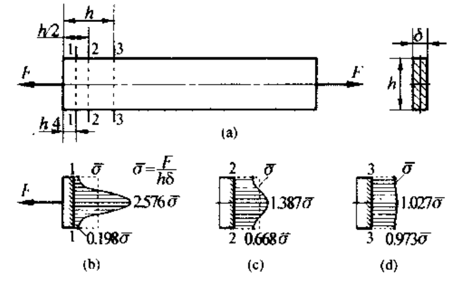

### 材料拉伸与压缩的力学性能

使用材料试验机测量拉伸/压缩的力学性能：

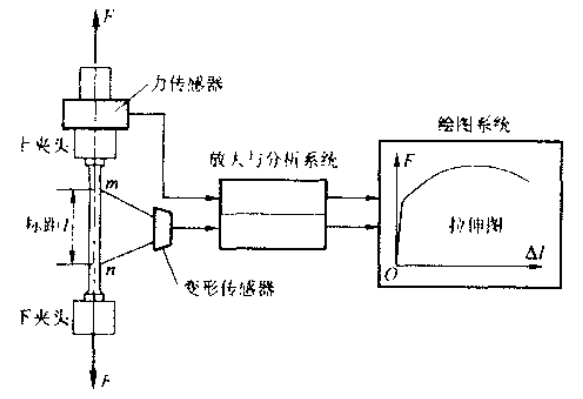

在 m，n 处安装测量轴向变形的仪器，拉力 F 和变形 $\Delta l$ 之间的关系被称作拉伸图，进一步得到 $\frac{F}{A}-\frac{\Delta l}{l}$ 的 **应力应变图**

应力应变图一般分为几个部分，以低碳钢为例：

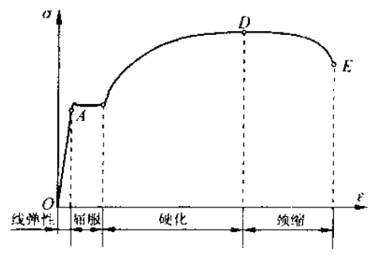

- 线性阶段

  - 应力应变曲线为一直线，$\sigma \propto \varepsilon$，线性阶段最高点 A 对应的正应力：比例极限 $\sigma_p$，低碳钢 Q235 比例极限约为 200MPa

- 屈服阶段

  - 超过比例极限，应力与应变之间不正比，应力增加到一定值后，应力应变曲线出现水平阶段（可能有微小波动）；应力值几乎不变，变形急速增长，被称为屈服。使材料出现屈服的正应力被称为屈服应力/屈服极限 $\sigma_s$。低碳钢为 235MPa。注意，如果试件表面光滑，屈服时表面出现与轴线 45° 的裂纹 (切应力最大)，被称为滑移线
  - 有的材料不存在明显地屈服阶段，工程中以卸载后产生数值为 $0.2\%$ 残余应变的应力作为屈服应力，称为屈服强度/名义屈服极限

- 硬化阶段

  - 经过屈服阶段，材料增强了抵抗变形的能力。此阶段重新呈现抵抗变形的能力，被称为应变硬化。最高点 D 被称为强度极限 $\sigma_b$。低碳钢为 380MPa

- 颈缩阶段

  - 应力达到强度极限 $\sigma_b$ 后，式样的莫以局部显著收缩，出现颈缩线性。使试件继续变形所需要的拉力变小，应力应变曲线下降。

- 卸载与再加载规律

  - 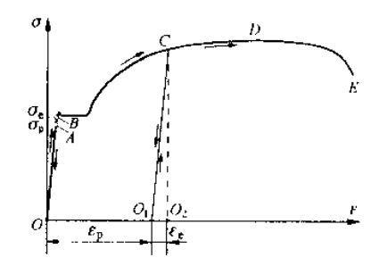
  - 在应力小于比例极限时停止加载并逐渐减小载荷，应力应变沿着直线 AO 回到 O 点，这只产生弹性变形。这种现象一直持续到应力应变曲线的某点 B，与之对应的正应力被称为材料的弹性极限 $\sigma_e$
  - 超过弹性极限后，在硬化阶段一点 C 减小载荷，其沿着一条与 OA 平行的直线回复零点，变形包含弹性和塑性。在 O1 点立即重新加载，其加载关系依然沿着 O1-C 变化，这表明在存在塑性变形的式样上实验，其比例极限/弹性极限将提高，断裂时的残余变形减小；工程上称这种预加载塑性变形使得材料的比例极限提高的现象为冷作硬化，利用这种现象提高某些构件 (钢筋、链条) 在弹性范围内的承载能力

- 材料的塑性

  - 断裂时试验段的残余变形为 $\Delta l_0$，断裂后端口的横截面积为 $A_1$，则材料伸长率 $\delta$ 和断面收缩率 $\psi$ 被定义为：

	- 
$$

	  \delta =\frac{\varDelta l_0}{l}\times 100\%
	  \\
	  \psi =\frac{A-A_1}{A}\times 100\%
	  
$$

  - 工程上称 $\delta \geq 5$ 为塑性/延性材料
	- 结构钢、硬铝塑性
	- 工具钢、灰口铸铁、陶瓷脆性

---

在材料压缩时，一般采用短粗圆柱形式样，已低碳钢为例：

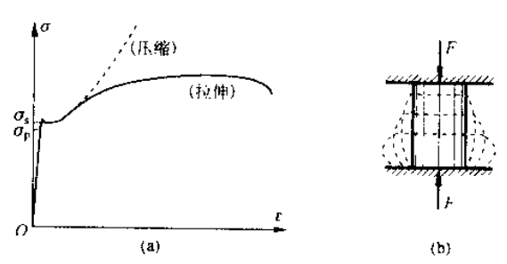

在屈服之前，压缩曲线和拉伸曲线基本重合，**压缩与拉伸时的屈服应力和弹性模量大致相同**。

注意到，灰口铸铁 (脆性材料) 压缩时的强度极限远远高于拉伸强度极限 (3-4 倍)，其他的脆性材料也具有类似特点，因此脆性材料宜作承压构件。

### 应力集中

在外力作用下，构件中邻近沟槽、孔、圆角的局部范围内，应力急剧增大。

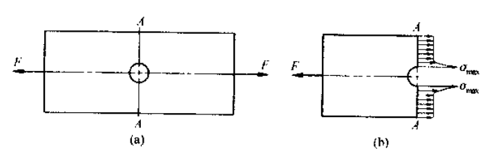

由于截面急剧变化引起的应力局部增大现象被称为应力集中，应力集中因数 K 定义为：

$$

K=\frac{\sigma _{max}}{\sigma _n}

$$

其中 $\sigma _n$ 为名义应力，不考虑应力集中的条件下得到的；$\sigma _{\max}$ 为最大局部应力。

- 对脆性材料，应力集中线性将一直保持到最大局部应力 $\sigma_\max$ 达到强度极限之前，因此需要考虑应力集中影响

- 对塑性材料，应力集中对其在静载荷作用下的强度几乎无影响，最大应力 $\sigma_\max$ 达到强度极限之后，继续增大载荷，同一截面的未屈服部分会承担这部分载荷，因此屈服区域不断增大，从而应力分布均匀化。在研究塑性材料构件的静强度问题，通常可以不考虑应力集中的影响

需要注意，存在循环应力 (交变应力) 情况下，会出现疲劳破坏，这是应力集中会促使疲劳裂纹的出现和扩展，对强度影响很大。

### 失效、许用应力和强度条件

- 失效、许用应力

  - 材料的极限应力被称为 $\sigma_u$
	- 对脆性材料，强度极限是其唯一强度指标
	- 对塑性材料，认为屈服应力为极限应力 $\sigma_u$

  - 为了保证安全，材料许用应力 $[\sigma]$ 定义为 $[\sigma ]=\frac{\sigma _u}{n}$，其中 n>1，被称为安全系数

- 强度条件

  - 保证拉压杆不因强度不够而被破坏，杆内最大工作应力 $\sigma_\max$ 不超过许用应力 $[\sigma]$

### 胡克定律和拉压杆的变形

#### 胡克定律

注意到在线弹性部分，比例极限内，有：

$$

\sigma \propto \varepsilon \Rightarrow \sigma =E\varepsilon

$$

其中 E 定义为弹性模量，其和应力有相同的量纲 Pa。

因此在比例极限内，有胡克定律为：

$$

\sigma =E\varepsilon \Rightarrow \sigma =\frac{F}{A}=E\frac{\varDelta l}{l}
\\
\Rightarrow \varDelta l=\frac{Fl}{EA}

$$

#### 横向变形和泊松比

假定杆件原宽度为 b，在轴向拉力下，杆件宽度变为 $b_1$，此时杆件的横向变形和横向正应变为：

$$

\varDelta b=b_1-b_1
\\
\varepsilon '=\frac{\varDelta b}{b}

$$

定义横向正应变和轴向正应变之比的绝对值为 $\mu$，有：

$$

\mu =\left| \frac{\varepsilon '}{\varepsilon} \right|=-\frac{\varepsilon '}{\varepsilon}

$$

比例系数 $\mu$ 被称为泊松比。在比例极限内，泊松比是一个常数。对大多数各向同性材料，$0<\mu<0.5$

从而对横向应变有：

$$

\varepsilon '=-\frac{\mu \sigma}{E}

$$

#### 叠加原理

多个载荷同时作用产生的效果和各个载荷单独作用产生的效果的综合相同

> Note: 线弹性

### 简单拉压静不定问题

静定问题：静平衡方程可以确定全部未知力 (包括支反力和内力)

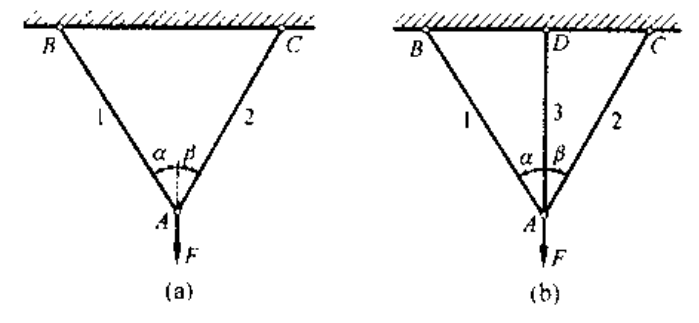

(a) 是静定问题，(b) 是静不定问题/超静定问题

超静定问题

- 变形协调方程：保证结构连续性应满足的变形几何关系
  - eg: for (b): $\Delta l_1=\Delta l_3 \cos(\alpha)$
- 受力平衡方程

### 应变能

构件因为变形而存储能量，被称为应变能 V

根据简单的积分可以发现，杆件的轴向拉压应变能为：

$$

V_{\varepsilon}=\frac{F^2l}{2EA}=\frac{EA\left( \varDelta l \right) ^2}{2l}

$$

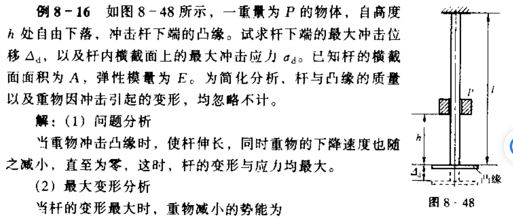

答案：

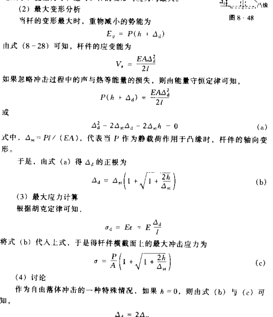

因此可以发现，在重物突然作用于凸缘时，杆件的变形与应力均比同值敬爱和引起的变形和应力增大一倍
