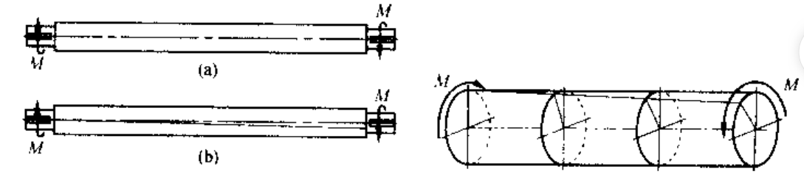
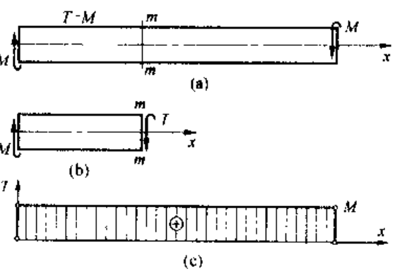
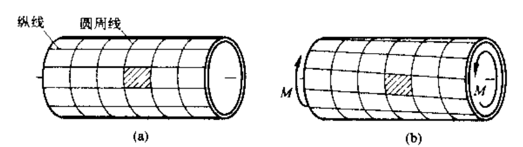
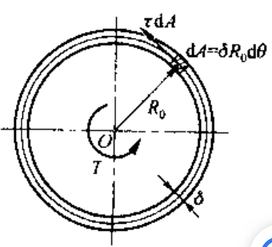
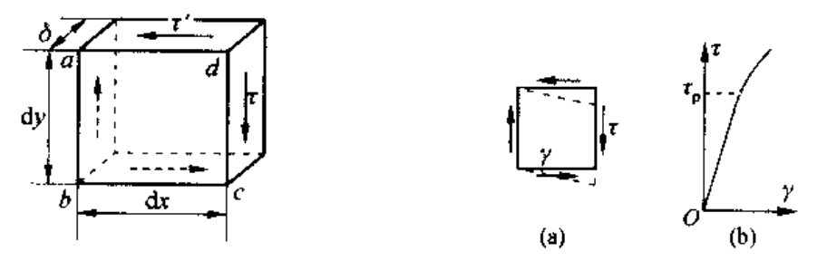
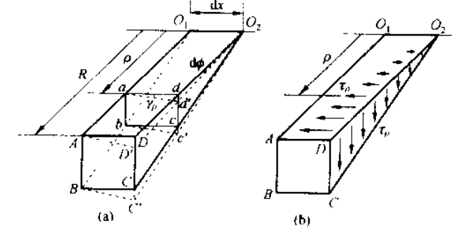
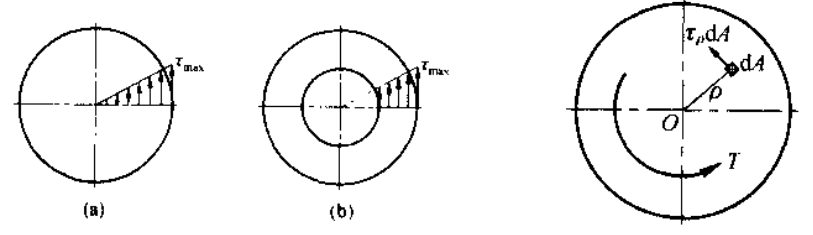
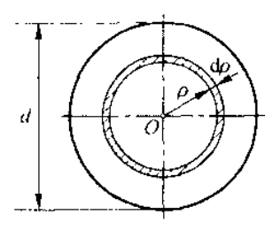
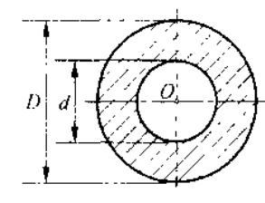
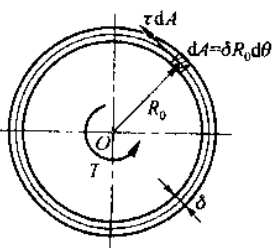

## chap9 扭转

### 基本定义

扭转定义在这些杆件下：

- 构件为直杆
- 垂直于杆件轴线的平面内作用有力偶

在这种情况下，杆件各截面绕轴线做相对旋转，被称为扭转；使之变形的外力偶称为扭力偶，扭矩为扭力偶矩

扭矩和扭矩图可以按照下面展示：

通常规定扭矩图满足下面信息：

- 按右手螺旋法则，将扭矩表示为矢量
- 矢量方向和横截面外法线方向一致，扭矩为正；否则为负

### 切应力互等定理与剪切胡克定律

首先做这样的简单分析：对一个薄壁圆管，在表面等间距地画上纵线与圆周线，然后再圆管两端施加一对大小相等方向相反的扭力偶据 M，可以发现：

- 各圆周线的形状不变，仅绕轴线做相对旋转
- 变形很小时，各圆周线的大小和间距也不变，所有矩形网格变成同样大小的平行四边形

这表明了，在圆管横截面的各点处，仅存在垂直于半径方向的切向应力 $\tau$，其沿圆周大小不变；由于管壁很薄，沿壁厚也可近似认为均匀分布

求解所有微力矩之和有：

$$

T=\int_0^{2\pi}{R_0\tau \delta R_0\mathrm{d}\theta}=2{\pi R_0}^2\tau \delta

$$

考虑更复杂的物体切应力情况：

在这个微元体上，可以发现，在左右侧面上的切应力偶和上下侧面的切应力偶应该平衡，从而：

$$

\tau '\delta \mathrm{d}x\mathrm{d}y=\tau \delta \mathrm{d}x\mathrm{d}y

$$

从而有，在微体的两个互垂截面上，垂直于截面交线的切应力数值相等，而方向则均指向或者离开该交线

根据实验，可以发现，在切应力不超过材料的剪切比例极限 $\tau_p$ 时，切应力和切应变成正比，即：

$$

\tau \propto \gamma \Rightarrow \tau =G\gamma

$$

其中比例系数 G 称为切变模量。此外，理论和研究均表明，对于各向同性材料，弹性模量 E，泊松比 $\mu$ 和切面模量 G 之间存在关系：

$$

G=\frac{E}{2\left( 1+\mu \right)}

$$

### 圆轴扭转横截面上应力

圆轴扭转平面假设：

假定变形后，横截面仍保持平面，其形状、大小与间距均不改变，半径仍为直线【即圆轴扭转时，各横截面如同刚性原片，仅绕着轴线做相对转动】

从微元角度分析，满足圆轴扭转平面假设条件下：

考虑相距 $\mathrm{d}x$ 的两个横截面以及夹角无限小的两个纵向截面：

可以发现，轴表面的矩形 ABCD 转变为平行四边形 ABC'D'，距离轴线 $\rho$ 处的矩形也类似转变。从而注意到两横截面的相对转角均为 $\mathrm{d}\phi$

$$

\gamma _{\rho}\approx \tan \gamma _{\rho}=\frac{\overline{dd'}}{\overline{ad}}=\frac{\rho \mathrm{d}\phi}{\mathrm{d}x}

$$

从而有：

$$

\gamma _{\rho}=\frac{\rho \mathrm{d}\phi}{\mathrm{d}x}\Rightarrow \tau _{\rho}=G\frac{\rho \mathrm{d}\phi}{\mathrm{d}x}

$$

综合截面上的剪力扭矩之和，有：

$$

\begin{array}{c}
	\int_A{\rho \tau _{\rho}\mathrm{d}A}=T\Rightarrow G\frac{\mathrm{d}\phi}{\mathrm{d}x}\int_A{\rho ^2\mathrm{d}A}=T\\
	I_{\rho}=\int_A{\rho ^2\mathrm{d}A}\Rightarrow \frac{\mathrm{d}\phi}{\mathrm{d}x}=\frac{T}{GI_{\rho}}\\
	\Rightarrow {\color[RGB]{240, 0, 0} \gamma _{\rho}=\frac{\rho T}{GI_{\rho}},\,\,\tau _{\rho}=\frac{\rho T}{I_{\rho}}}\\
\end{array}

$$

这就是圆轴扭转变形的基本公式，其中 $I_\rho$ 是 **极惯性矩**，有点类似于转动惯量定义哈

从上面公式可以发现，在圆截面边缘各点，切应力最大，为：

$$

\tau _{\rho}=\frac{T}{I_{\rho}/R}, W_p=\frac{I_{\rho}}{R}

$$

其中 Wp 被定义为抗扭截面系数，仅与截面形状和尺寸有关

#### 极惯性矩和抗扭截面系数例子

根据上面介绍，抗扭截面系数可以计算如下：

| 截面形状   | 示意图                                                       | 抗扭截面系数                                                 |
| --- |
| 实心圆截面 |  | $W_p=\frac{\pi d^3}{16}$                                     |
| 空心圆截面 |  | $W_p=\frac{\pi D^3}{16}\left( 1-\left( \frac{d}{D} \right) ^4 \right)$ |
| 薄壁圆截面 |  | $W_p=2{\pi R_0}^2\delta$                                    |

### 圆轴扭转破坏和强度条件

实验表明

- 塑性材料受扭
  - 首先发生屈服，在式样表面的横向和纵向出现滑移线
  - 式样沿横截面被剪断
- 脆性材料受扭
  - 变形小
  - 最终在轴线 45° 倾角断裂

因此对受扭轴，破坏标志为屈服、断裂；扭转屈服时横截面的最大切应力为 **扭转屈服应力**；式样扭转断裂的最大切应力为 **扭转强度极限**。扭转屈服应力和扭转强度极限统称为 **扭转极限应力**，使用 $\tau_u$ 表示

和拉压杆件类似，扭转轴的强度条件也通过安全因素限制：

$$

\tau _{\max}=\frac{T}{W_p}\le \left[ \tau \right] =\frac{\tau _u}{n}

$$

一般而言，

- 对塑性材料，$\left[ \tau \right] =\left( 0.5\sim 0.6 \right) \tau _u$
- 对脆性材料，$\left[ \tau \right] =\left( 0.8\sim 1.0 \right) \tau _u$

注意到，实心圆截面轴内力分布中心小，外部大，因此对一些大型轴、对减轻重量有要求的轴，一般将周作成空心的。但需要注意，如果过薄 ($\frac{R_0}{\delta}$ 过大)，管在受扭时会出现皱褶现象 (局部失稳)，降低其抗扭能力

### 圆轴扭转变形和刚度条件

注意到：

$$

\mathrm{d}\phi =\frac{T}{GI_{\rho}}\mathrm{d}x\Rightarrow \phi =\int_l{\frac{T}{GI_{\rho}}\mathrm{d}x}

$$

这表明，对于长为 l，扭矩 T 和切变模量 G 均为常数的等截面圆周，两端横截面之间的相对转角/扭转角为：

$$

\phi =\frac{Tl}{GI_{\rho}}

$$

在工程设计中，通常限制扭转角沿着轴线的变化率，这意味着限制了周扭转刚度：

$$

\phi =\frac{T}{GI_{\rho}}\leqslant \left[ \theta \right]

$$

### 非圆截面轴扭转简介

非圆截面轴不满足前面介绍的扭转平面假设，会出现翘曲；可以参考《工程力学》书 P187
