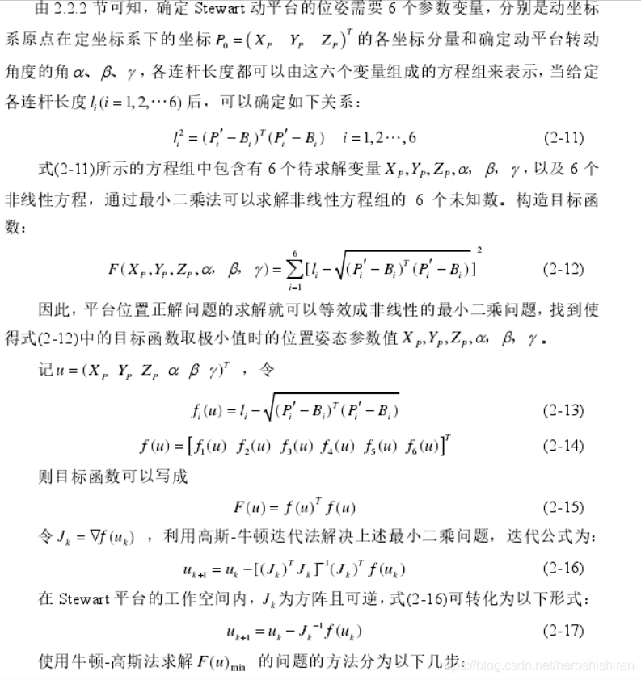

# Stewart 运动学正解

# Stewart 运动学正解

## 定义

使用 Matlab 对 Stewart 机器人进行运动学正解求解。

注意到，一般的给定构型下不存在解析解，因此一般使用数值解进行求解。比较常用的工具是牛顿迭代法，基本思路如下：

**理论分析**

对单根轴进行分析，即计算 $\frac{\partial f_i(u)}{\partial u}$，其中 $f_i(u)=||l_i||-||l_i(u)||$。

注意到，对一个矢量 $s$，有微分关系：

$$

\frac{\partial s^Ts}{\partial x} = \frac{\sum s_i^2}{\partial x} =2s^T\frac{\partial s}{\partial x}

$$

因此对 $f_i(u)$ 有：

$$

\frac{\partial f_i(u)}{\partial u}=-\frac{\sqrt{\partial l_i(u)^T l_i(u)}}{\partial u}

$$

其中，$l_i(u)$ 代表估计参数 $u$ 对应的之链长度。

结合 [stewart 并联机构 Jacobi 矩阵推导](./stewart-并联机构-Jacobi-矩阵推导.md)，有：

$$

\dot{\vec{l}}=-R p \times \omega+\dot{u_m}=[I_{3\times 3} -S(Rp)E]\dot{u}

$$

当描述方式为==RPY 时 $E=I$==，有：

::: note note
collapse: open
title: Note
注意这里只是一般形式下满足$E=I$的结果，在Euler角下也可以实现$E=I$，比如ZYX情况下后面两个轴转动角度为0情况。
:::

$$

J=[I_{3\times 3} -S(Rp)I] = [I_{3\times 3} -S(Rp)]

$$

因此有：

$$

\frac{\partial f_i(u)}{\partial u}=\frac{1}{2||l_i(u)||}\frac{\partial l_i(u)^T l_i(u)}{\partial u} =\frac{l_i(u)^T}{||l_i(u)||}\frac{\partial l_i(u)}{\partial u} =\frac{l_i(u)^T}{||l_i(u)||} J

$$

因此带入有：

$$

\frac{\partial f_i(u)}{\partial u}= \frac{l_i(u)^T}{||l_i(u)||}[I_{3\times 3} -S(Rp)]=\frac{[l_i(u)^T , -l_i(u)^T S(Rp)]}{||l_i(u)||}

$$

记 $r=Rp$，因此有：

$$

-l_i(u)^T S(r) = -(S(r)^T l_i(u))^T = -(-S(r) l_i(u))^T = (r \times l_i(u))^T

$$

带入得到：

$$

\frac{\partial f_i(u)}{\partial u}=\frac{[l_i(u)^T , -l_i(u)^T S(Rp)]}{||l_i(u)||}=\frac{[l_i(u)^T , (r \times l_i(u))^T]}{||l_i(u)||}

$$

其中位姿变换描述在 RPY 下。

::: note note
collapse: open
title: Note
需要注意，这里计算的存在一个负号，因为之前定义$f(u)=l_i-l(u)$，因此前面带负号，上面计算没写
:::

**Functions**

参考我自己完成的正解:

[calForwardKinematicsNewton](./assets/calForwardKinematicsNewton.m)

## 参考

- Matlab 官方手册
- [Stewart平台运动学_heroshishiran的博客-CSDN博客](https://blog.csdn.net/heroshishiran/article/details/114417461)
- [vinaym815/Stewart-Platform-Kinematics: This code computes the forward kinematics of stewart platform and is written in matlab (github.com)](https://github.com/vinaym815/Stewart-Platform-Kinematics)
- [@nguyenEfficientComputationForward1991](.//)
