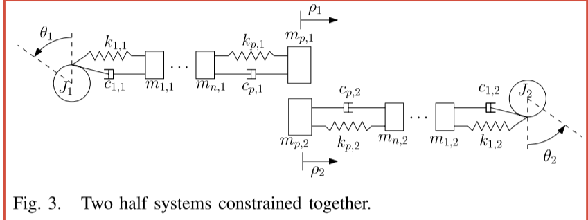
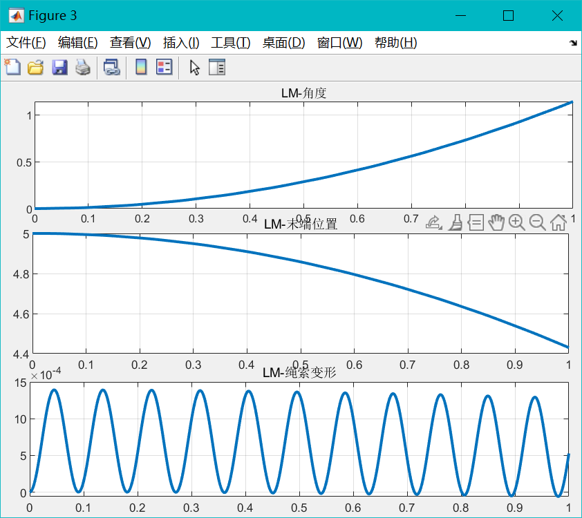
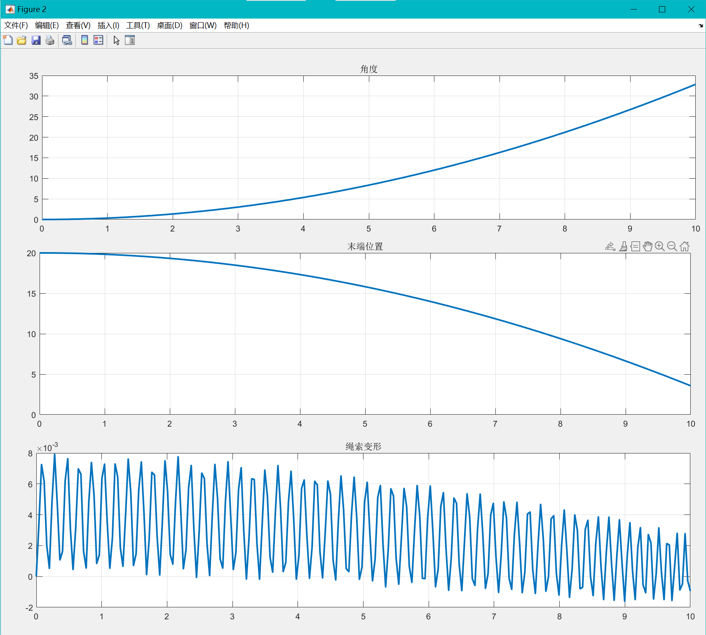
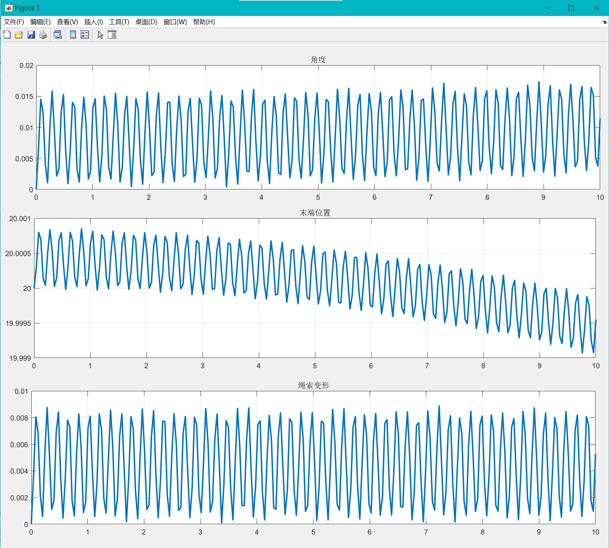
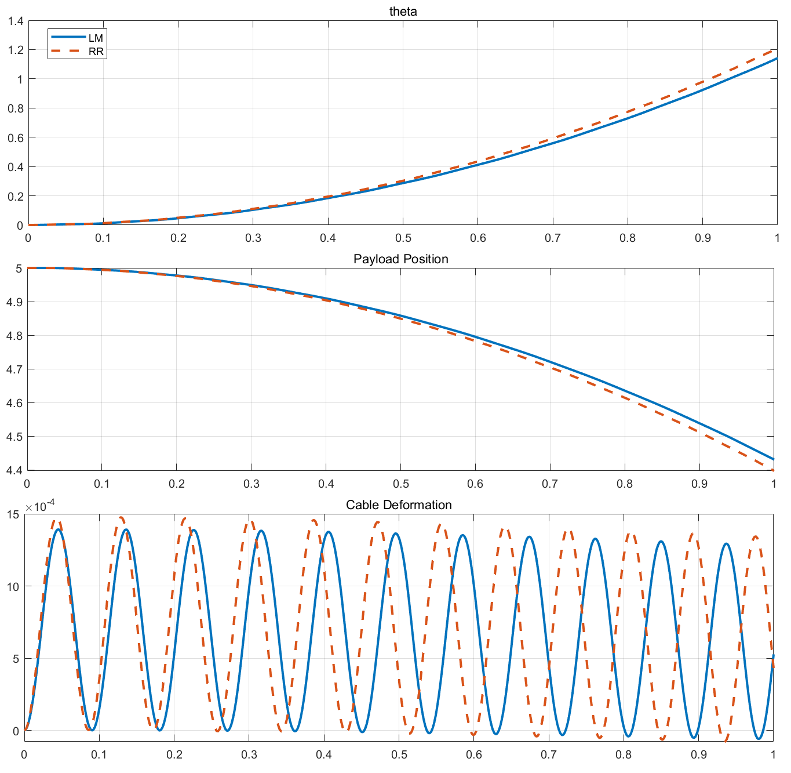
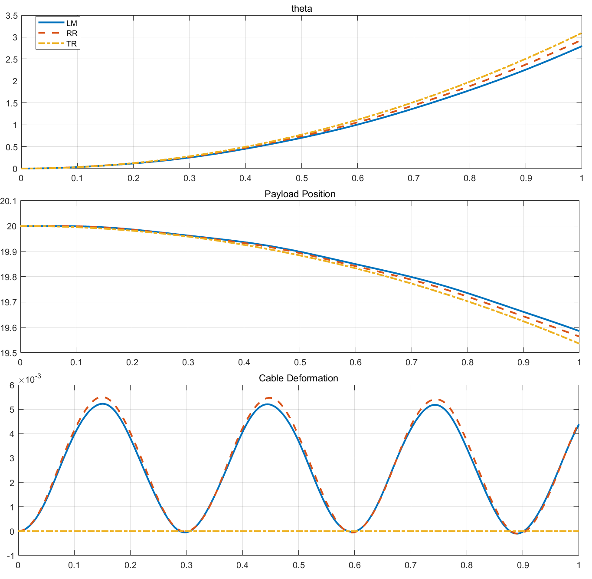
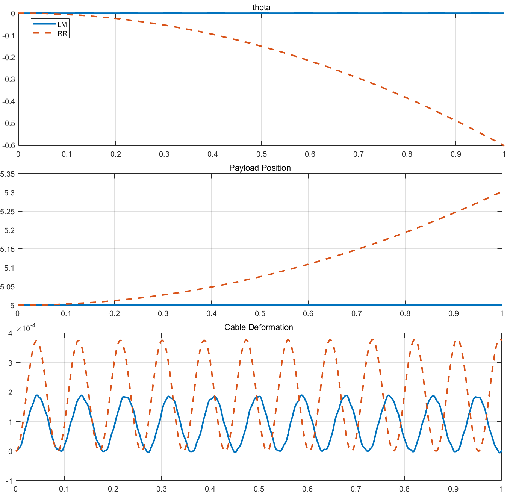
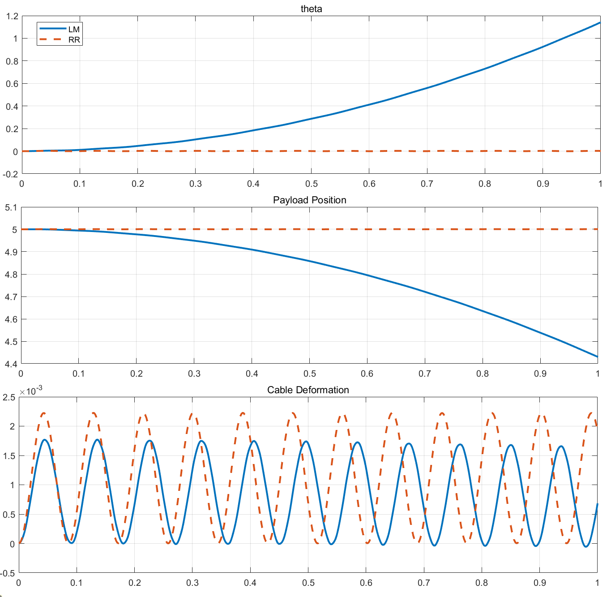
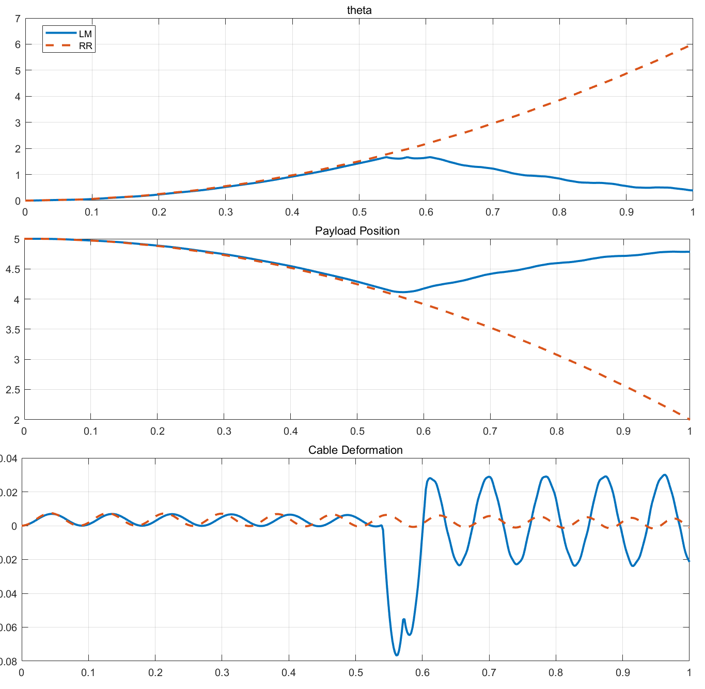
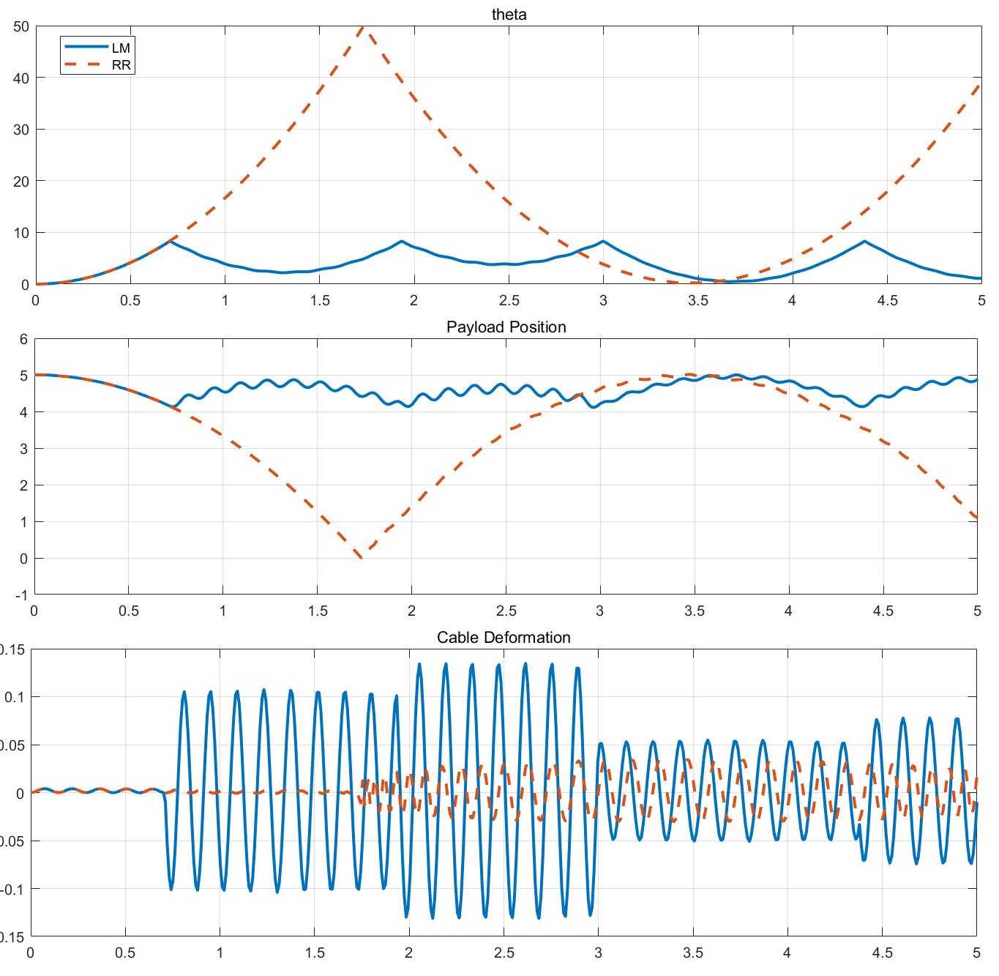

# 单索并联机构动力学模型


## 定义

介绍 **单索并联机构** 的动力学模型构建，给出其基本的动力学建模技巧

## 方案

索机构动力学模型是进行索机构原型测试的必要条件，之前研究的运动学模型是动力学模型上的自然延伸，在研究过程中涉及到的主要映射如下：

[p246r54](.//)


正逆动力学的基本框架如下图：

[p250r54](.//)


### 动力学模型介绍

绳索的动力学特性与其长度、材料乃至预紧力都有关系，下面总结了可能影响绳索动力学特性的原因：
- 弹性变形：对长距离绳索以及大负载绳索影响大
- 热变形
- 蠕变 (Creeping？)：是绳索材料中变形的一种特殊形式，比如高分子材料。Creeping 是一种 hysteresis(迟滞) 效应，可以引起绳索一定时间的可恢复拉伸变形
- 下垂 (Saggingg)：由于绳索重力导致的静态变形
- 横向振动 (Transversal vibration)：绳索像琴弦一样的横向振动，会导致 effective length $l_{\mathrm{eff},i}$ 和 tension $f_{i}$ 出现高频的震动。这一现象在以高加速度运动、绳索质量相对运动平台的质量不可忽略的时候容易出现
- 纵向振动 (Longitudinal vibration)：对大尺度的绳索机器人，绳索材料中的音速导致不可忽略的延迟，从而减小了机器人的动力学带宽 (dynamic bandwidth)；这也出现在超级高加速度运行的机构中
- 并不是完全的可变形的 (Imperfect flexiblity)：绳索通常来说是忽略了其 bending 和 torsional 的刚度的，但在有些情况下，比如金属制造的绳索在小滑轮上会体现出一定的弯曲刚度

### 动力学模型分析

#### 理想模型

[Pott_2018_Cable-Driven Parallel Robots](.//)

理想模型中，绳索的传递函数就是一个符号函数，使得拉力为正时传递力，为负时不传递力

这一方法虽然之间实现简单，但是其使得仿真分析变得比较困难，因为这一模型是一个不连续的模型，而且具有强烈的非线性性

#### 弹簧 - 阻尼模型


绳索也被建模为一个并联的弹簧 - 阻尼模型，其中弹簧弹性系数和阻尼比都是可变的，取决于绳索的有效变形长度 $l_{\mathrm{eff},i}$

这一模型忽略了绳索自身的质量，认为绳索的张力只取决于其弹性变形，这表示纵向和横向的振动都被忽略

在此基础上建立绳索的模型为：

[p257r57](.//)


其中有效绳长的初始条件 $l_{\mathrm{eff},0,i}=l_{N,i}(\mathbf{y}_{0})$ 可以通过绳索原长计算：


$$

l_{N,i}(\mathbf{y})=\|\mathbf{l_{i}(y)}\|_{2} + l_{R,i}(\mathbf{y})+l_{G,i}

$$


其中 $l_{R,i}$ 是绳索在滑轮上的长度，$l_{G,i}$ 是绳索在 winch 上的长度。注意到缠绕的绳索长度为 $l_{D,i}=r_{i}\theta_{i}$，从而可以将有效长度表示为：$l_{\mathrm{eff},i}=l_{\mathrm{eff},0,i}+l_{D,i}$，从而可以计算出变形量为：


[p257r48](.//)


$$

\Delta l_i\left(\mathbf{y}, \theta_i\right)=l_{\mathrm{N}, i}(\mathbf{y})-l_{\mathrm{N}, i}\left(\mathbf{y}_0\right)-l_{\mathrm{D}, i}

$$


估计模型中弹簧的刚度还是一个未定的问题，目前一般使用弹性模量进行估算：


$$

c_{i}=\frac{E_{c}A_{c}}{l_{i,0}}

$$


其中 $l_{i,0}$ 是绳索的原始的长度


#### 弹性绳索建模——集中质量法

^7bd30c

这是很经典的一种方法，通过将绳索离散为多段单元，并将质量集中到每段的端点上，利用线性变形的假设将端点之间通过弹簧连接，最终通过拉格朗日方法建立动力学模型

> [@caverlyDynamicModelingPassivityBased2015](./../../../paper/@caverlyDynamicModelingPassivityBased2015.md)

##### 动力学模型



::: note note
我们只看其中一半模型
:::


将 winch 外的绳索划分为 n 段，取系统坐标为：


$$

q^T=\left[ \begin{matrix}
	\theta&		{q_e}^T\\
\end{matrix} \right]

$$


其中


$$

q_e=\left[ \begin{matrix}
	x_1&		x_2&		\cdots&		x_n&		x_p\\
\end{matrix} \right] ^T

$$


是划分段数的 **相对坐标**，$x_{p}$ 代表末端坐标的相对坐标

::: note note
事实上如果你愿意，将末端那一节勉强也能看成是第n+1段，只不过质量有所变化
:::


可以将系统的动能和使能以及 Rayleigh dissipation 表示为：


$$

T=\frac{1}{2}\dot{q}^TM\dot{q}, V=\frac{1}{2}q^TKq, R=\frac{1}{2}\dot{q}^TD\dot{q}

$$


其中 $M=M^T=M_p+M_w+\sum_{i=1}^n{M_i}$，$K^T=\mathrm{diag}\left\{ 0,k_1,k_2,\cdots ,k_n,k_p \right\}$，$D^T=\mathrm{diag}\left\{ 0,c_1,c_2,\cdots ,c_n,c_p \right\}$，且：


$$

M_p=m_p\left[ \begin{matrix}
	r^2&		-r{1_{1:n+1}}^T\\
	-r1_{1:n+1}&		1_{1:n+1}{1_{1:n+1}}^T\\
\end{matrix} \right]

$$


$$

M_w=\left[ \begin{matrix}
	J_1&		\\
	&		\\
\end{matrix} \right]

$$


$$

M_i=m_i\left[ \begin{matrix}
	r^2&		-r{1_{1:i}}^T\\
	-r1_{1:i}&		1_{1:i}{1_{1:i}}^T\\
\end{matrix} \right]

$$


其中


$$

1_{i:j}=\left[ \begin{matrix}
	0&		\cdots&		0&		\underset{i}{\underbrace{1}}&		\cdots&		\underset{j}{\underbrace{1}}&		0&		\cdots&		0\\
\end{matrix} \right] ^T
$$


对离散的绳索有：


$$

m_1=\sigma A\left( \frac{L}{n}-r\theta \right)

$$


$$

m_i=\sigma A\frac{L}{n}, i=2,3,\cdots ,n

$$


$$

k_1=\frac{EA}{\frac{L}{n+1}-r\theta}

$$


$$

k_i=\frac{EA}{\frac{L}{n+1}}, i=2,3,\cdots ,n,p

$$


$$

J_1=J_w+\sigma Ar^3\theta

$$


其中 $J_{w}$ 是 winch 转动惯量

::: note note
这里其实是有点暗示角度不能太大，否则 $m_{1}<0$？

那么为什么不定义成：


$$

m_1=\sigma A\left( \frac{L-r\theta}{n} \right)

$$

:::


进一步建立拉格朗日方程可以得到：


$$

M\ddot{q}+D\dot{q}+Kq=\hat{b}\tau +f_{non}

$$


其中


$$

\hat{b}=\left[ \begin{matrix}
	1&		0\\
\end{matrix} \right] ^T

$$


代表了施加在 winch 上的转矩系数


$$

f_{non}=-\dot{M}\dot{q}+\left( \frac{\tilde{\partial}}{\tilde{\partial}q}\left( \frac{1}{2}\dot{q}^TM\dot{q} \right) \right) ^T-\left( \frac{\tilde{\partial}}{\tilde{\partial}q}\left( \frac{1}{2}q^TKq \right) \right) ^T

$$


这一些项是在考虑了 winch 之后，由于第一段绳子的质量和刚度改变带来的非线性项：


$$

\dot{M}=\left[ \begin{matrix}
	0&		-\dot{m}_1r&		0\\
	-\dot{m}_1r&		\dot{m}_1&		0\\
	0&		0&		0\\
\end{matrix} \right]

$$


$$

\dot{m}_{1}=-r\sigma A\dot{\theta}

$$


$$

\left( \frac{\tilde{\partial}}{\tilde{\partial}q}\left( \frac{1}{2}\dot{q}^TM\dot{q} \right) \right) ^T=-\frac{1}{2}\sigma Ar\left[ \begin{array}{c}
	-2r\dot{\theta}\dot{x}_1+{\dot{x}_1}^2\\
	0\\
\end{array} \right]

$$


$$

\left( \frac{\tilde{\partial}}{\tilde{\partial}q}\left( \frac{1}{2}q^TKq \right) \right) ^T=\left[ \begin{array}{c}
	\frac{1}{2}\frac{EAr}{\left( \frac{L}{n+1}-r\theta \right) ^2}{x_1}^2\\
	0\\
\end{array} \right]

$$


::: note note
注意如果将位移分散到每一段中，即


$$

m_i=\sigma A\left( \frac{L}{n}-r\theta \right)

$$


那么计算$F_{non}$的时候会复杂很多...全部质量非线性
:::


##### 数值仿真

仿真参数：

```matlab
%% INIT PARAMS

mp = 1; % 负载质量
r = 0.5; % 滑轮半径
Jw = 1.39e-1; % winch 转动惯量
L = 5; % 绳索原长
A = 17.95e-6; % 绳索截面面积
rho = 2200; % 绳索密度
E = 500e6; % 弹性模量
tau = @(t) 1; % 转矩
f = @(t) 0; % 外力

n = 5; % 瑞利基数

% damper coefficients
D = zeros(n+2);

% params
P.r = r;
P.rho = rho;
P.A = A;
P.Jw = Jw;
P.mp = mp;
P.D = D;
P.tau = tau;
P.f = f;
P.L = L;
P.E = E;
P.n = n;

t_end = 1;
tspan = [0 t_end];
simu_num = 500;
```

仿真代码：

```matlab
q0 = zeros(n+2,1);
dq0 = zeros(n+2,1);
y0 = [q0;dq0];
sol = ode45(@(t,y) CableLMModel(t, y, P),tspan,y0)
x = linspace(0,t_end,simu_num);
y = deval(sol,x);
LM_theta = y(1, :);
LM_dx = sum(y(2:(n+2), :), 1);
LM_xp = L - r.*LM_theta + LM_dx;
LM_figPlot(x, LM_theta, LM_xp, LM_dx)
```

- [CableLMModel](./assets/LMModel/CableLMModel.m)
- [SingleCableSim](./assets/SingleCableSim.m)





#### 弹性绳索建模——Rayleigh-Ritz 方法

> 参考 [@gosselinCableDrivenParallelRobots2018](./../../../paper/@gosselinCableDrivenParallelRobots2018.md) 的 P14：Modelling of Flexible Cable-Driven Parallel Robots Using a Rayleigh-Ritz Approach

> 关于 Rayleigh-Ritz 方法可以参考： [Chap3 弹性体振动](.//)，[Chap3 弹性体振动](.//)


##### 模型基础

[p16r57](.//)


其中 $i,w,c$ 分别是世界坐标系，winch 坐标系和绳索坐标系

Payload 到 winch 切点距离为 $l_{i}$，winch 转角为 $\theta$，绳子名义的初始长度 (总长) 为 $L$，那么有：$l_{i}=L-r\theta$。定义 **时不变的坐标 x** 为绳子上一点相对 C 点的长度，$\beta$ 为 winch 上绳子相对竖直位置的角度， $x_{p}$ 是 payload 中心相对 winch 中心在 $i_{1}$ 方向的位置

::: note note
注意这里的$l_{i}$是不考虑变形时候的payload到切点的距离，而$x_{p}$是考虑变形后实际的payload到切点的距离
:::


选取 Ritz 基为：


$$

\varPsi _{oe}\left( x,l_i \right) =\left[ \begin{matrix}
	\sin \left( \frac{\pi \left( x-L+l_i \right)}{2l_{\mathrm{i}}} \right)&		\sin \left( \frac{2\pi \left( x-L+l_i \right)}{2l_{\mathrm{i}}} \right)&		\cdots\\
\end{matrix} \right]

$$

^eqn-ritz-basis

其中 $x-L+l_{i}=x-r\theta$

我们根据 Ritz 基给出绳子在任一点上的变形量为：


$$

w\left( x,t \right) =\varPsi _{oe}\left( x,l_i\left( t \right) \right) q_e\left( t \right)

$$


这里的 $q_{e}$ 就是弹性变形相对 Ritz 基的时变的坐标，有 n 个自由度

从而根据上面的分析将整个系统的广义坐标表示为：


$$

q^T=\left[ \begin{matrix}
	\theta&		{q_e}^T&		x_p\\
\end{matrix} \right]

$$

^eqn-generalized-coordinates

::: note note
我知道这么选取广义坐标是不独立的，但这么建立动力学模型，在后面如果涉及到多索机构的时候可以方便的添加约束上去，从而保证独立性
:::


##### 动力学模型

使用拉格朗日方程可以建立起动力学模型：

::: note Assumption
在 inertial fram(i) 下进行分析

:::


首先对 winch 上的绳子进行分析：

一个单位质量元 $dm$ 对应的坐标可以表示为：


$$

\begin{array}{l}
	r_{i}^{dm\,\,i}=\left[ \begin{matrix}
	-r\sin \beta&		r\cos \beta&		0\\
\end{matrix} \right] ^T\\
	v_{i}^{dm\,\,i}=\left[ \begin{matrix}
	-r\dot{\beta}\cos \beta&		-r\dot{\beta}\sin \beta&		0\\
\end{matrix} \right] ^T\\
\end{array}

$$


从而动能可以表示为：


$$

\frac{1}{2}\int_{C_w}{v_{i}^{dm\,\,i}\cdot v_{i}^{dm\,\,i}\mathrm{d}m}=\frac{1}{2}\int_0^{r\theta}{v_{i}^{dm\,\,i}\cdot v_{i}^{dm\,\,i}\rho A\mathrm{d}x}=\frac{1}{2}\dot{q}^TM_{cw}\dot{q}

$$


其中 $M_{cw}=\mathrm{diag}\left\{ r^3\rho A\theta ,0 \right\} \in \mathbb{R} ^{\left( n+2 \right) \times \left( n+2 \right)}$

类似的可以得到 winch 和 payload 的动能：


$$

\begin{array}{c}
	T_w=\frac{1}{2}\dot{q}^TM_w\dot{q}\\
	T_p=\frac{1}{2}\dot{q}^TM_p\dot{q}\\
\end{array}

$$


其中 $M_w=\mathrm{diag}\left\{ J_w,0 \right\}$，$M_p=\mathrm{diag}\left\{ 0,m_p \right\}$

对 winch 外的绳子进行分析：


$$

\begin{array}{l}
	r_{i}^{dm\,\,i}=\left[ \begin{matrix}
	x-r\theta +\varPsi q_e&		r&		0\\
\end{matrix} \right] ^T\\
	v_{i}^{dm\,\,i}=\left[ \begin{matrix}
	-r\dot{\theta}+\dot{\varPsi}q_e+\varPsi \dot{q}_e&		0&		0\\
\end{matrix} \right] ^T\\
\end{array}

$$


其中


$$

\begin{array}{c}
	\dot{\varPsi}=\left( -r\dot{\theta} \right) \frac{\partial \varPsi}{\partial l_i}\\
	\frac{\partial \varPsi}{\partial l_i}=\left[ \begin{matrix}
	-\frac{\pi x}{2{l_i}^2}\cos \left( \frac{\pi x}{2l_i} \right)&		-\frac{2\pi x}{2{l_i}^2}\cos \left( \frac{2\pi x}{2l_i} \right)&		\cdots\\
\end{matrix} \right]\\
\end{array}

$$


从而可以得到 unwarpped cable 的动能为：


$$

\frac{1}{2}\int_{C_{l_i}}{v_{i}^{dm\,\,i}\cdot v_{i}^{dm\,\,i}\mathrm{d}m}=\frac{1}{2}\int_{C_{l_i}}{\left( -r\dot{\theta}_1\frac{\partial \varPsi}{\partial l_{\mathrm{i}}}q_e+\varPsi \dot{q}_e-r\dot{\theta}_1 \right) ^2\mathrm{d}m}

$$


从而可以将其写成一个二次型的形式：


$$

\begin{array}{l}
	T_C=\frac{1}{2}\dot{q}^TM_{ce}\dot{q}\\
	M_{ce}=\int_{L-l_i}^L{\rho A\left[ \begin{matrix}
	r^2\left( 1+2\frac{\partial \varPsi}{\partial l_i}q_e+{q_e}^T\left( \frac{\partial \varPsi}{\partial l_i} \right) ^T\frac{\partial \varPsi}{\partial l_i}q_e \right)&		-r\left( 1+{q_e}^T\left( \frac{\partial \varPsi}{\partial l_i} \right) ^T \right) \varPsi&		0\\
	*&		*&		0\\
	*&		*&		0\\
\end{matrix} \right] \mathrm{d}x}\\
\end{array}

$$


通过变换 $z=x-L+l_{i}$，可以得到问题方程被简化为：


$$

\mathbf{M}_{ce}=\rho A\left[ \begin{matrix}
	r^2\left( \ell _i+2\mathbf{\Lambda }_1\mathbf{q}_e+\frac{1}{\ell _i}\mathbf{q}_{e}^{\top}\mathbf{\Lambda }_{11}\mathbf{q}_e \right)&		-r\left( \ell _i\mathbf{\Lambda }_2+\mathbf{q}_{e}^{\top}\mathbf{\Lambda }_{12} \right)&		0\\
	*&		\ell _i\mathbf{\Lambda }_{22}&		0\\
	*&		*&		0\\
\end{matrix} \right]

$$


其中 $\mathbf{\Lambda }_1=\int_0^{l_i}{\frac{\partial \varPsi}{\partial l_i}\mathrm{d}z}$，$\mathbf{\Lambda }_{11}=l_i\int_0^{l_i}{\left( \frac{\partial \varPsi}{\partial l_i} \right) ^T\frac{\partial \varPsi}{\partial l_i}\mathrm{d}z}$，$\mathbf{\Lambda }_{12}=l_i\int_0^{l_i}{\left( \frac{\partial \varPsi}{\partial l_i} \right) ^T\varPsi \mathrm{d}z}$，$\mathbf{\Lambda }_2=\frac{1}{l_i}\int_0^{l_i}{\varPsi \mathrm{d}z}$，$\mathbf{\Lambda }_{22}=\frac{1}{l_i}\int_0^{l_i}{\varPsi ^T\varPsi \mathrm{d}z}$

::: note note
这一质量方程的简化是通过选取合适的这种三角函数基完成的
:::


对绳子的势能可以通过弹性变形得到：


$$

\frac{1}{2}\int_{L-\ell _i}^L{E}A\left( \frac{\partial \left( \mathbf{\Psi q}_e \right)}{\partial x} \right) ^2\mathrm{d}x=\frac{1}{2}\mathbf{q}_{e}^{\top}\int_0^{\ell _i}{E}A\left( \frac{\partial \mathbf{\Psi }}{\partial x} \right) ^{\top}\left( \frac{\partial \mathbf{\Psi }}{\partial x} \right) \mathrm{d}z\mathbf{q}_e=\frac{1}{2}\mathbf{q}^{\top}\mathbf{Kq}

$$


其中 $K=\mathrm{diag}\left\{ 0,EA\varLambda _{33}/l_i,0 \right\} ,\varLambda _{33}=l_i\int_0^{l_i}{\left( \frac{\partial \varPsi}{\partial x} \right) ^T\frac{\partial \varPsi}{\partial x}\mathrm{d}z}$

为了引入绳索自然的阻尼项，加入 Rayleigh dissipation 为：


$$

R=\frac{1}{2}\dot{q}^TD\dot{q},D=\mathrm{diag}\left\{ 0,c_1,c_2,\cdots ,c_n,0 \right\}

$$


从而系统的拉格朗日方程导出的动力学方程为：


$$

M_e\ddot{q}+D\dot{q}+Kq=\hat{b}\tau +f_{non}

$$


其中

[p18r47](.//)
^eqn-dynamic-model


[p19r47](.//)


::: note note
注意，到目前为止，末端的payload还没有被连接到绳索末端，需要后面增加constraints
:::


##### 基于能量的模型简化

1. 注意到仿真中，unwarpped cable 的动能 $T_{ce}=\frac{1}{2}\int_{L-l_i}^L{\left( -r\dot{\theta}_1+\varPsi \dot{q}_e+\dot{\varPsi}q_e \right) ^2\rho A\mathrm{d}x}$，其中的 $\dot{\varPsi}q_e$ 比 $\varPsi \dot{q}_e$ 小了很多 (约 $10^{-2}$ 量级)，从而忽略这一项，进而忽略了 $\Lambda_{1}, \Lambda_{11},\Lambda_{12}$这几项，[方程](./)简化为：


[p19r33](.//)


其中


$$

\varLambda _2\left( k \right) =\frac{4\sin ^2\left( \frac{\pi k}{4} \right)}{\pi k}

$$


$$

\varLambda _{22}=\begin{cases}
	\frac{1}{2}\left( 1-\frac{\sin \left( \pi i \right)}{\pi i} \right) ,\quad i=j\\
	\frac{\frac{\sin \left( \frac{1}{2}\pi (i-j) \right)}{i-j}-\frac{\sin \left( \frac{1}{2}\pi (i+j) \right)}{i+j}}{\pi},\quad i\ne j\\
\end{cases}\quad

$$


$$

\varLambda _{33}=\begin{cases}
	\frac{1}{8}\pi i(\pi i+\sin\mathrm{(}\pi i))=\frac{\left( \pi i \right) ^2}{8},i=j\\
	\frac{1}{4}\pi ij\left( \frac{\sin \left( \frac{1}{2}\pi (i-j) \right)}{i-j}+\frac{\sin \left( \frac{1}{2}\pi (i+j) \right)}{i+j} \right) ,i\ne j\\
\end{cases}

$$


$\Lambda(k)$ 代表第 k 个元素

##### 连接约束

在 [^eqn-dynamic-model](./#^eqn-dynamic-model) 中，选取的广义坐标并不是独立的，因此需要对其施加约束来保证问题的求解：

考虑到初始选取的广义坐标为：

[^eqn-generalized-coordinates](./#^eqn-generalized-coordinates)

从而考虑其缺失的一个约束，即末端位置 $x_{p}$ 和前 2 个坐标存在关系：


$$

x_p=\varPsi \left( L,l_i \right) q_e-r\theta \Rightarrow \dot{x}_p=\varPsi \left( L,l_i \right) \dot{q}_e-r\dot{\theta}

$$


::: note note
这里的约束其实感觉不是对时间的导数，有点像虚位移的感觉=>虚功那一套
:::


从而构造约束 $\Xi$ 为：


$$

\begin{array}{c}
	\Xi \dot{q}=0, \Xi =\left[ \begin{matrix}
	J_{\theta}&		J_e&		-1\\
\end{matrix} \right]\\
	J_{\theta}=-r, J_e=\varPsi \left( L,l_i \right)\\
\end{array}

$$


我们考虑构造带约束的拉格朗日系统为：


$$

M\ddot{q}+D\dot{q}+Kq=\hat{b}\tau +f_{non}+\Xi ^T\lambda

$$


其中 $\lambda$ 为拉格朗日乘子，用于约束系统

我们考虑构造新的广义坐标为：


$$

z^T=\left[ \begin{matrix}
	\theta&		{q_e}^T\\
\end{matrix} \right]

$$


使得其在约束 $\Xi$ 的零空间中，即：


$$

q=Rz, \dot{q}=R\dot{z}, \Xi R=0

$$


通过约束可以直接得到 R 为：


$$

R=\left[ \begin{matrix}
	1&		0\\
	0&		1\\
	J_{\theta}&		J_e\\
\end{matrix} \right]

$$


从而考虑新系统：


$$

\begin{array}{c}
	R^TMR\ddot{z}+R^TDR\dot{z}+R^TKRz=R^T\hat{b}\tau +R^Tf_{non}+R^T\Xi ^T\lambda\\
	\Rightarrow M_{zz}\ddot{z}+D_{zz}\dot{z}+K_{zz}z=\hat{b}_{zz}\tau +f_{non,zz}\\
\end{array}

$$


新系统下就可以直接进行仿真了

::: note remark
这么做的主要优势是将约束放在最后进行考虑，对多索耦合的系统可以按照范式方便的进行拓展
:::


::: note note
对比[弹性绳索建模——集中质量法](./#弹性绳索建模——集中质量法)，集中质量法构造的单索模型就不需要施加约束，但是多索的话还是需要的
:::


##### 仿真结果

仿真条件为：

```matlab
mp = 5;      % 负载质量
r = 0.5;       % 滑轮半径
Jw = 1.39e-1;  % winch 转动惯量
L = 20;        % 绳索原长
A = 17.95e-6;   % 绳索截面面积
rho = 2200;     % 绳索密度
E = 500e6;      % 弹性模量
n = 5;          % 瑞利基数

% damper coefficients
D = zeros(n+2);
% init conditions: (n+2)x2
% q = [\theta, q_e^T]
% y = [q;dq]
q0 = zeros(n+1,1);
dq0 = zeros(n+1,1);
y0 = [q0;dq0];
```

仿真时长 10s，250 步

::: note note
这里的瑞利基选取5个，而不选取更高阶是因为高阶的基计算出的 $\Lambda_{22}$ 会有很大的条件数，测试发现的是:
- 5阶：9.6306e+04
- 10阶：1.4618e+12
- 20阶：9.0865e+16

因此不能算高了，会导致数值计算不稳定
:::


不对拉结果为：

```matlab
tau = @(t) 1;        % 转矩
f = @(t) 0;      % 外力
```



对拉拉力为：

```matlab
tau = @(t) 1;        % 转矩
f = @(t) tau(t)/r;      % 外力
```



至少说明施加的力还是有效果的

仿真代码参考：

- [CableRRModel](./assets/RRModel/CableRRModel.m)
- [SingleCableSim](./assets/SingleCableSim.m)

符号计算参考：

- [SymbolCal](./assets/SymbolCal.nb)

#### 对比：集中质量 Vs 瑞雷 - 李兹

从理论推导上来看，[集中质量法](./) 是 [瑞雷李兹法](./) 的一种特例，无非是选取的基函数变成了分段的单位函数，这一改变的影响体现在推导瑞雷李兹法过程中的 $\Lambda$ 上

注意到建立的模型大概为：

[单索并联机构动力学模型 2022-09-21 14](.//)

因此对集中质量法 (至少我参考的文章)，其要求 **winch 转角 $\theta$ 不能太大**，否则超过了第一段的长度会导致计算错误（比如出现负质量、负刚度），特别地：


$$

\theta _{\max}\leqslant \frac{L}{\left( n+1 \right) r}

$$


::: note note
额外选取一个最简单的模型：绳索认为完全刚性，可以立即传导双向的力和力矩，忽略绳子的质量，那么动力学模型为：


$$

\begin{aligned}
	\tau -rf&=\left( J+Mr^2 \right) \ddot{\theta}\\
	x_p&=L-r\theta\\
\end{aligned}

$$


:::


选取基本的仿真参数为：

```matlab
mp = 1; % 负载质量
r = 0.5; % 滑轮半径
Jw = 1.39e-1; % winch 转动惯量
L = 5; % 绳索原长
A = 17.95e-6; % 绳索截面面积
rho = 2200; % 绳索密度
E = 500e6; % 弹性模量

n = 5; % 瑞利基数

% damper coefficients
D = zeros(n+2);

t_end = 1;
tspan = [0 t_end];
simu_num = 500;
```

带入可以计算得到：


$$

\theta _{\max}\leqslant \frac{L}{\left( n+1 \right) r}=\frac{5}{6\times 0.5}=1.66667

$$


代码可以参考：

- [SingleCableSim](./assets/SingleCableSim.m)

##### 单向转矩

对单向转动的情况，考虑：

```matlab
tau = @(t) 1; % 转矩
f = @(t) 0; % 外力
```

进行仿真有：



基本上比较贴合

附上和完全刚性的结构进行对比的图片：



##### 单向拉力

```matlab
tau = @(t) 0; % 转矩
f = @(t) 1; % 外力
```



可以发现，LM 角度基本不变，这是因为按照设计他就不能按照这个方向被拉；而反过来的 RR 就可以被拉伸，产生反方向的转动

##### 双向对拉

```matlab
tau = @(t) 1; % 转矩
f = @(t) tau(t)/r; % 外力
```



可以发现 RR 基本是满足期望的，但是对 LM 就不太对，这应该是程序 Bug，还没想到为什么

##### 大力矩拉动

```matlab
tau = @(t) 5; % 转矩
f = @(t) 0; % 外力
```



可以发现，LM 模型在角度为 1.6 度左右的时候出现反向振动，这就是前面说的到了最大转动角度，出现了负质量和负刚度

如果更极端一点，取下面这样的条件：

```matlab
mp = 1; % 负载质量
r = 0.1; % 滑轮半径
Jw = 1.39e-1; % winch 转动惯量
L = 5; % 绳索原长
A = 17.95e-6; % 绳索截面面积
rho = 2200; % 绳索密度
E = 500e6; % 弹性模量
tau = @(t) 5; % 转矩
f = @(t) 0; % 外力
```

仿真 5s 的结果：



这里可以发现，RR 方法当其绳子全部缠到了 winch 上后就出问题了，这表明还是存在局限性的

::: note note
不过确实这个情况很极端了
:::


##### 总结

对比 LM 方法和 RR 方法，有下面特点：
- RR 方法仿真的使用情况更广，多种情况下仿真
- RR 方法在低阶的时候稳定，高阶的话会出现高条件数的情况从而出现奇异
- 经过验证，无阻尼情况下，两个方法基本高阶和低阶解的结果基本一样

## 参考

##### 引文

- [@gosselinCableDrivenParallelRobots2018](./../../../paper/@gosselinCableDrivenParallelRobots2018.md)
- [@pottCableDrivenParallelRobots2018](./../../../paper/@pottCableDrivenParallelRobots2018.md)

##### 脚注
