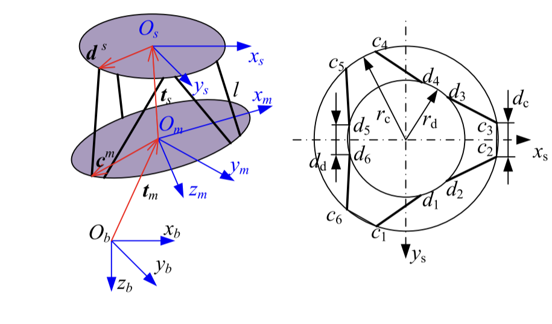

# 旋转矩阵求导

# 旋转矩阵求导

## 定义

我们知道，在机器人建立运动学/动力学模型时，很常见的情况是对旋转矩阵进行求导，因此特地拿出一节用作记录。

旋转矩阵可以有四元数的形式，也可以有欧拉角等形式，这里特指欧拉角形式。

旋转轴已知，假设只发生了旋转变换，上标 e 代表 inertial 坐标系，上表 b 代表随动的机体坐标系。

明确反对称矩阵表示为：

$$

\vec{a} \times \vec{b} = S(a) \vec{b}

$$

其中，

$$

S(a)= \left[\begin{array}{ccc}
0 & -a_{z} & a_{y} \\
a_{z} & 0 & -a_{x} \\
-a_{y} & a_{x} & 0
\end{array}\right]

$$

## 证明

注意到，对仅旋转的向量 $\vec{r_e}$ 有：

$$

\frac{d \vec{r_e}}{dt}=\vec{\omega_e} \times \vec{r_e}

$$

因此对旋转矩阵，将其==看作为三个在地球坐标系下表达的列向量的组合==，有：

$$

\begin{aligned}
\frac{d R_{e}^{b}}{d t}&=\frac{d\left[\vec{b}_{1}^{e} \quad \vec{b}_{2}^{e} \quad \vec{b}_{3}^{e}\right]}{d t}\\
& = \left[\vec{\omega^e}\times \vec{b}_{1}^{e} \quad \vec{\omega^e}\times \vec{b}_{2}^{e} \quad \vec{\omega^e}\times \vec{b}_{3}^{e}\right]\\
&= \left[ S(\vec{\omega^e})\vec{b}_{1}^{e} \quad S(\vec{\omega^e})\vec{b}_{2}^{e} \quad
S(\vec{\omega^e})\vec{b}_{3}^{e}\right] \\
&= S(\vec{\omega^e})R_{e}^{b}

\end{aligned}

$$

其中，$R_{e}^{b}$ 代表从惯性系 e 转换到随体系 b 的旋转矩阵。

此外，具有如下性质：

$$

S\left( R\omega \right) =RS\left( \omega \right) R^{\mathrm{T}}

$$

这本质上是一个线性变换在不同空间下的观察结果，也就是相似矩阵。

假定 R: A->B，按照题意 $\omega$ 代表在 B 坐标系下观察到的角速度，那么参考 [矩阵坐标意义和变换意义](./../math/线性代数/矩阵直观理解/矩阵坐标意义和变换意义.md) 中对相似矩阵的分析，有：

$$

S\left( R\omega \right) =(R^\mathrm{T})^{-1} S\left( \omega \right) R^{\mathrm{T}}

$$

即上面的式子。

## 例子

如论文 [@caiModelAnalysisModified2021](./../paper/@caiModelAnalysisModified2021.md) 模型所示，坐标系如下：

为了求向量 $\vec{c}$ 和向量 $\vec{d}$ 在全局坐标系 $O_b$ 下的速度，有（为了方便，下文不写向量符号了）：

$$

\begin{aligned}
{c} &= t_m+R_{bm} c^m\\
{d} &= t_m + R_{bm} t_s + R_{bm} R_{ms}d^s
\end{aligned}

$$

因此速度有微分为:

$$

\begin{aligned}
v_c &= \frac{dc}{dt}=\dot{t_m}+S(w_m) R_{bm} c^m\\
v_d &= \frac{dd}{dt}=\dot{t_m}+S(w_m)R_{bm} t_s+R_{bm} \dot{t_s}+ S(w_m)R_{bm} R_{ms}d^s + R_{bm} (S(w_{sm})R_{ms}d^s)\\
\end{aligned}

$$

将坐标系转换到坐标系 m 上，得到结果：

$$

\begin{aligned}
{c} &= R_{bm}^{T} t_m+ c^m\\
{d} &= R_{bm}^{T}t_m + t_s + R_{ms}d^s
\end{aligned}

$$

注意到，把旋转变换当作一个变换时，其切换空间满足：$
R:A\rightarrow B$,
T 为定义在 A 上的线性变换，那么在 B 坐标系下看:

$$

T_B= R^TTR

$$

对速度，结合 [叉积以及反对称矩阵的性质](./../math/线性代数/叉积以及反对称矩阵的性质.md)，有：

$$

\begin{aligned}
v_c &= \frac{dc}{dt}=R_{bm}^{T} \dot{t_m}+R_{bm}^{T}S(w_m) R_{bm} c^m = R_{bm}^{T} \dot{t_m}+S(R_{bm}^{T} w_m) c^m \\
	& = R_{bm}^{T} \dot{t_m}-S(c^m) R_{bm}^{T} w_m\\

v_d &=\frac{dd}{dt}= \dot{t_s}+R_{bm}^{T} \dot{t_m}+R_{bm}^{T} S(w_m)R_{bm} t_s+R_{bm}^{T} S(w_m)R_{bm} R_{ms}d^s +R_{bm}^{T} R_{bm} (S(w_{sm})R_{ms}d^s)\\
	&= \dot{t_s}+R_{bm}^{T} \dot{t_m} -S(t_s) R_{bm}^{T} w_m-S(R_{ms}d^s) R_{bm}^{T} w_m+(S(w_{sm})R_{ms}d^s)\\
	&= \dot{t_s}+R_{bm}^{T} \dot{t_m} -S(t_s)) R_{bm}^{T} w_m-S(R_{ms}d^s) R_{bm}^{T}w_m-(S(R_{ms}d^s)w_{sm})\\
\end{aligned}

$$

## 参考

- [欧拉角、旋转矩阵、四元数角运动微分方程 - 知乎 (zhihu.com)](https://zhuanlan.zhihu.com/p/77992837)
