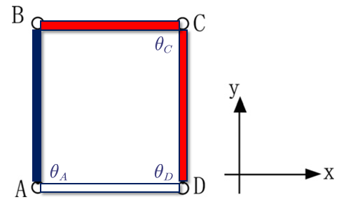

# 机构自由度计算

## 定义

机构自由度计算是一个探索了 150 年的问题，人们有多种计算方式，可以我写的自然辩证法论文 [main](./../tool/tex/assets/TeXSource/main.pdf)。

### 经典的 G-K 公式

$$

M=6\left( n-g-1 \right) +\sum{f_i}
\\
M=3\left( n-g-1 \right) +\sum{f_i}

$$

例子如下图：

$$

M=3\left( n-g-1 \right) +\sum{f_i}
\\
=3\times 3-4\times 2=1

$$

### Jacobian 方法

假设机构相对一个参考点有 Jacobian 矩阵 $J$，其满足

$$

J\dot{q}=\dot{x}

$$

其中：$q$ 是关节坐标系下的坐标，$y$ 是世界坐标系下坐标 (并联机构则存在两个 Jacobian$J_q,J_x$)。

那么机构自由度为 J 的零空间维数。

如下图：

其中参数为：

$$

A:\left( -1,-2,0 \right) , B:\left( -1,2,0 \right)
\\
C:\left( 1,2,0 \right) ,D:\left( 1,-2,0 \right)

$$

假定 x 坐标满足形式：

$$

x^T=\left( r_x\,\,r_y\,\,r_z\,\,m_x\,\,m_y\,\,m_z \right)

$$

那么对参考点 B==实际上是 B 的一小段邻接部分，这样才能有完整的 6 个自由度==

从支链 AB 和 DC 分别有:

$$

J_{AB}=\left( \begin{matrix}
	0&		0\\
	0&		0\\
	1&		1\\
	-4&		0\\
	0&		0\\
	0&		0\\
\end{matrix} \right) ,J_{DC}=\left( \begin{matrix}
	0&		0\\
	0&		0\\
	1&		1\\
	4&		0\\
	-2&		-2\\
	0&		0\\
\end{matrix} \right) , J=\left[ J_{AB}\,\,J_{DC} \right]

$$

注意 $J_{AB}(\dot\theta_A, \dot\theta_B)^T=\dot x_B$，因为包含了 B 的一小段邻接部分，因此可以包含关节 B 本身的角速度，其对 z 方向角速度有影响，但对其余方向速度无影响。

对合成的 J 使用奇异值分解考虑其零空间：

$$

J=U\Sigma V^T, \Sigma =\left[ \begin{matrix}
	{\color[RGB]{240, 0, 0} 5.87}&		0.0&		0.0&		0.0\\
	0.0&		{\color[RGB]{240, 0, 0} 2.95}&		0.0&		0.0\\
	0.0&		0.0&		{\color[RGB]{240, 0, 0} 0.93}&		0.0\\
	0.0&		0.0&		0.0&		{\color[RGB]{0, 0, 240} 0}\\
\end{matrix} \right]

$$

因此维数为 1.

### 约束方程角度

分别对 AB 和 DCB 的工作空间作图，求交集：

因此为 1 维。

## 参考

- [@yangSimpleMethodCalculate2008](.//)
- [main](./../tool/tex/assets/TeXSource/main.pdf)
