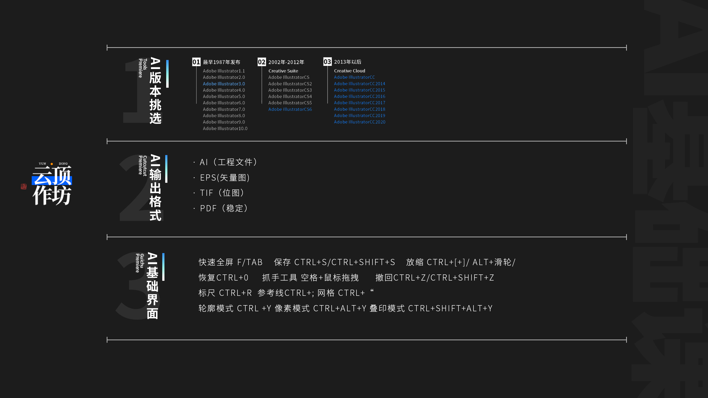
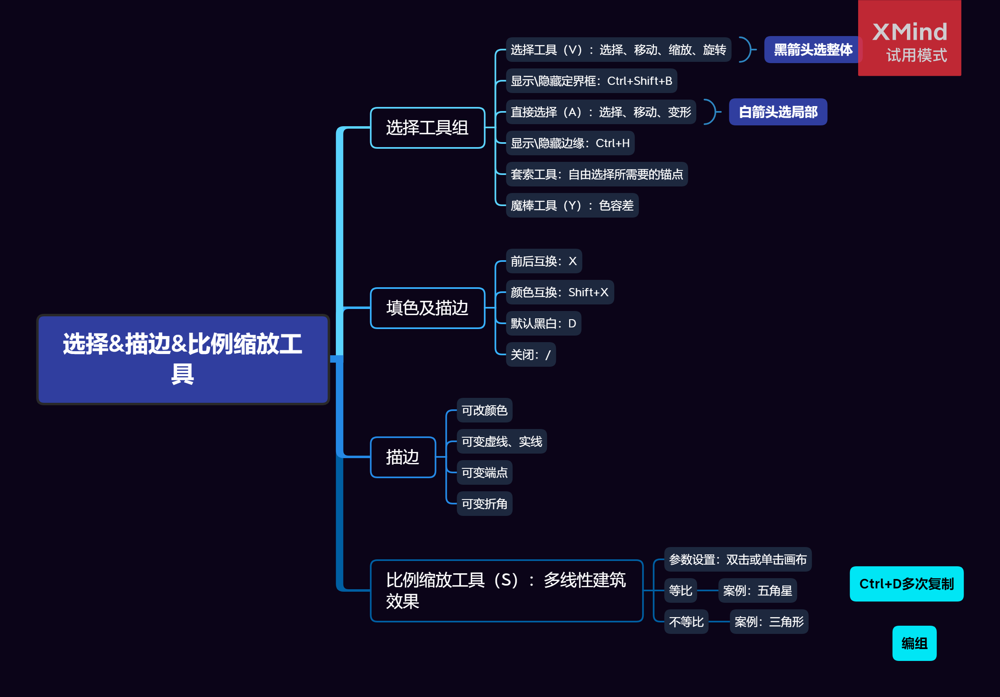

# Ai 学习

## Class 1: AI 界面 快捷键

**概念**

- 出血边：早期印刷防止干扰内容，留存装订白边

**快捷键**

- Alt 滚轮 ：放大缩小
- Space 左键 = Ctrl +/- ：抓手工具，挪动界面
- Ctrl 0 ：恢复画布填充满状态
- 标尺
  - Ctrl r(ruler) ：生成参考线
  - Ctrl ; ：隐藏标尺
  - Ctrl ' ：打开网格系统
- 撤回
  - Ctrl z ：撤回
  - Ctrl Shift z ：撤回撤回:)
- 模式切换
  - Ctrl y ：轮廓模式
  - Ctrl Alt y ： 像素模式
  - Ctrl Shift y ：叠印模式（印刷业使用）
- 操作相关
  - f ：进入“画板模式”
  - tab ：类似 f

## Class 2: 选择工具 描边 放缩

**概念**

- 魔棒
  - 挑选出颜色相同的部分
- 比例缩放工具
  - 注意缩放时圆角和描边等效果，如果想同步缩放，需要双击 V 勾选对应的缩放框。

**快捷键**

- 锁定图层
  - Ctrl 2 ：防止误触移动图层
  - Ctrl alt 2 ：解锁
- 选择工具组
  - V ：选择、移动、缩放、旋转
- 其余快捷键
  - alt ： 复制
  - shift ：代表规则地运动，比如按住 alt 复制元素，按住 shift 使得直线移动
  - Ctrl d ：重复上一步操作

## 参考

- [AI 教程](https://www.bilibili.com/video/BV1cy4y1p7vp?p=1)
- [20个-AI源文件及思维导图](.//)
