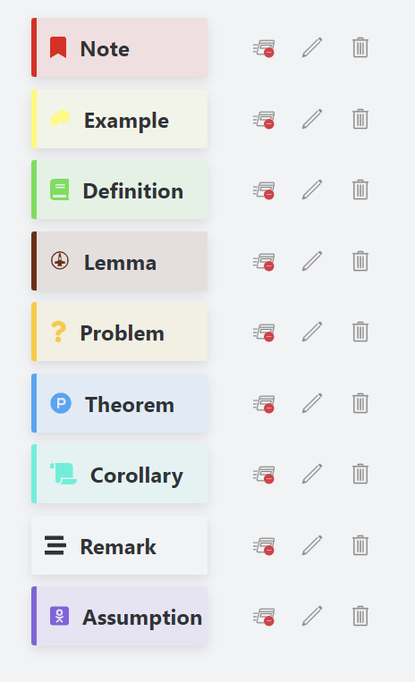
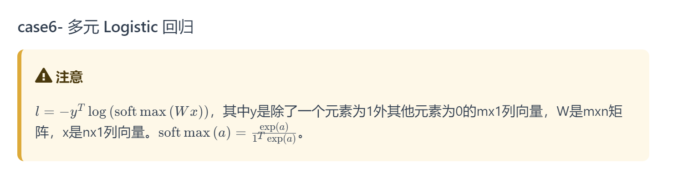

# 博客架构设计


## 功能描述

#### 文章

- [x] 支持数学公式
- [x] 支持大纲显示
- [x] 支持文章基本信息
	- [x] 时间
	- [x] 作者
	- [x] 字数统计
	- [x] 作者
	- [x] tag 显示
- [x] 支持 admontion
- [x] 支持文章链接


#### 管理

- [ ] 文件管理按照相对路径
- [ ] 支持搜索
	- [ ] tag
	- [ ] 主题
	- [ ] 分类

#### 拓展功能

- [ ] 支持双链链接
- [ ] 支持类似 obsidian 的 graph 视图
- [ ] 支持 ctrl+ 鼠标悬浮文章链接文章预览 (类似 obsidian )
- [ ] 留言/评论系统

## 架构设计

#### 文章撰写

使用 obsidian 完成，其使用体验经过这一年的打磨已经很好用了

#### 博客渲染

~~有 **dotNET/CSharp** 的 Static Site Generator 最好~~

> 很遗憾没有~

备选：

使用 [VuePress](https://vuepress.vuejs.org/zh/) 实现：

1. 支持很多自定义插件
	1. 比如 [Getting Started | Catalog Graph](https://catalog-graph.netlify.app/guide/getting-started.html#installation)
2. 支持 Netlifly 和 Github Page 托管

#### 转换工具

使用 C#自己写一个~

应该有下面的配置架构

- 插件模式配置转换规则
	- yaml 配置功能和信息
	- 支持正则等语法排除文件

##### Conifg 配置
> 按照功能分区

- log
	- logLevel
	- logFile
- db
	- dbFile
- fileParse
	- vaultPath
	- ignoreRegex: LIST
	- destinationPath
	- moduleMap: : LIST{OBJ} 每个 module 对应博客一个大模块，目前是 6 个
- fileParse
	- replaceWikiLink
	- replaceAdmontion
	- addYamlInfo

##### 转换文章注意事项

1. 文件结构
	1. 生成 6 个文件夹
		1. control
		2. math
		3. paper
		4. physics
		5. tool
		6. robot
	2. 文件夹下文件按照 obsidian 文件同样组织
		1. 每个文件夹下生成 README.md
			1. 规则和普通一样
			2. 如果有文件夹名称/README，将其作为 README.md
2. 文件修改
	1. yaml
		1. date: 2022-01-07
		2. category: subfolders
		3. tag:
		4. 示意：
	```yaml
	date: 2022-01-07
	category:
	  - CategoryA 
	  - CategoryB
	tag:
	  - tag A
	  - tag B
	```
	2. 文件链接
		1. wiki→md
			1. 示意:
				1. `[article5](.//)`
			2. 需要建立文件数据库索引
	3. admontion
		1. 
		2. **不会 vue 自定义组件，尝试了一小时失败** 替换表：
			1. info
				1. theorem
				2. lemma
			2. note
				1. remark
				2. note
			3. tip
				1. definition
				2. assumption
			4. warning
				1. problem
			5. danger
				1. corolary
			6. details
				1. example


#### 开发计划

1. [x] 完成数据库建立
	1. [x] 统计所有文件
		1. [x] 获取所有 module 文件
		2. [x] 根据 ingoreRegex 剔除文件
		3. [x] 建立文件列表
2. [ ] 添加搜索功能

##### Target

1. 重构文件数据库建立
	1. 使用 C#结合Everything模式快速获取
2. 使用 dotnet-cli 工具发布代码，使用依赖注入方式重构功能
5. 数据库存储或许有问题
	1. 考虑移动文件位置怎么办？未被访问数据的直接删除？
6. 页面链接 hover 显示，类似 obsidian

##### Bug

1. [x] 数学公式 `
$$
as
$$
` 添加上下文空行，避免渲染出错
2. [x] admontion 默认名字改为 obsidian 中 
3. [x] 空行转义 
	1. ~~%20~~
	2. 替换所有空格为’-‘
4. [x] 外链判断，拒绝解析
5. [x] 文章添加一级标题：title
6. [x] 解析 table 会出 Bug 似乎
	1. [x] 是识别表格换行出问题了，和 yaml 头解析重复了
7. [x] 解决经常出现的 kLateX 编译 bug
	1. [x] 是公式颜色解析问题
	2. [x] 平衡括号组正则匹配
8. [x] 链接名字小 bug
	1. [x] 
