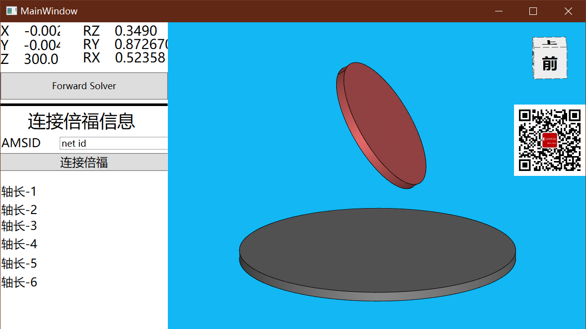

# CSharp调用matlab

> 本文由 [简悦 SimpRead](http://ksria.com/simpread/) 转码， 原文地址 [https://blog.csdn.net/qq_45689779/article/details/116837363](https://blog.csdn.net/qq_45689779/article/details/116837363)

最近正在学习如何使用 C# 调用 [Matlab](https://so.csdn.net/so/search?q=Matlab&spm=1001.2101.3001.7020) 的代码，查阅了很多相关资料，踩了不少坑 ，不过终于解决了问题。

**软件环境：**C#: **`Visual Studio 2013`** MATLAB : **`MATLAB R2020b`**

::: note note
亲测dotnet core 6.0 和 Matlab R2022a可以，但是求解精度感觉不太好
:::

(MATLAB 是使用学校邮箱注册的正版软件，Vs2013 用的是破解版，之后也成功测试了 Vs2017)。

## 1. MATLAB 工具包安装

需要安装 **`MATLAB Compiler`** 和 **`MATLAB Compiler SDK`** 两个工具包 (==**缺一不可**==)，一种可行的方法是用安装程序安装；另一种方法是：在命令行窗口输入： `deploytool`，==点击== `MATLAB Compiler` 和 **`MATLAB Compiler SDK`** 进入到 **附加功能资源管理器** 界面中，这里安装的是 **`MATLAB Compiler SDK`**，因为安装 `MATLAB Compiler SDK`，会连带安装`MATLAB Compiler`；

## 2. 编写 MATLAB 程序

编写一个简单的 ==加法== 函数 (保存为 _addNum.m_)；

function result = addNum(a,b)
    result = a + b;  
end    
​

## 3. 封装为 Dll

(1) 在命令行窗口输入： `deploytool`；

在弹出的 **MATLAB Compiler** 窗口中 选择 **`Library Compiler`**；或者也可以通过上方 _**编辑器**_ 旁边的 **`APP`**，右边的下拉按钮，在 **应用程序部署** 中也可以找到 **`Library Compiler`**，(2) 在 Library Compiler 界面中，只需要执行下面三个步骤：

第一步：下拉 ==TYPE== 的滑动条，选择其中的 **`.NET Assembly`**；第二步：点击 ==EXPORTED FUNCTIONS== 的加号，添加所写函数保存的. m 文件的==路径==；

第三步：类的名字可以自己设置，这里保持默认的 **`Class1`** ；最后点击 **`Package`**。路径可以选择和. m 文件在同一文件夹下，然后等待打包完成。至此 **MATLAB** 对. m 文件内函数的封装已经完成。

## 1. Vs 配置

第一步：打开 Visual Studio 2013，新建项目，这里使用的是 ==控制台应用程序==，给定名称、设置好路径后，点击 **确定** ，创建项目。第二步：在 _**解决方案资源管理器**_ 中，右键 ==引用==，点击 ==添加引用==点击 **浏览** ，找到之前 MATLAB 封装后生成的文件夹，打开文件名为 `for_redistribution_files_only`下的 **`addNum.dll`**，

进行添加，然后还需添加一个 **`MWArray.dll`** 用于 C# 和 MATLAB 之间的数据传递，路径是：**MATLAB 安装的文件夹 / toolbox / dotnetbuilder / bin / win64 / v4.0**；添加完成后可以看到 **`addNum`** 和 **`MWArry`** 已经在 **引用** 中；第三步：右键 **项目**，点击 **属性** ，(这一步也是最坑的，花费了大量时间才找到解决办法)；左边一栏中，选择 _**生成**_，将 _**目标平台**_，修改为 ==x64==；

::: note note
这一步x64平台我自己没用到
:::

## 2. 编写 C# 程序

这里用最简单的一个例子进行测试：

using System;
using addNum;
using MathWorks.MATLAB.NET.Arrays;
​
namespace UseMatlab
{
    class Program
    {
        static void Main()
        {
            Class1 demo = new Class1();
            MWArray a = 1, b = 2, c;
            c = demo.addNum(a, b);
            Console.WriteLine("a:{0},b:{1}", a, b);
            Console.WriteLine("c:{0}",c);
        }
    }
}
​

点击启动，需要稍等一会，控制台上即可显示输出结果。

## 3. 额外测试

::: note note
我的测试参考[StewartInBeckhoff](.//)，实现了从倍福读取6轴长度，使用Matlab导出dll求解正解，使用[工业软件图形开发平台 | AnyCAD三维控件](http://www.anycad.net/)显示3D模型的结果

:::

之后又尝试了 C# 调用 Matlab 的 ==plot== 功能，将原来写的 **addNum** 函数进行修改：

function result = addNum(a,b)
    result = a + b;
​
    x = -5:0.1:5;
    y = sin(x);
    plot(x,y);  
end    
​

代码修改后，双击 **`addNum.prj`** 工程文件，点击 **Package**，对函数重新进行打包；此时 Vs 端 **不需要** 重新添加引用，直接点击 _**启动**_，即可运行代码，_控制台窗口_ 显示数字后，弹出 Matlab `plot`函数运行后的 _Figure_ 窗口。至此，完成 C# 对 Matlab 函数的调用。

1. MATLAB 需要安装两个工具包 ：**`MATLAB Compiler`** 和 **`MATLAB Compiler SDK`** ;

2. MATLAB 封装的 **步骤** 和 **路径** 要清楚；

3. VS 端 **需要** 添加 两个引用：**`addNum.dll`** 和 **`MWArray.dll`**；

4. VS 端 生成的 **目标平台** 一定要改为 **`x64`**。

网络上能够查到很多关于 C# 调用 Matlab 代码的资料，但是绝大多数的步骤不是很全面，十分不方便学习和参考。经过大量的查询和测试后，终于找到了一个解决问题的办法，于是总结并分享给大家。

By 氷い （￣︶￣）↗
