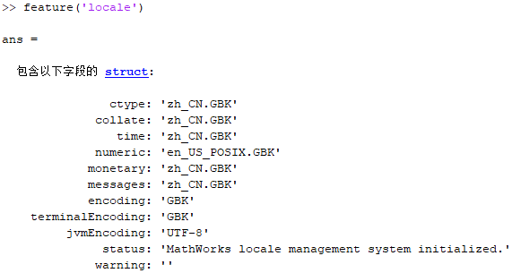

# Matlab 更改默认编码方式


## 定义

matlab 默认编码方式为 GBK，这导致我们经常会出现文档打开乱码，可以通过命令 `feature(locale)` 查看：



修改方法如下：

- 打开 matlab bin 目录

  - e. g. `fallback D:\Program Files\MATLAB\R2019a\bin`

- `lcdata.xml` 重命名为 `lcdata_old.xml`，即把它备份一份，防止以后要用到

- 把 `lcdata_utf8.xml` 复制一份，就叫做 `lcdata.xml`，并且打开它，作出一些改动

  - 首先要删掉关于 GBK 的这一部分

	```xml
    <encoding name="GBK'>
        <encoding_alias name="936"/>
    </encoding>
    ```

  - 改动一下关于 UTF-8 的部分

	```xml
    <encoding name="UTF-8">
        <encoding_alias name="utf8"/>
        <encoding_alias name="GBK"/> 
    </encoding>
    ```

这么做的目的就是，将 GBK 编码从一种独立的编码方式，改成了 UTF-8 的一个别名，从而欺骗 Matlab，让它使用 UTF-8。**虽然很不优雅，但是真的有用。**


## 参考

- [如何在 Matlab 中启用 UTF-8 编码 - Zyxiria (ericzhuochen.com)](https://blog.ericzhuochen.com/post/matlab-utf8/)
