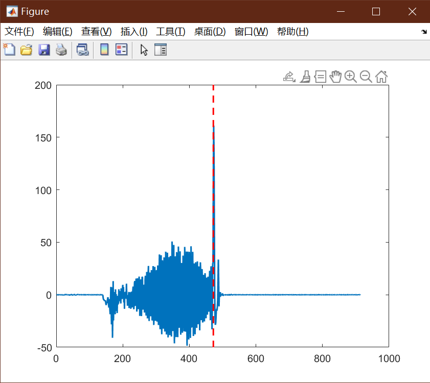

# matlab 绘图添加竖线


## 定义

在matlab绘制图片过程中，有时需要在图片中添加竖直的标记线来加强对比，下面介绍如何实现

## 方案

### 竖线

```matlab
figure;plot(diff_vel_1); hold on; hh=axis;
plot([id_1,id_1],[hh(3),hh(4)],'r--'); hold off;
```

绘图结果为：



### 横线

```matlab
figure;plot(diff_vel_2,'LineWidth',1.5);hold on; hh=axis;
plot([hh(1),hh(2)],[80,80],'g--','LineWidth',1.5); hold off;
```


## 参考

##### 引文


##### 脚注
