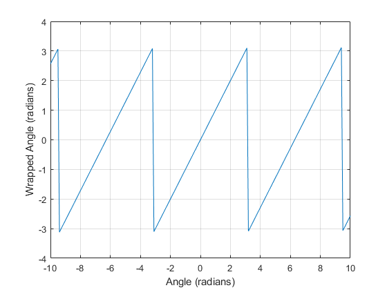

# Matlab 角度限制 Pi

## 定义

有时在画图的时候，我们需要将得到的角度信息限制在 [-pi, pi] 之间，这时可以使用 matlab 的函数 `warpToPi`

使用方法如下：

```matlab
lambda = [-2*pi -pi-0.1 -pi -2.8 3.1 pi pi+1 2*pi];
lambdaWrapped = wrapToPi(lambda)
```

结果为：

```
lambdaWrapped = 1×8

         0    3.0416   -3.1416   -2.8000    3.1000    3.1416   -2.1416         0

```

---

```matlab
lambda2 = -10:0.1:10;
lambda2Wrapped = wrapToPi(lambda2);

plot(lambda2,lambda2Wrapped)
xlabel("Angle (radians)")
ylabel("Wrapped Angle (radians)")
grid on
```



此外还有 warpTo360, warpTo2Pi 等函数

## 参考

- [Wrap angle in radians to [−pi pi] - MATLAB wrapToPi - MathWorks 中国](https://ww2.mathworks.cn/help/map/ref/wraptopi.html)
