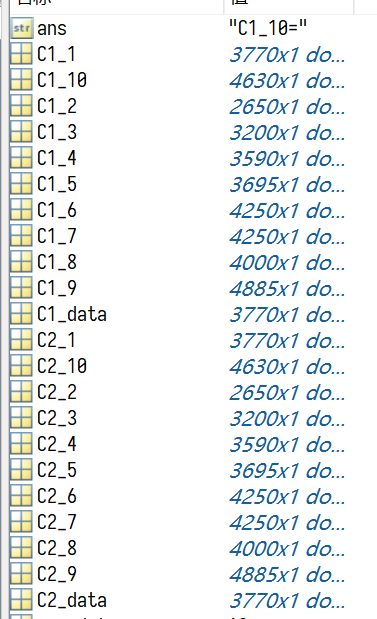

# matlab元编程


## 定义

期望能够在 matlab 中使用元编程的功能，比如实现下面功能：
- 变量通过命令创建，其变量名是

## 方案

### 变量名程序控制


```matlab
for i = 1:length(raw_data)
    var_C1_data = raw_data{3,i}(:,2);
    var_C2_data = raw_data{3,i}(:,3);
    eval(['C1_',num2str(i),'=var_C1_data;']);
    eval(['C2_',num2str(i),'=var_C2_data;']);
end
```

其中 `var_C1_data` 之类的是一个辅助变量，用于传递幅值代码

执行结果：




## 参考

##### 引文

- [Matlab如何以变量的值作为新的变量名赋值？ – MATLAB中文论坛](https://www.ilovematlab.cn/thread-28446-1-1.html#:~:text=%E5%8F%98%E9%87%8F%E5%90%8D%E6%98%AF%E4%B8%8D%E5%AE%9A%E7%9A%84%EF%BC%8C%E6%AF%94%E5%A6%82%EF%BC%9AA_Cell%3D%20%7B%27abc%27%2C%27defg%27%2C%27matlab_1%27%7D%3B%20%E5%88%86%E5%88%AB%E4%BB%A5A_Cell%E4%B8%AD%E7%9A%84%E5%90%84%E5%85%83%E7%B4%A0%E4%BD%9C%E4%B8%BA%E6%96%B0%E7%9A%84%E5%8F%98%E9%87%8F%E5%90%8D%E6%9D%A5%E8%B5%8B%E5%80%BC%EF%BC%8C%E6%AF%94%E5%A6%82%EF%BC%9Aabc%3D%27ilovematlab%27%EF%BC%8Cmatlab_1%3D3%EF%BC%8Cdefg%3DB%EF%BC%8C%E5%85%B6%E4%B8%ADB%E6%98%AF%E4%B8%80%E4%B8%AA%E5%B7%B2%E7%9F%A5%E7%9A%84%E6%95%B0%E6%8D%AE%E7%BB%93%E6%9E%84%EF%BC%8C%E6%AF%94%E5%A6%82%E7%BB%86%E8%83%9E%E4%BD%93%E3%80%82,%E8%BF%99%E6%A0%B7%E5%81%9A%E7%9A%84%E8%AF%9Deval%20%28%5B%27a_%27%2Cnum2str%20%28i%29%2C%27%3D%27%2Cnum2str%20%28i%5E2%29%5D%29%E5%B0%B1%E6%8C%82%E4%BA%86%E3%80%82)

##### 脚注
