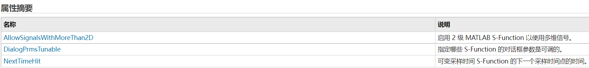
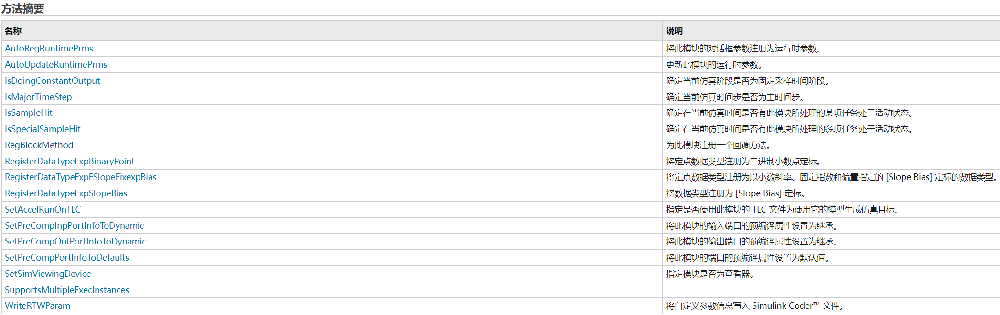
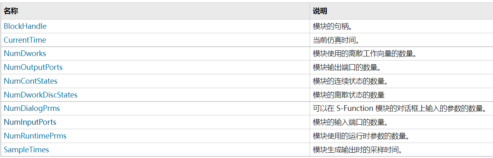
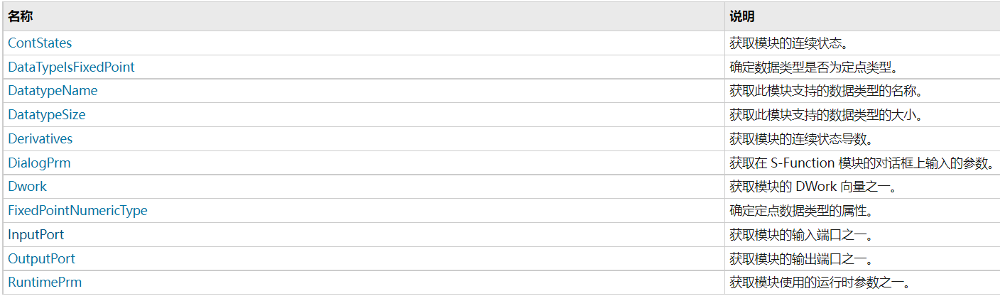
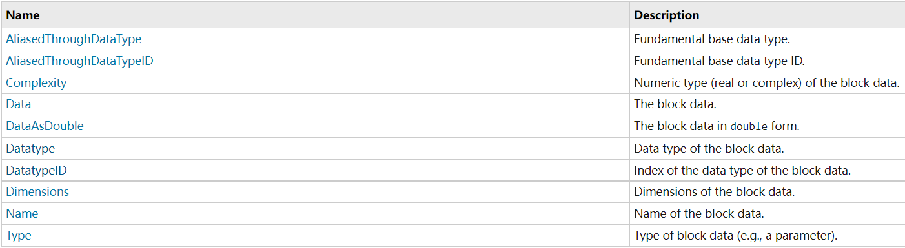
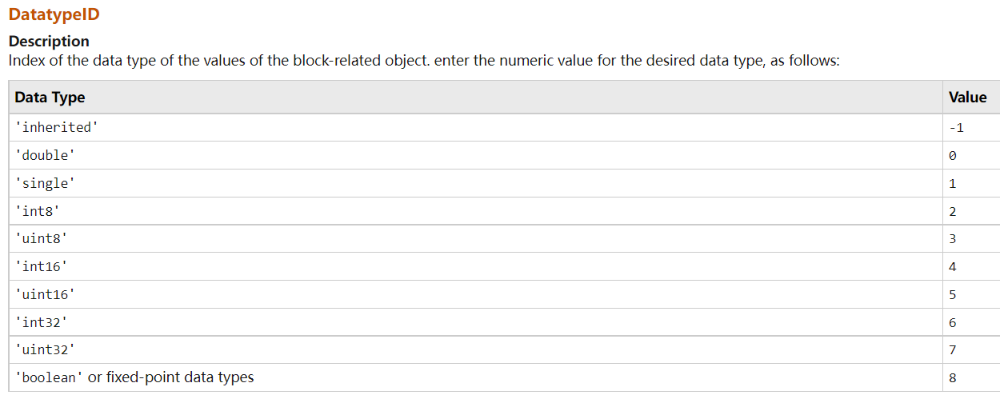

# sfunction实现

# 实现 S-function

> [matlab文档-sfuction搭建步骤](https://www.mathworks.com/help/releases/R2021a/simulink/sfg/writing-level-2-matlab-s-functions.html)


## Notes
* **从模板开始**
   <br>使用 Level-2 MATLAB S-function template[`msfuntmpl_basic](./assets/msfuntmpl.m.md) ，其中带有较多的注释。

* **模型 setup**
	<br>为了实现 s-function (level-2) 的功能，matlab 将一个运行时对象作为参数传送到回调方法中。运行时对象实际上充当了 matlab 的 s-function 模块代理，使其能够在仿真期间设置、访问模型属性。
	* 在 simulink engine 调用 level-2 的 sfunction 回调函数时，一个 [`Simulink.MSFcnRunTimeBlock`](https://www.mathworks.com/help/releases/R2021a/simulink/slref/simulink.msfcnruntimeblock.html) 类的实例作为运行时对象传递给回调函数。注意，运行时对象不支持 matlab sparse matrices，因此 `speye` 等函数不支持使用。
		<br>[`Simulink.MSFcnRunTimeBlock`的介绍网页](https://www.mathworks.com/help/releases/R2021a/simulink/slref/simulink.msfcnruntimeblock.html) 拥有包括 `RegBlockMethod` 在内的多种成员介绍与语法说明，对这些对象的设置（包括对不同种类输入、输出、状态变量的设置，函数的设置等）是 setup 中需要完成的任务。
		
		
		两个例子：
		 - `SetPreCompOutPortInfoToDynamic`：将模块的输出端口的编译信息（维度、数据类型、复/实性以及采样模式）初始化为继承。
		 - `SetPreCompPortInfoToDefaults`：将此模块的端口的预编译属性设置为默认值。
		 - `RegBlockMethod` ：注册回调函数。第一个参数是 sfunction API method 的名字，第二个输入参数是对应本地处理这些函数的名字，比如 `block.RegBlockMethod('PostPropagationSetup',@DoPostPropSetup);`

	* 但在上述页面中没有对实际需要设置的每一种参数进行详细说明，在其父类 [`Simulink.RunTimeBlock`介绍网页](https://ww2.mathworks.cn/help/releases/R2021a/simulink/slref/simulink.runtimeblock.html) 中有更多参数介绍，例如 `Dwork` 为离散向量，`InputPort` 为输入端口等。如下表
		
		
		几个例子：
		- `NumDialogPrms` ：初始化 sfunction 的的 dialog parameter。
		- `SampleTimes`：来继承==采样时间==。关于采样时间，可以参考 [采样时间类型](./采样时间类型.md)。
		* 对于上述每一个 `Simulink.RunTimeBlock` 成员，可以查看其具体定义，若此页面中没有详细介绍，可以在其父类中寻找。例如 `InputPort`，在此页面中可以看到它属于 `Simulink.BlockCompInputPortData` 或 `Simulink.BlockPreCompInputPortData` 类，这两个类父类的父类为 [`Simulink.BlockData`](https://ww2.mathworks.cn/help/releases/R2021a/simulink/slref/simulink.blockdata.html#f29-108665)，在页面中可以找到更多定义，例如 `DatatypeID` 等
	 
	  
		   * 需要注意，`InputPort` 与 `OutputPort` 类成员没有找到 `SampleMode`，但实际使用时如果==sfunction 作为源信号输出==，那么需要指定其输出模式，是采样信号输出还是帧输出。可以参考 [Sample- and Frame-Based Concepts - MATLAB & Simulink (mathworks.com)](https://www.mathworks.com/help/dsp/ug/sample-and-frame-based-concepts.html)。
			具体代码参考如下：
			<br>
			`block.OutputPort(1).SamplingMode = 'Sample'; % sample mode`
			<br>
			`block.OutputPort(1).SamplingMode = 'Frame'; % frame mode`

* debug 可以参考 [matlab官方指导](https://ww2.mathworks.cn/help/releases/R2021a/slci/ref/simulink-code-inspector-checks.html?searchHighlight=SamplingMode&s_tid=doc_srchtitle#responsive_offcanvas)
* 一个例子 [adapt_lms](./assets/adapt_lms.m.md)，可以在 matlab 输入指令查看完整 simulink 模型：
```open_system('sldemo_msfcn_lms');```
