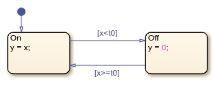
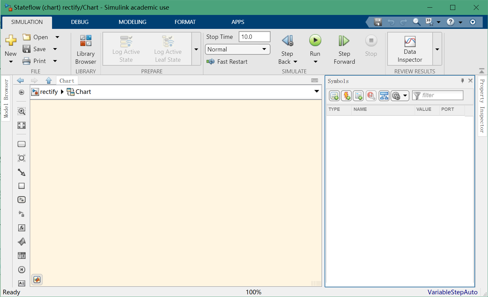
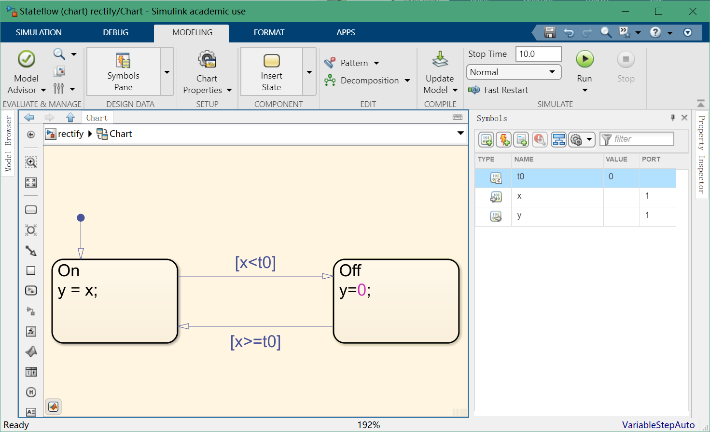
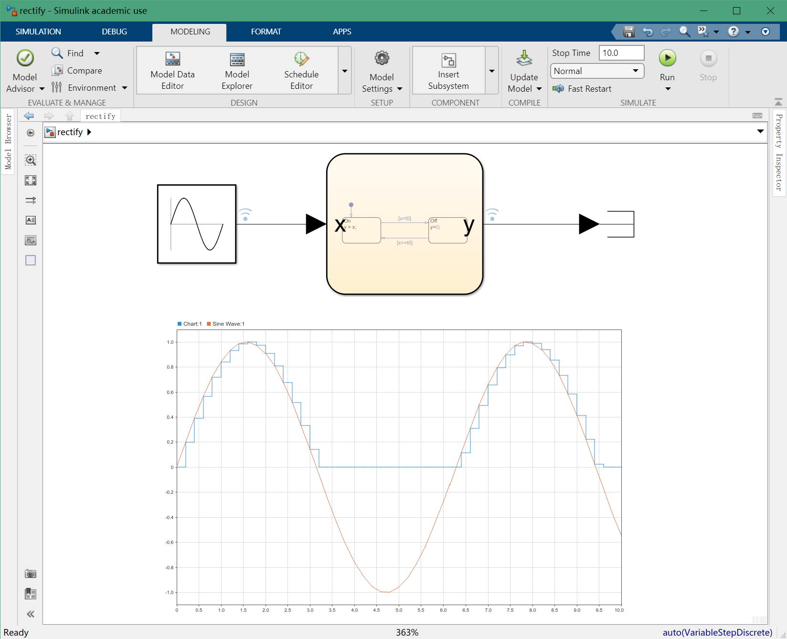
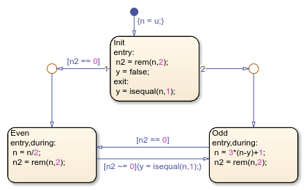
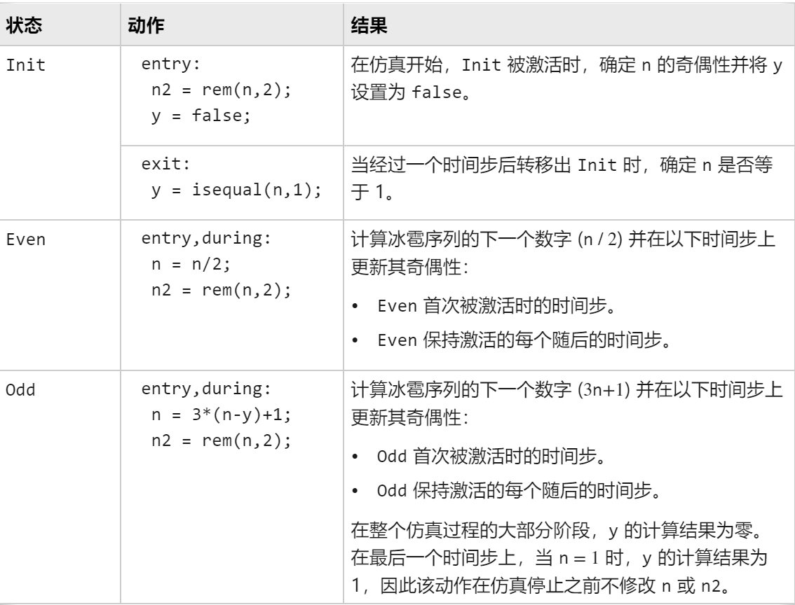
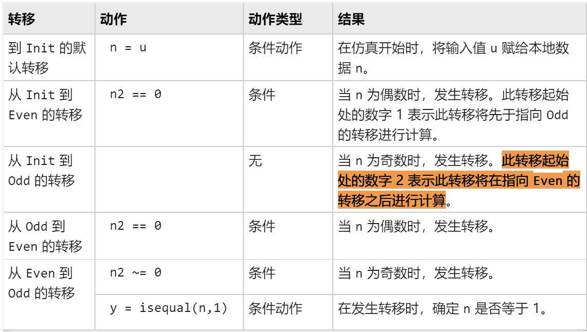
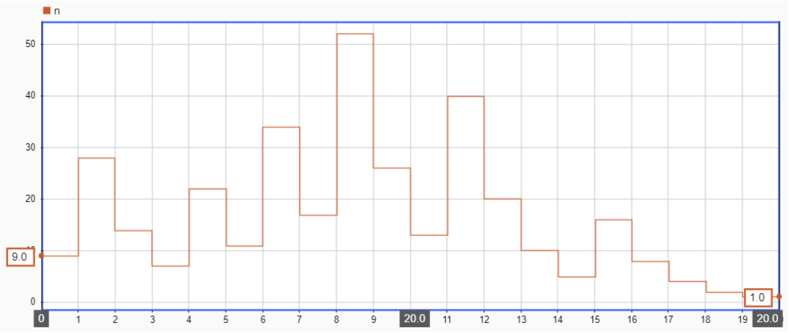
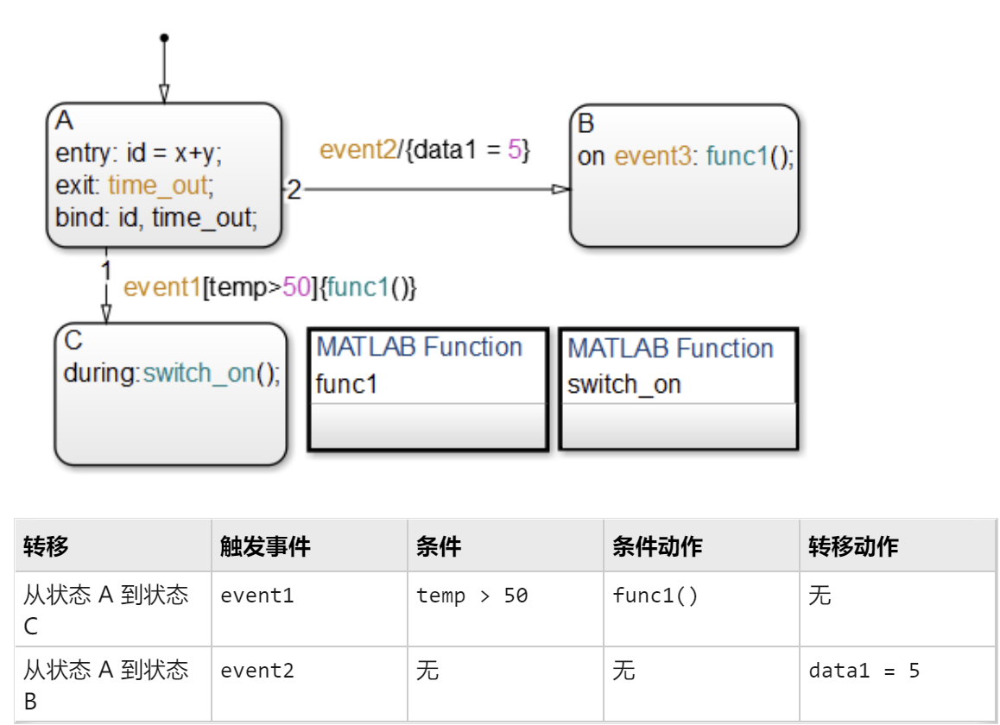

# Simulink 状态机


## 定义

matlab 使用==Stateflow==图表示有限状态机，由：==状态、转移、数据==组成。

下面是有限状态机的一个例子：半波整流器。下面这个例子包含两个状态：On、Off。在 On 状态下，图输出信号 y 等于输出 x。在 Off 状态下，输出信号设置为 0。在输入信号跨越某个阈值 t0 时，图在这些状态之间转移。各个状态的动作在仿真的每一时间步都会更新 y 的值。



## 构造 StateFlow

#### 打开 Stateflow Editor

首先确定控制系统的设计逻辑：

- 要建立周期性或连续时间 Simulink 算法的条件、基于事件和基于时间的逻辑模型，请创建一个可在 Simulink 模型中作为模块进行仿真的 Stateflow 图

  - ```matlab
    sfnew rectify     % create chart for simulation in a Simulink model
    ```

- 要为 MATLAB 应用程序设计可重用的状态机和时序逻辑，请创建可作为 MATLAB 对象执行的独立 Stateflow 图。

  - ```matlab
    edit rectify.sfx  % create chart for execution as a MATLAB object
    ```

Stateflow Editor 的主要组件是对象选项板、图画布和 Symbols 窗格。

- 图画布是一个绘图区域，您可以在其中通过组合状态、转移和其他图形元素来创建图。
- 在画布的左侧有一个对象选项板，其中显示了一组可向图中添加图形元素的工具。
- 在画布的右侧有一个 Symbols 窗格，您可以用它向图添加新数据并解析任何未定义或未使用的符号。
- 

#### 添加状态和转移

按照 [构造并运行 Stateflow 图](https://ww2.mathworks.cn/help/stateflow/gs/stateflow-charts.html) 提示的构建方式，建立模型如下图：



使用 Simulink 进行仿真结果如下：



可以发现仿真结果滤掉了复输入值。

PS：**将图作为 Matlab 对象执行**

要在 MATLAB 命令行窗口中执行图，请创建一个图对象，并调用其 `step` 函数。如果您要在 Simulink 模型中对图进行仿真，请参阅 [将图作为 Simulink 模块进行仿真](https://ww2.mathworks.cn/help/stateflow/gs/stateflow-charts.html#mw_83cbfede-9ce2-4ad8-99df-68a135a08694)。

## 进阶操作

*状态和转移动作* 是您在状态或转移旁编写的指令，用于定义 Stateflow® 图在仿真过程中的行为。

### 用动作定义图行为

下图中的动作定义了一个以实验方式验证 [Collatz](https://mathworld.wolfram.com/CollatzProblem.html) 猜想实例的状态机。对于给定的数值输入 $u$，该图通过迭代以下规则计算冰雹序列 $n_0 = u,n_1,n_2,n_3$：

- $n_i$ 为偶数，$n_{i+1} = n_i/2$
- $n_i$ 为奇数，$n_{i+1} = 3 n_i +1$

Collatz 猜想指出，每个正整数都有一个最终达到 1 的冰雹序列。计算如下：



该图由三个状态组成。在仿真开始时，`Init` 状态初始化图数据：

- 本地数据 `n` 设置为输入 `u` 的值。
- 当 `n` 除以 2 时，本地数据 `n2` 设置为余数。
- 输出数据 `y` 设置为 `false`。

根据输入的奇偶性，图转移到 `Even` 或 `Odd` 状态。当状态活动在 `Even` 和 `Odd` 状态之间切换时，图会计算冰雹序列中的数字。当序列达到 1 值时，输出数据 `y` 变为 `true`，并触发 Simulink® 模型中的 [Stop Simulation](https://ww2.mathworks.cn/help/simulink/slref/stopsimulation.html) (Simulink) 模块。

#### 状态动作类型

状态动作定义当状态被激活时 Stateflow 图的动作。最常见的状态动作类型是 `entry`、`during` 和 `exit` 动作。

| 状态动作类型 | 缩写 | 说明                                                     |
|  | ----- |
| entry        | en   | 当状态被激活时，动作在时间步上发生。                     |
| during       | du   | 当状态已激活并且图未转移出该状态时，动作在时间步上发生。 |
| exit         | ex   | 当图转移出状态时，动作在时间步上发生。                   |

您可以通过状态动作的完整关键字（`entry`、`during`、`exit`）或其缩写（`en`、`du`、`ex`）指定状态动作的类型。您还可以==使用逗号组合各状态动作类型==。例如，组合类型 `entry,during` 当状态被激活时在时间步上发生，并且在状态保持激活时在每个后续时间步上发生，也就是说逗号串联的状态动作为并列关系，类似于 Mathematica 的 case 的匹配序列。

下面是上面仿真图的状态动作的说明：



#### 转移动作的类型

转移动作定义当转移出激活状态时 Stateflow 图执行的动作。最常见的转移动作类型是条件和条件动作。要指定转移动作，请使用采用以下语法的标签：

```matlab
[condition]{conditional_action}
```

`condition` 是布尔表达式，用于确定是否发生转移。如果不指定条件，则假定采用一个计算结果为 true 的隐含条件。

`conditional_action` 是在判断转移的条件为 true 时执行的指令。条件动作发生在条件后，但在任何 `exit` 或 `entry` 状态动作之前。

下表列出了冰雹图中每个转移动作的结果。



#### 仿真结果



### 转移动作详解

转移可以有不同的动作类型，包括事件或消息触发器、条件、条件动作和转移动作。动作类型采用标签表示法，一般格式如下：

```matlab
event_or_message trigger[condition]{condition_action}/{transition_action}
```

典型的转移方法：



#### 事件或消息触发器

在转移标签语法中，事件或消息触发器作为事件或消息的名称首先出现。没有特别的区分字符可以将它们与转移标签中的其他动作区别开来。在 [转移动作的类型](https://ww2.mathworks.cn/help/stateflow/ug/transition-action-types.html) 中的示例中，来自状态 A 的两个转移都有事件触发器。状态 A 到状态 B 的转移带有事件触发器 `event2`，状态 A 到状态 C 的转移带有事件触发器 `event1`。

事件触发器指定在已指定条件且条件为 true 时导致转移发生的事件。可以选择是否指定事件。消息触发器指定如果消息队列中存在消息则发生转移。未指定事件或消息表示在发生任意事件时都会产生该转移。可以使用 OR 逻辑运算符 (`|`) 指定多个事件或消息。

#### 转移动作

在转移标签语法中，转移动作以正斜线 (`/`) 开头，并括在花括号 (`{}`) 中。在 [转移动作的类型](https://ww2.mathworks.cn/help/stateflow/ug/transition-action-types.html) 的示例中，从状态 A 到状态 B 的转移包含转移动作 `data1 = 5`。转移动作只在获取完整的转移路径之后才会执行。它们在转移目标确定为有效且条件（如果指定）为 true 后执行。如果转移由多个段组成，转移动作只在到最终目标的整个转移路径确定为有效后执行。

### 在线参考

使用 Simulink Start Page 的 Learn 模块，学习 Simulink 和 StateFlow 的一些操作。


## 参考

- [构造并运行 Stateflow 图 - MATLAB & Simulink - MathWorks 中国](https://ww2.mathworks.cn/help/stateflow/gs/stateflow-charts.html)
- [对有限状态机建模 - MATLAB & Simulink - MathWorks 中国](https://ww2.mathworks.cn/help/stateflow/gs/finite-state-machines.html)
- [使用动作定义图行为 - MATLAB & Simulink - MathWorks 中国](https://ww2.mathworks.cn/help/stateflow/gs/actions.html)
- [转移动作的类型 - MATLAB & Simulink - MathWorks 中国](https://ww2.mathworks.cn/help/stateflow/ug/transition-action-types.html)

- [Stateflow Editor 操作 - MATLAB & Simulink - MathWorks 中国](https://ww2.mathworks.cn/help/stateflow/ug/editor-operations.html)
- [Stateflow 快速入门](assets/stateflow_gs_zh_CN.pdf)
- [Stateflow userguide](assets/stateflow_ug.pdf)
- [Stateflow API](assets/stateflow_api.pdf)
- [Stateflow Reference](assets/stateflow_ref.pdf)
