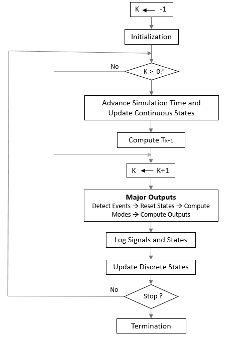

# Simulink 执行细节

## 定义

为了理解 simulink 如何执行系统仿真，下面介绍具体的实现细节。

## 动态系统的仿真阶段

### 模型编译

当系统的模型处于打开状态，并且您对模型进行仿真时，将进行仿真的第一个阶段。在 Simulink® Editor 中，点击 **Run**。运行仿真会导致 Simulink 引擎调用模型编译器。模型编译器会将模型转换为可执行形式，这个过程称为编译。具体说就是，编译器会：

- 计算模型的模块参数表达式，以确定它们的值。
- 确定模型没有显式指定的信号属性，例如，名称、数据类型、数值类型和维度，并检查每个模块是否都接受连接到其输入的信号。
- 将源信号的属性传播到它所驱动的模块的输入，以便计算模块中先前未指定的属性。
- 执行模块约简优化。
- 通过将虚拟子系统替换为它们所包含的模块，将模型层次结构扁平化（请参阅 [比较求解器](https://www.mathworks.com/help/releases/R2021a/simulink/ug/compare-solvers.html)）。
- 通过基于任务的排序确定模块执行顺序。
- 确定模型中您未显式指定其采样时间的所有模块的采样时间（请参阅 [传播如何影响继承的采样时间](https://www.mathworks.com/help/releases/R2021a/simulink/ug/how-propagation-affects-inherited-sample-times.html)）。

这些事件本质上与您更新模块图时发生的情况相同（[更新图和运行仿真](https://www.mathworks.com/help/releases/R2021a/simulink/ug/updating-a-block-diagram.html)）。差别在于 Simulink 软件作为模型仿真的一部分启动模型编译，编译会直接进入链接阶段，如 [链接阶段](https://www.mathworks.com/help/releases/R2021a/simulink/ug/simulating-dynamic-systems.html#f7-22298) 中所述。而显式模型更新是针对模型的独立操作。

### 链接阶段

在此阶段，Simulink 引擎为工作区域（信号、状态和运行时参数）分配执行模块图所需的内存。它还为用于存储每个模块的运行时信息的数据结构体分配和初始化内存。对于内置模块，模块的主要运行时数据结构体称为 SimBlock。它存储指向模块的输入和输出缓冲区以及状态和工作向量的指针。

#### 方法执行列表

在链接阶段，Simulink 引擎还会创建方法执行列表。这些列表列出了调用模型的模块方法以计算其输出的最有效顺序。在模型编译阶段生成的模块执行顺序列表用于构造方法执行列表。

#### 模块优先级

您可以向模块分配更新优先级。较高优先级模块的输出方法在较低优先级模块的输出方法之前执行。仅当这些优先级与其模块执行顺序一致时，才会遵循它们。

### 仿真环阶段

链接阶段完成后，仿真会进入仿真环阶段。在此阶段，Simulink 引擎使用该模型提供的信息，从仿真开始到完成的时间段内以固定间隔连续计算系统的状态和输出。计算状态和输出的连续时间点称为时间步。时间步之间的时间长度称为步长大小。步长大小取决于用来计算系统连续状态、系统基础采样时间（请参阅 [系统中的采样时间](https://www.mathworks.com/help/releases/R2021a/simulink/ug/managing-sample-times-in-systems.html)）以及系统的连续状态是否具有不连续性（请参阅 [过零检测](https://www.mathworks.com/help/releases/R2021a/simulink/ug/zero-crossing-detection.html)）的求解器类型（请参阅 [比较求解器](https://www.mathworks.com/help/releases/R2021a/simulink/ug/compare-solvers.html)）。

仿真环阶段有两个子阶段：循环初始化阶段和循环迭代阶段。初始化阶段在循环开始时出现一次。迭代阶段在从仿真开始到仿真停止的时间段内的每个时间步重复一次。

在仿真开始时，模型将指定要仿真的系统的初始状态和输出。在每个时间步中，计算系统的输入、状态和输出的新值，并且将更新该模型以反映计算的值。仿真结束时，该模型将反映系统的输入、状态和输出的最终值。Simulink 软件会提供数据显示和日志记录模块。您可以通过在模型中包含这些模块来显示和/或记录中间结果。

以下流程图解释仿真环的工作原理，其中 `k` 表示主时间步计数器：

#### 循环迭代

在每个时间步中，Simulink engine 将：

1. 计算模型输出

   Simulink 引擎通过调用 Simulink 模型 Outputs 方法启动此步骤。而模型 Outputs 方法会反过来调用模型系统 Outputs 方法，后者按仿真链接阶段生成的 Outputs 方法执行列表中指定的顺序调用模型所包含的模块的 Outputs 方法（请参阅 [比较求解器](https://www.mathworks.com/help/releases/R2021a/simulink/ug/compare-solvers.html)）。

   系统的 Outputs 方法将以下参数传递给每个模块的 Outputs 方法：指向模块数据结构体及其 SimBlock 结构体的指针。SimBlock 数据结构体指向 Outputs 方法计算模块的输出所需的信息，包括其输入缓冲区和其输出缓冲区的位置。

2. 计算模型的状态

   Simulink 引擎可通过调用求解器来计算模型状态。它调用哪个求解器取决于模型是否具有状态、只有离散状态、只有连续状态还是同时具有连续和离散状态。

   如果模型只有离散状态，Simulink 引擎将调用用户选择的离散求解器。求解器计算命中模型采样时间所需时间步的大小。然后，它调用模型的 Update 方法。模型的 Update 方法会调用其系统的 Update 方法，后者按链接阶段生成的 Update 方法列表中指定的顺序调用系统所包含的每个模块的 Update 方法。

   如果模型只有连续状态，Simulink 引擎将调用模型指定的连续求解器。根据求解器的不同，求解器要么调用一次模型的 Derivatives 方法，要么进入子时间步的子循环，求解器在该子循环中重复调用模型的 Outputs 方法和 Derivatives 方法，以便在主时间步内按连续时间间隔计算模型的输出和导数。这样做是为了提高状态计算的准确性。而模型的 Outputs 方法和 Derivatives 方法将调用其相应的系统方法，这些系统方法随后按链接阶段生成的 Outputs 和 Derivatives 方法执行列表中指定的顺序调用模块的 Outputs 和 Derivatives 方法。

3. （可选）检查模块连续状态中的不连续性

   将使用一种称为过零检测的技术来检测连续状态中的不连续性。有关详细信息，请参阅 [过零检测](https://www.mathworks.com/help/releases/R2021a/simulink/ug/zero-crossing-detection.html)。

4. 计算下一个时间步的时间

## 参考

- [Simulation Phases in Dynamic Systems - MATLAB & Simulink (mathworks.com)](https://www.mathworks.com/help/releases/R2021a/simulink/ug/simulating-dynamic-systems.html)
