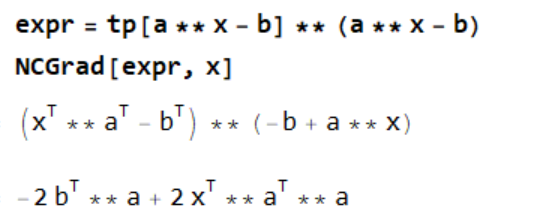

# mma矩阵微分

# Mma 矩阵微分

## 定义

Mathematica 可以很方便的计算符号函数，这里进一步介绍如何使用其来进行矩阵微分运算等操作。

## 流程

### 前置准备

- 安装 `NCAlgebra` 包
	- 参考 [https://github.com/NCAlgebra/NC](https://github.com/NCAlgebra/NC) 安装包文件
		- 建议直接下载 Archives

### 使用技巧

常用的几个基本命令：
- `**` 代表不可交换乘法
- 单个小写字符默认不可交换，其余均可交换
```mathematica
a**b-b**a==>a**b-b**a
A**B-B**A==>0
A**b-b**A==>0
```
	- `SetNonCommutative[]/SNC[]`可以指定不可交换
- `tp`=>转置
- `inv`=>逆
- `aj`=>伴随
- `NCGrad`=>求微分

#### 使用例子

```mathematica
<< NC`;
<< NCAlgebra`;
expr = tp[a ** x - b] ** (a ** x - b)
NCGrad[expr, x]
```

**result**



可以发现计算少了个转置，相比我们定义的 [矩阵求导](./../../math/线性代数/矩阵求导.md)，这是因为定义微元的时候差了一个转置所以给一个转置就行，即结果为 `NCGrad[expr, x]//tp` 即可

需要注意，计算 `NCGrad` 的时候不能计算可交换乘法，即==所有乘法必须要使用不可交换乘法进行计算==

### 参考文档


## 参考

- [GitHub - NCAlgebra/NC: NCAlgebra - Non Commutative Algebra Package for Mathematica](https://github.com/NCAlgebra/NC)
- [The NCAlgebra Suite - Version 5.0](https://mathweb.ucsd.edu/~ncalg/DOCUMENTATION/index.html#PackageNCDiff)
- [Basic · NCAlgebra/NC Wiki · GitHub](https://github.com/NCAlgebra/NC/wiki/Basic#inverses-transposes-and-adjoints)
