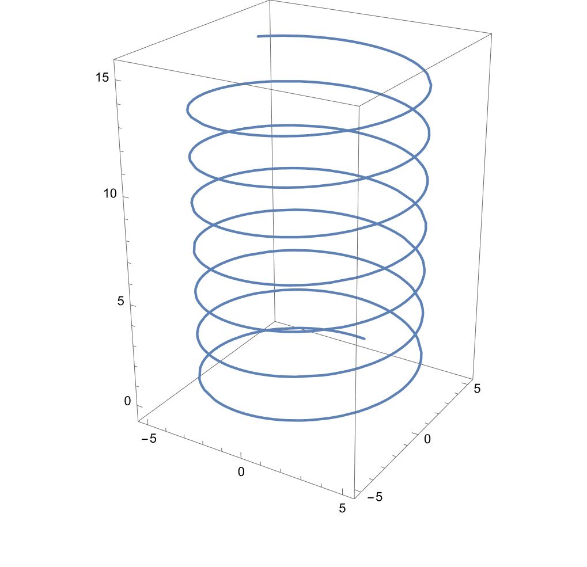
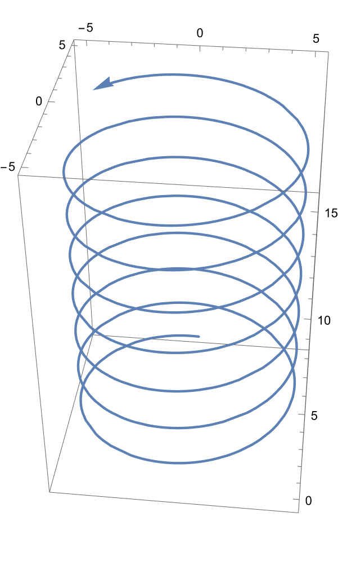
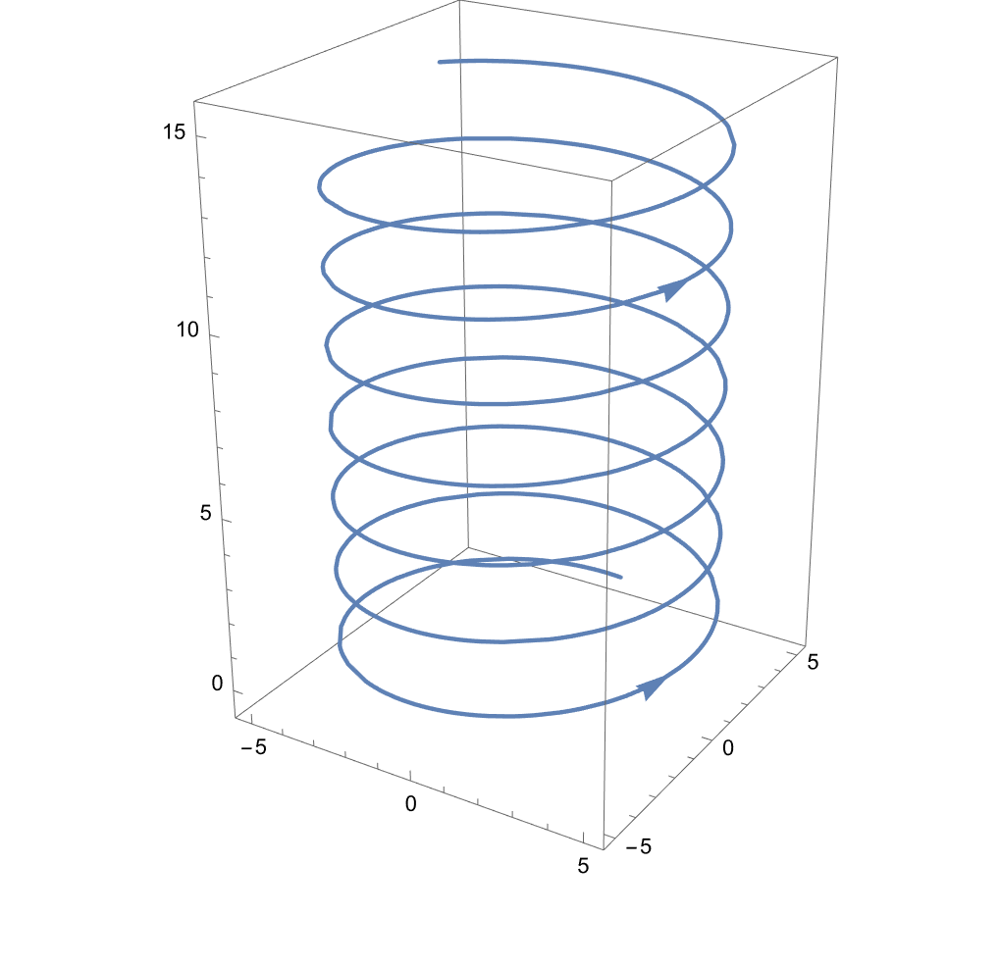

# mma绘制带方向的3D曲线


## 问题描述

绘制3D曲线的时候，特别是`ParametricPlot3D`的时候，我们期望绘制的曲线上带有箭头来标注曲线的方向

## 解决方案

对简单的曲线：

```mathematica
p1 = ParametricPlot3D[{-5 Sin[3 t], 5 Cos[3 t], t}, {t, 0, 15}];
```



### 简单方案——单箭头

```mathematica
p1 = ParametricPlot3D[{-5 Sin[3 t], 5 Cos[3 t], t}, {t, 0, 15}];
p1 /. Line -> Arrow
```



### 复杂方案——多箭头

```mathematica
p1 = ParametricPlot3D[{-5 Sin[3 t], 5 Cos[3 t], t}, {t, 0, 
   15}]; arrowheads = 
 Arrowheads@Transpose[{ConstantArray[Large, 2], {0.1, 0.8}}];
p1 /. Line[pts_] :> {arrowheads, Arrow[pts]}
```



其中给了2个箭头，分别为曲线的0.1和0.8节点处

## 参考

- [plotting - Adding arrow head at the end of ParametricPlot3D - Mathematica Stack Exchange](https://mathematica.stackexchange.com/questions/225621/adding-arrow-head-at-the-end-of-parametricplot3d)
