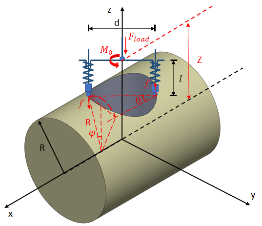
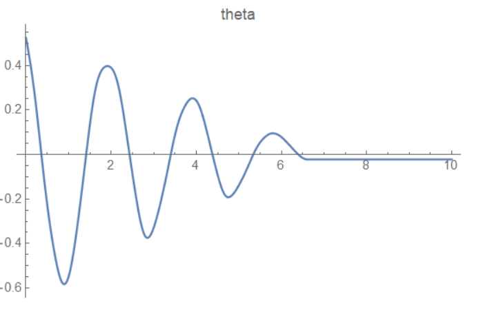
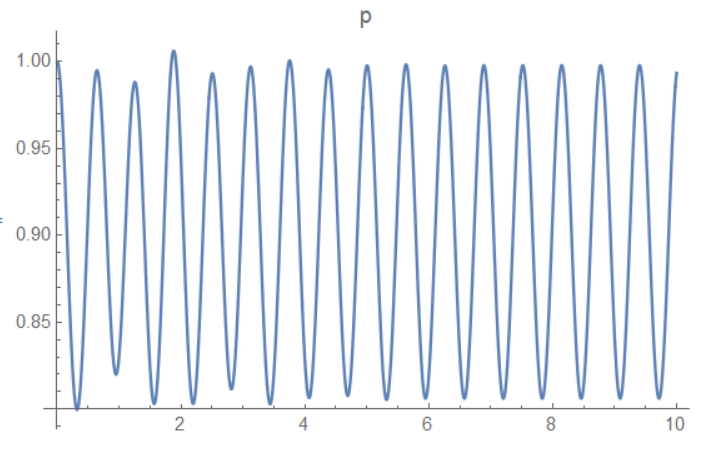
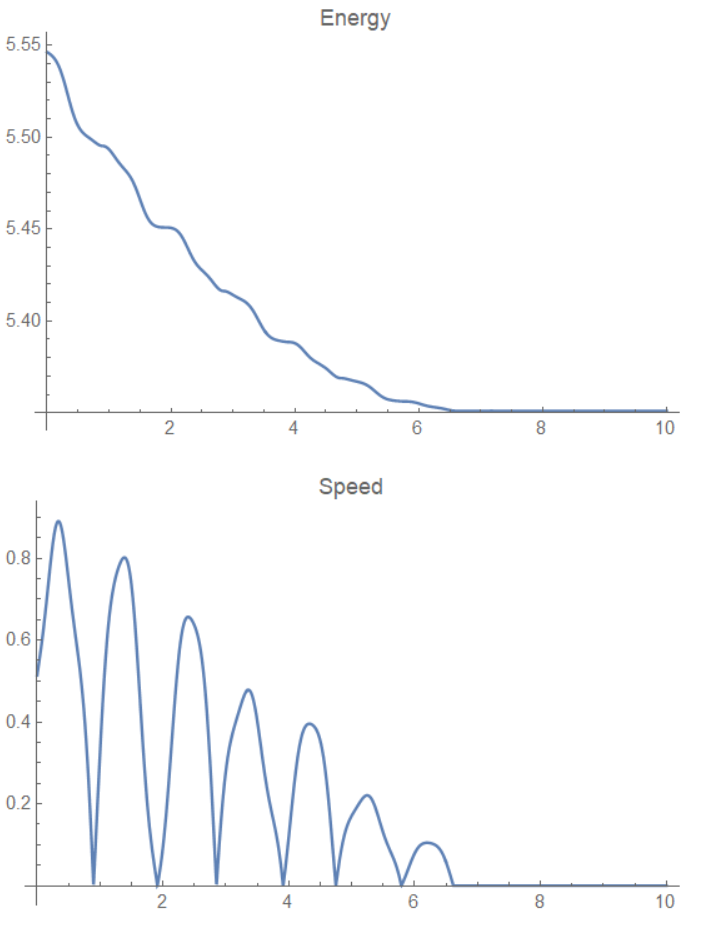
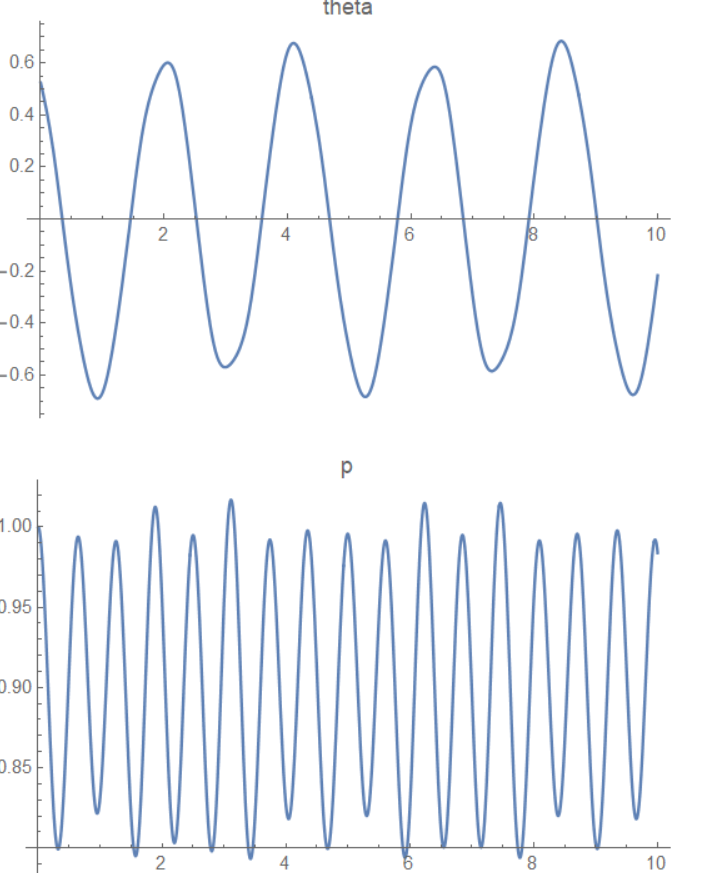
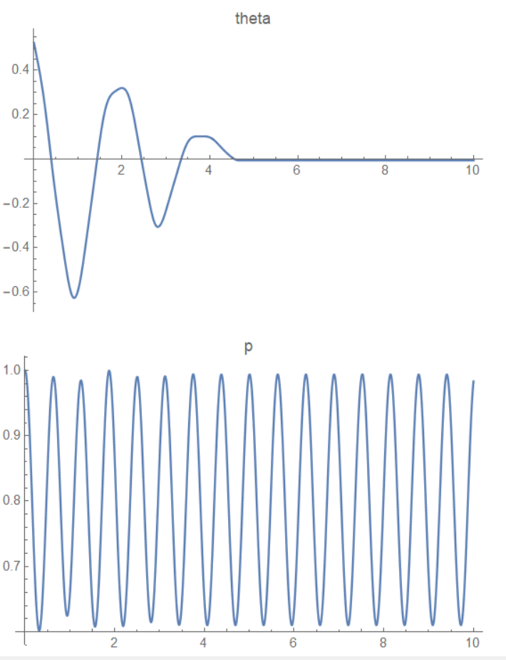
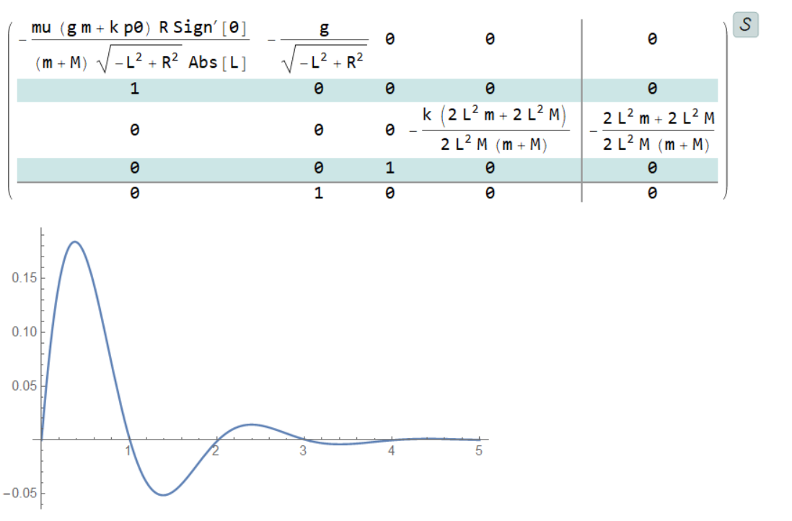
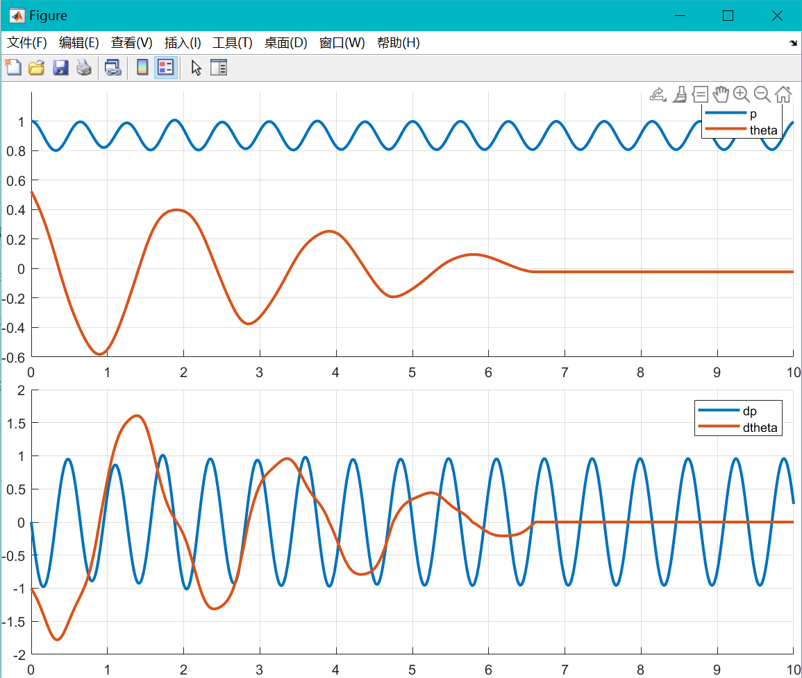

# 拉格朗日法动力学分析

# 拉格朗日法动力学分析


使用拉格朗日法分析物理动力学问题是一个常用的手段，下面列举几道在学习生活中遇见的问题，使用拉格朗日方程建立系统的动力学模型。

## 例子 1



上图是一个简单的夹持机构，主要工作场景如下：在棕黄色的圆柱面上建立坐标系 xyz，z 轴上有一个和 x-y 平面平行的转轴，转轴末端对称分布两个 z 向垂直向下的杆，杆上串联一个弹簧，弹簧末端是一个物体，被弹簧压在柱面上

现在要分析在给定系统初始条件的情况下，输入图中的 Fload 的力，看系统如何运动，希望能调节 F 使得系统最快稳定

容易发现，由于对称性，系统一共 2 个自由度：一个 z 轴转动，一个 z 轴弹簧长度。简化顶部杆为质量集中在两端，分别质量为 M，弹簧压着的物体质量分别为 m，L 为单根转轴和 z 轴距离，R 为底部圆柱面半径，p 为弹簧长度，theta 为绕 z 轴正方向转动角度，建立拉格朗日方程如下：

```mathematica
mx = -L Sin[theta[t]];
my = L Cos[theta[t]];
mz = Sqrt[R^2 - my^2];
mPos = {mx, my, mz};
mVel = D[mPos, t];
Mx = mx;
My = my;
Mz = mz + p[t];
MPos = {Mx, My, Mz};
T = 2 (1/2 m ((Map[#^2 &, D[mPos, t]]) // Total) + 
     1/2 M (Map[#^2 &, D[MPos, t]] // Total));
V = 2 (m g mz + M g Mz + 1/2 k ( p[t] - p0)^2);
Lag = (T - V);
f = mu  R/mz (m g + m D[mz, {t, 2}] + k (p0 - p[t]));
(*Mf=(Cross[mPos,-f*(mVel)]//Last)/Norm[mVel]/.params/.{t\[Rule]0.2}/.\
{theta[0]\[Rule]30Degree};*)
(*由于计算Normalize在初速为0的时候会0/0，直接得到公式*)
Mf = ((Cross[mPos, -f*(mVel)] // Last) /. { 
      Derivative[1][theta][t]^n_ /; n > 1 -> 
       Derivative[1][theta][t]^(n - 1) Sign[Derivative[1][theta][t]], 
      Derivative[1][theta][t] -> 
       Sign[ Derivative[1][theta][t]]})/(Norm[mVel] /. { 
      Derivative[1][theta][t] -> 1});
tend = 10;
tstart = 0;
params = {L -> 0.5, R -> 1, m -> 0.1, M -> 0.1, g -> 9.8, k -> 10, 
   F[t] -> 0, mu -> 0.02, p0 -> 1};
eqn1 = D[D[Lag, p'[t]], t] - D[Lag, p[t]] == -2 F[t];
eqn2 = D[D[Lag, theta'[t]], t] - D[Lag, theta[t]] == 2 Mf;
ic = {theta[tstart] == 30 Degree, p[tstart] == p0, 
    theta'[tstart] == -1, p'[tstart] == 0} /. params;
sol = NDSolve[{eqn1, eqn2, ic} /. params, {theta, p}, {t, tstart, 
    tend}];
Plot[theta[t] /. sol, {t, tstart, tend}, PlotLabel -> "theta", 
 PlotRange -> All]
Plot[p[t] /. sol, {t, tstart, tend}, PlotLabel -> "p", 
 PlotRange -> All]
Plot[T + V /. params /. sol, {t, tstart, tend}, PlotRange -> All, 
 PlotLabel -> "Energy"]
Plot[Evaluate[Norm[D[mPos, t]] /. params /. sol], {t, tstart, tend}, 
 PlotRange -> All, PlotLabel -> "Speed"]    
```

注意其中 f 代表物块和圆柱面摩擦力大小，Mf 为摩擦力力矩。Mf 写成这样是为了避免速度向量为 0 的时候带来的 0/0 问题，因为 Mf 只与速度向量的方向有关，因此分母出现的 theta' 全是平方项，即可以除到分子上，分子引入 sign 函数即可。

最后仿真结果如下：







其中初始状态为一个负的 theta' 和一个正的 theta，最终的仿真结果和猜想吻合，由于摩擦力停止位置不是最低点

阻尼取 0 时系统不会停止，一直震动；



增大外力 F 后系统收敛加快


此外，值得一提的是，MMA 可以使用 StateSpaceModel 将控制方程线性化，如下图：
```mathematica
sm = StateSpaceModel[{eqn1, 
   eqn2}, {{theta'[t], 0}, {theta[t], 0}, {p'[t], 0}, {p[t], 
    0}}, {{F[t], 0}}, {theta[t]}, t]
resp = OutputResponse[{sm, {1, 0, 0, 0}}, 0, t] /. 
    params /. {Derivative[1][Sign][0] -> 1};
Plot[resp /. params, {t, 0, 5}, PlotRange -> All]
```



以后做分析或许有用

### 转 Matlab 仿真

利用 [mma 表达式转matlab](./mma-表达式转matlab.md) 的技巧，可以轻松地将其转换到 matlab 中进行仿真，转换代码为：

```mathematica
sol = Solve[{eqn1, eqn2}, {theta''[t], p''[t]}];
pSol = sol /. {theta'[t] -> dtheta, theta[t] -> theta, p'[t] -> dp, 
    p[t] -> p};
L1 = ToMatlab[p''[t] /. pSol // First];
Export["C:\\Users\\randolf\\Desktop\\tests\\testMMACal\\getDDp.m", L1]
```

转换完的代码仿真结果为：



和 mathematica 中结果一样

仿真代码：

- [getDDp](./assets/getDDp.m)
- [getDDtheta](./assets/getDDtheta.m)
- [test](./assets/test.m)
- [testModel](./assets/testModel.m)

其中 `test.m` 是执行仿真的代码
