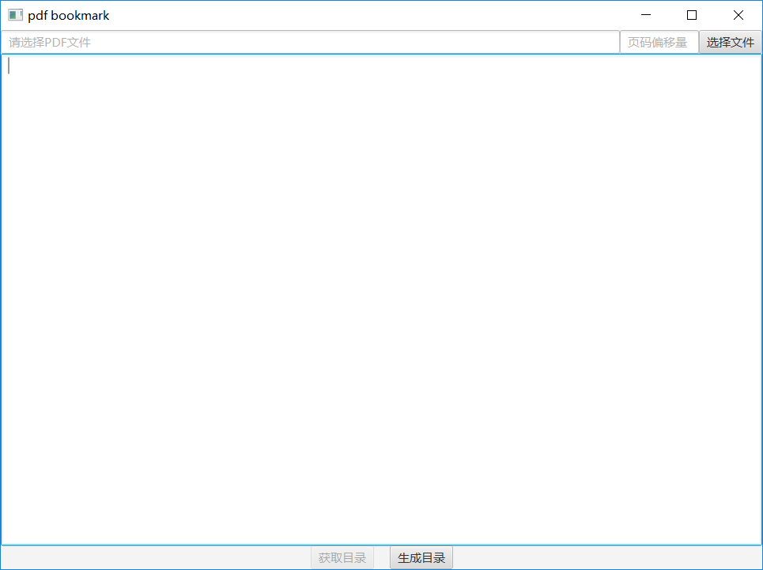
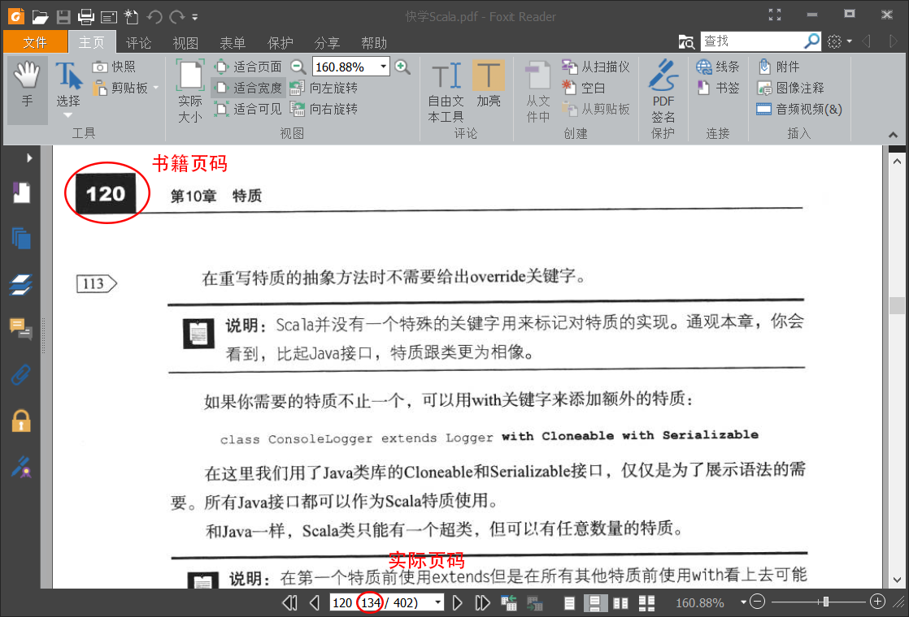
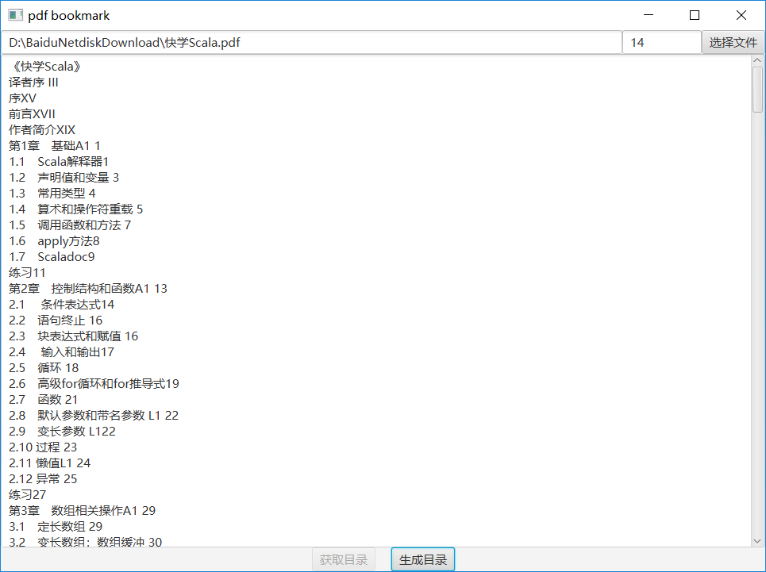
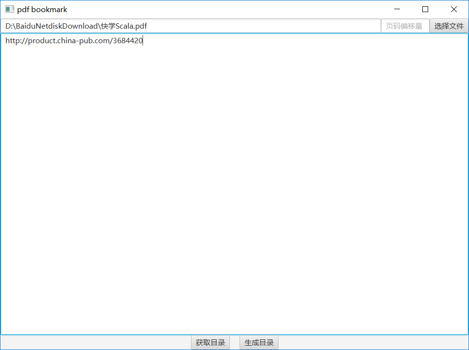
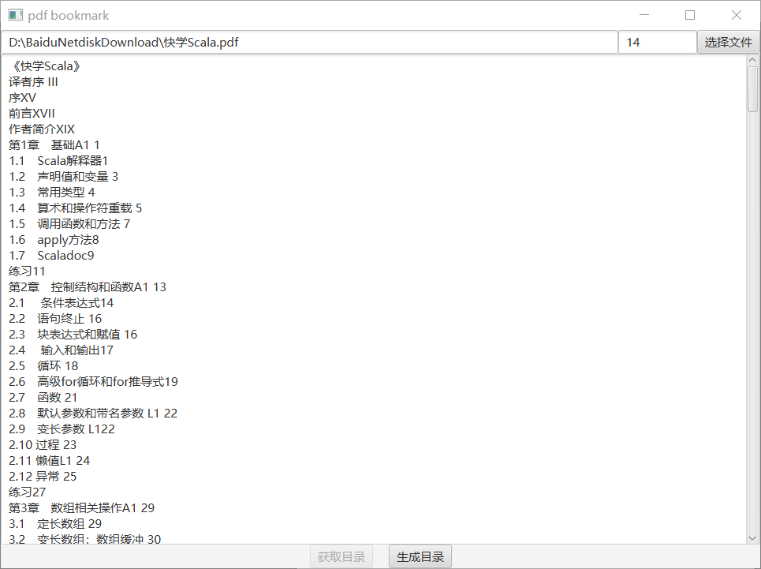
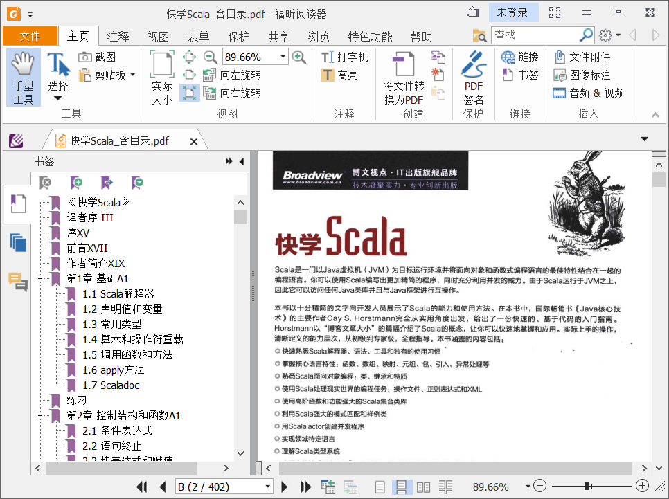

# Pdf 文件制作目录


## 定义

有时下载的 pdf 是图片的，没有目录，看起来很不方便，因此考虑使用工具添加目录。

使用这个工具： [assets\pdf-bookmark-1](.//)

## 使用方法

> 本文由 [简悦 SimpRead](http://ksria.com/simpread/) 转码， 原文地址 [github.com](https://github.com/ifnoelse/pdf-bookmark)

> pdf bookmark generator 目录 书签 大纲. Contribute to ifnoelse/pdf-bookmark development by creating an accou......

[English](https://github.com/ifnoelse/pdf-bookmark/blob/master/README-EN.md)

[#示例](.//) 示例


由于互联网上存在很多没有书签的 pdf 书籍，阅读起来十分不方便，手动添加书签工作量太大，本项目用来给 pdf 书籍自动打上书签方便阅读
**软件界面**
[](https://github.com/ifnoelse/pdf-bookmark/blob/master/img/main_gui.png)

[#使用方法](.//) 使用方法
-

### [#1-选择pdf文件](.//)1. 选择 Pdf 文件

点击 **选择文件** 按钮选择要添加目录的 pdf 文件

### [#2-填写页面偏移量](.//)2. 填写页面偏移量

有的 pdf 为扫描版，所以目录中的页码（书籍页码）可能与 pdf 文件实际页码不同，目录中的页码与 pdf 文件实际页码之间的差值（实际页码 - 书籍页码）即为页码偏移量。

#### [#21-确定页码偏移量的方法](.//)2.1 确定页码偏移量的方法：

打开 pdf 文件将 pdf 翻到任意带页码的一页，如下图，通过 pdf 阅读软件查看书籍中的页码与实际页码，将这两个数字相减即可得到页码偏移量，比如下图中的页码偏移量为 134-120=14 [](https://github.com/ifnoelse/pdf-bookmark/blob/master/img/page_offset_m.png)

### [#3-设置目录内容](.//)3. 设置目录内容

目前设置目录内容的方法有以下两种

#### [#31-在pdf-bookmark目录编辑框填入目录内容方法一](.//)3.1 在 Pdf-bookmark 目录编辑框填入目录内容（方法一）

#### [#32-或者包含此书目录内容的页面urlurl方式目前只支持china-pub方法二](.//)3.2 或者包含此书目录内容的页面 url（url 方式目前只支持 china-pub）（方法二）

#### [#33-示例](.//)3.3 示例

假设要给《快学 scala》自动生成目录书签，我们可以通过互联网书店找到目录内容，以 [china-pub](http://www](./assets/scala_exp_cp.png)](https://github.com/ifnoelse/pdf-bookmark/blob/master/img/scala_exp_cp.png)
以上为 **china-pub** 中书籍详情页目录部分，可以点击 **↓展开全部内容**然后将完整目录复制到 pdf-bookmark 目录编辑框中，或者直接将此页面 url 填入目录编辑框
**填入目录内容示例**
[](https://github.com/ifnoelse/pdf-bookmark/blob/master/img/scala_exp_bm1.png)
**填入 url 示例**
[](https://github.com/ifnoelse/pdf-bookmark/blob/master/img/scala_exp_bm2.png)

### [#4-生成目录](.//)4. 生成目录

点击 **生成目录**按钮会生成一个新的包含目录的 pdf 文件，如下图
[](https://github.com/ifnoelse/pdf-bookmark/blob/master/img/scala_exp_bm3.png)
生成之后的 pdf 目录截图
[](https://github.com/ifnoelse/pdf-bookmark/blob/master/img/scala_exp.png)

[#关于目录内容格式](.//)关于目录内容格式
---

目录内容格式基本结构为 ` 章节序号 章节标题 章节页码`即可，示例如下：

```
第1章　基础A1 1 
1.1　Scala解释器1 
1.2　声明值和变量 3 
1.3　常用类型 4 
1.4　算术和操作符重载 5 
1.5　调用函数和方法 7 
1.6　apply方法8 
1.7　Scaladoc9
```

## 参考

- [ifnoelse/pdf-bookmark: pdf bookmark generator 目录 书签 大纲 (github.com)](https://github.com/ifnoelse/pdf-bookmark)
