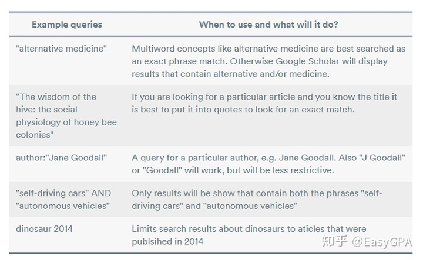

# 学术网站搜索

## 定义

介绍关于如何使用学术网站：
- google scholar
- web of science
- ieee

等学术网站的高级搜索功能，方便查找资料

## 方案

### Google Scholar

#### 基础规则

基础的检索规则有：
1. 搜索不区分大小写
2. 使用关键词而不是长句，比如：
	1. 不要用长句比如 "what is the current state of the technology used for self driving cars",而是明确关键词类似“ self-driving cars, autonomous vehicles, 或“driverless cars. ”
3. 引号内的检索词会被看作整体，分组的单词和确切的短语应该用引号包裹
4. 可以在搜索短语中添加年份来搜索限定年限文章
	1. 比如搜索：self-driving cars 2015
5. 布尔运算符
	1. 单词作为布尔运算符出现时，必须要大写
	2. **AND**：前后两个单词或者词组都要出现
	3. **NOT**：排除包含在其后的单词词组的检索结果
	4. **OR**：前后的单词词组有同样的权重，检索结果可仅匹配其一
	5. 
6. 可以使用 advanced search 进行进一步筛选

### Web of Science

#### 检索规则

::: note Assumption
不区分大小写

:::

##### 检索运算符

**AND**

查找同时包含被该运算符分开的所有检索词的记录。例如 Beverage AND bottle 查找同时包含这两个词语的记录。在大多数字段输入两个或两个以上相邻的检索词时，产品会使用隐含的 AND。例如标题检索式 rainbow trout fish farm 与 rainbow AND trout AND fish AND farm 等效，这两条检索式将返回相同数量的结果。

::: note note
隐含 AND 不适用于中文检索式
:::

**OR**

查找包含被该运算符分开的任何检索词的记录。例如 Beverage OR bottle 查找包含 beverage 或 bottle（或同时包含二者）的记录。

**NOT**

将包含特定检索词的记录从检索结果中排除。例如 Beverage NOT bottle 查找包含 beverage 但不包含 bottle 的记录。

**NEAR/x**

查找由该运算符连接的检索词之间相隔指定数量的单词的记录。 该规则也适用于单词处于不同字段的情况。该规则也适用于单词处于不同字段的情况。如果只使用 NEAR 而不使用 /x，则系统将查找其中的检索词由 NEAR 连接且彼此相隔不到 15 个单词的记录。不能在“出版年”字段使用。例如 Beverage NEAR/5 bottle 查找同时包含 beverage 和 bottle 的记录。两个单词间相隔必须在五个单词内。

**SAME**

在“地址”检索中使用，使用 SAME 将检索限制为出现在“全记录”同一地址中的检索词，你需要使用括号来分组地址检索词。例如 Mineral Resources SAME Beijing 查找记录的“地址”字段中某作者的地址同时包含检索词 Mineral Resources 和 Beijing 的记录。

当在其他字段（如“主题”和“标题”）中使用时，如果检索词出现在同一记录中，SAME 与 AND 的作用就完全相同。检索包含布尔运算符（AND、NOT、NEAR 和 SAME）的组织名称时，应始终使用引号 ( " " ) 将单词引起。

优先级：NEAR/x  SAME NOT AND OR

##### 通配符

**星号 (\*)** 表示任何字符组，包括空字符。
s\*food 可查找：seafood  soyfood
enzym\* 可查找：enzyme enzymes enzymatic
enzymicHof\*man\* 可查找：Hofman Hofmann  Hoffman Hoffmann

**问号 (?)** 表示任意一个字符。    
wom?n 可查找：woman women

**美元符号 ($)** 表示零或一个字符。
colo$r 可查找：color colour
grain$ 可查找：grain grains
organ?ation\* 可查找：organisation organisations organisational organization organizations organizational

##### 短语检索

**若要精确查找短语，请用引号括住短语。**

例如，检索式 "energy conservation" 将检索包含精确短语 energy conservation 的记录。这仅适用于“主题”和“标题”检索。

如果输入不带引号的短语，则检索引擎将检索包含您所输入的所有单词的记录。这些单词可能连在一起出现，也可能不连在一起出现。

例如，energy conservation 将查找包含精确短语 energy conservation 的记录。还会查找到包含短语 conservation of energy 的记录。

**如果输入以连字号、句号或逗号分隔的两个单词**，则检索词将视为精确短语。
例如，检索词 waste-water 将查找包含精确短语 waste-water 或短语 waste water 的记录。而不会查找包含 water waste、waste in drinking water 或 water extracted from waste 的记录。

**检索精确匹配的短语时，请不要 在引号内部使用 $ 符号，否则产品将检索不到结果。**

##### 其余杂项

括号括号用于将合成布尔运算符进行分组。例如，(Antibiotic OR Antiviral) AND (Alga\* OR Seaweed)	(Pagets OR Paget's) AND (cell\* AND tumor\*)

撇号撇号被视为空格，是不可检索字符。请确保检索不带撇号的不同拼写形式。例如，Paget's OR Pagets 可查找包含 Paget's 和 Pagets 的记录。

连字号输入带连字号或不带连字号的检索词可以检索用连字号连接的单词和短语。例如，speech-impairment 可查找包含 speech-impairment 和 speech impairment 的记录

### IEEE

和 [Web of Science](./#web-of-science) 基本一样

## 参考

##### 引文

- [Google Scholar终极使用指南 - 知乎](https://zhuanlan.zhihu.com/p/107911957)
- [WOS(Web of Science)检索规则_kiara_wei的博客-CSDN博客_wos检索式](https://blog.csdn.net/kiara_wei/article/details/70145566)
- [极简IEEE文献数据库入门介绍 - 知乎](https://zhuanlan.zhihu.com/p/488761118)
- [IEEE Xplore平台及其数据库的检索](https://wjk.usst.edu.cn/2020/0507/c10162a219532/page.htm)

##### 脚注
