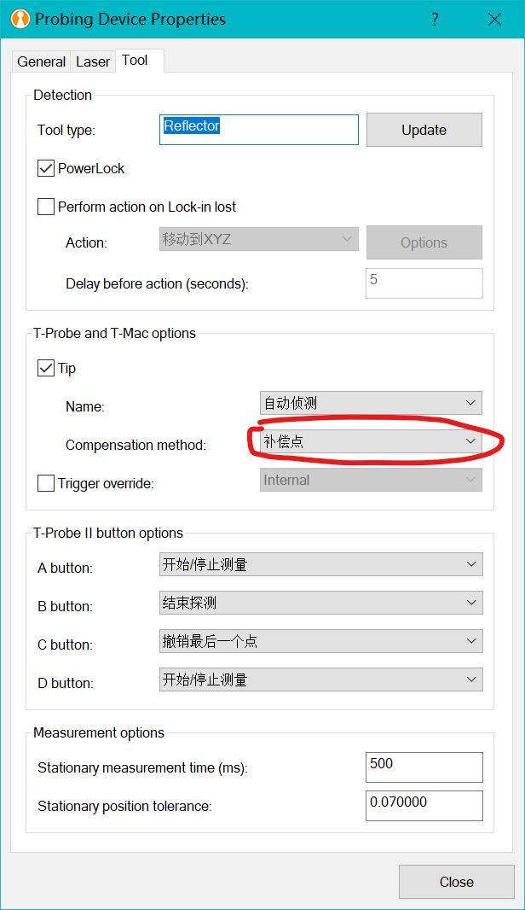
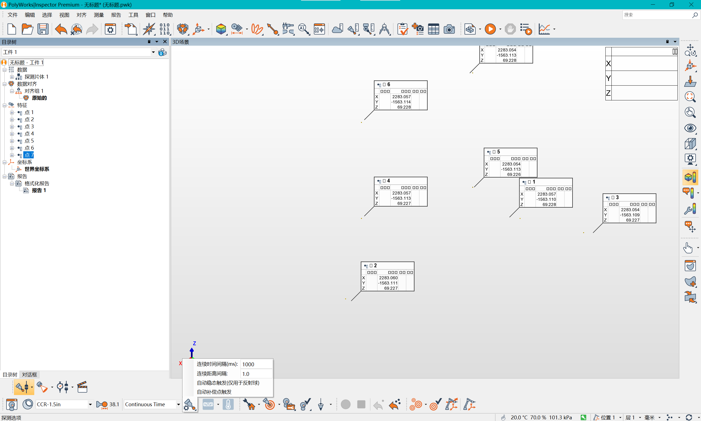
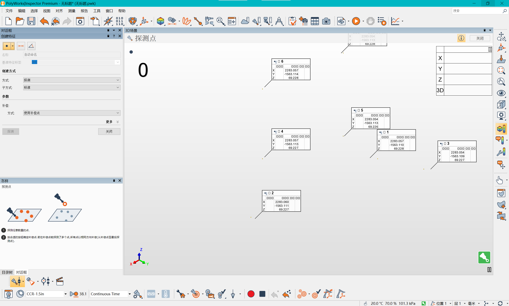
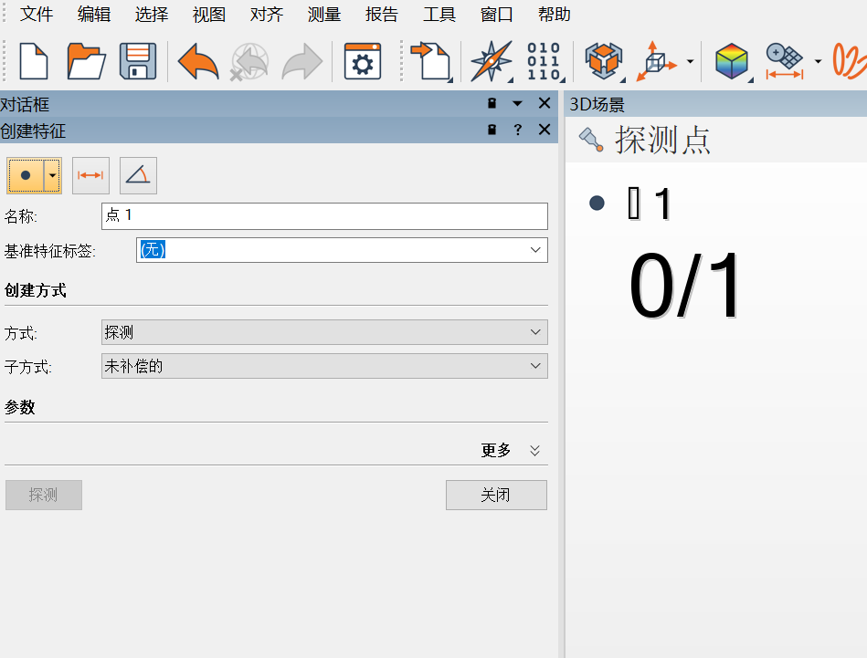

# 激光跟踪仪多点测量

# 激光跟踪仪多点测量

## 定义

激光跟踪仪多点测量配置：

1. 配置激光跟踪仪属性

2. 修改期望的连续控制时间

3. 开始测量 (注意左侧选取点特征参数配置)

::: note note
切界面，换窗口，显示别的应用似乎可以激光跟踪仪导出点速度
:::

## 正确的测量方式 2

点击特征后，选择点，未补偿，然后点击上面工具栏 0, 1 那个图标，即数据对象。
然后点击探测曲面点云就可以连续测量点了

导出的话，直接目录树下探测曲面，导出点云即可

## 参考

- None
