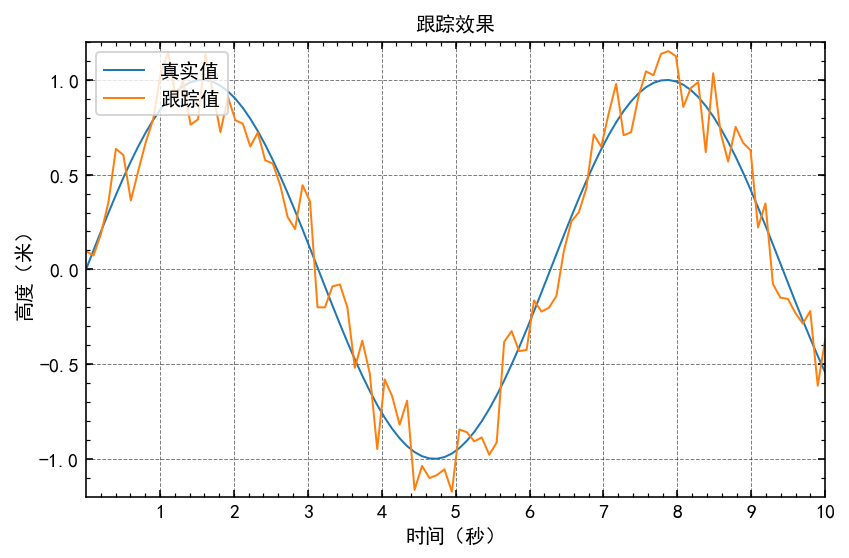
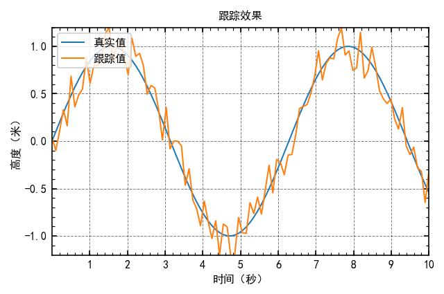
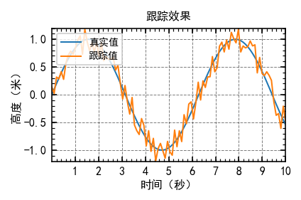
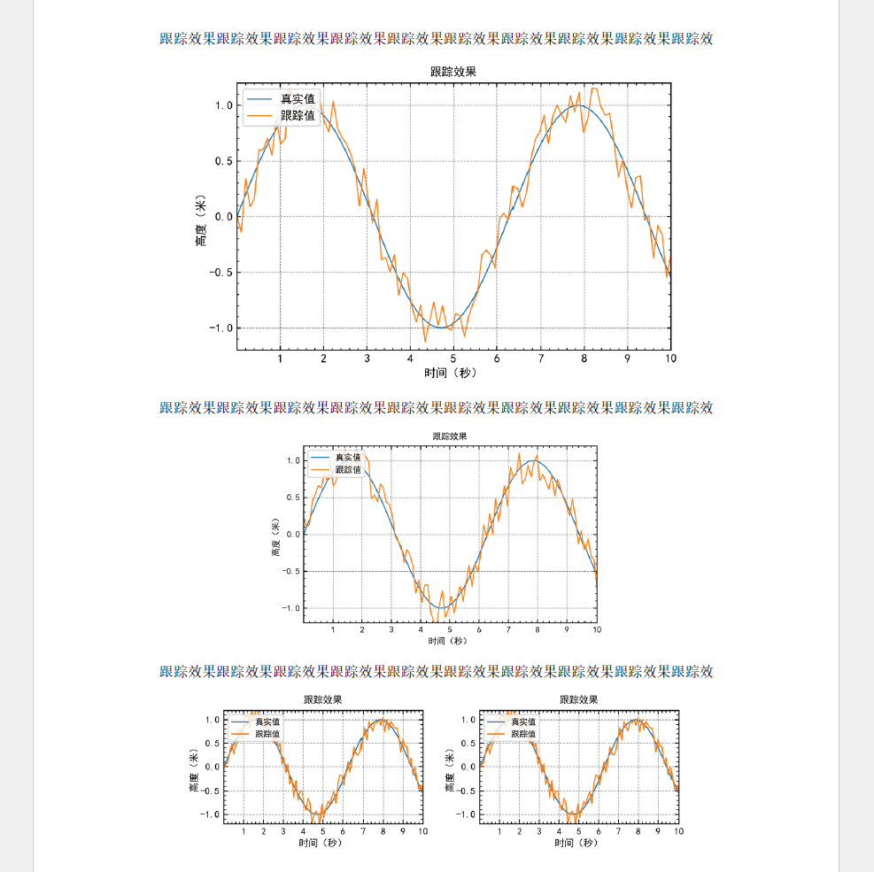
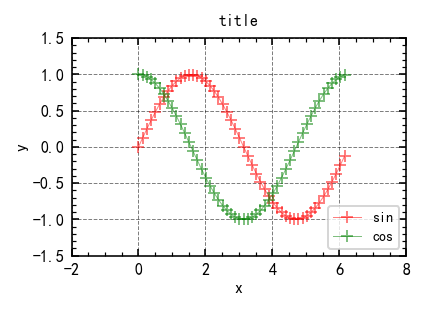
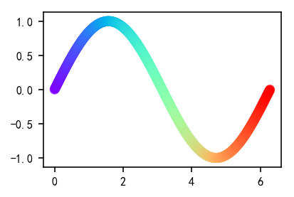

# Matplotlib 作图模板


> 来源：[我的Matplotlib绘图模板 · Zodiac Wang](https://zodiac911.github.io/blog/matplotlib-template.html#Matplotlib-%E8%AE%BE%E7%BD%AE%E5%85%A8%E5%AE%B6%E6%A1%B6)

## Jupyter 设置

```python
import matplotlib
import matplotlib.pyplot as plt
import matplotlib.pylab as pylab
from mpl_toolkits.mplot3d import Axes3D
import numpy as np
%matplotlib inline
%config InlineBackend.figure_format = 'retina'
```

## 基本设置

matplotlib 中的 figsize 对应的图片大小并不是分辨率，在 word 中直接体现为粘贴进去之后图片的长宽尺寸有多少英尺，而 dpi 决定了图片的清晰程度。

可以通过 `pylab.rcParams.keys()` 查看图片的各种属性

### 设置中文字体

```python
font_name = "SimHei"
# 指定字体，实际上相当于修改 matplotlibrc 文件　只不过这样做是暂时的　下次失效
matplotlib.rcParams['font.family'] = font_name
matplotlib.rcParams['axes.unicode_minus'] = False  # 正确显示负号，防止变成方框
```


### 尺寸推荐
matplotlib 中的 figsize 图片大小，对应的是粘贴到 word 里的宽高，单位为英寸

1 英寸=2.54 厘米

使用比例 宽：高 = 4:3

论文写作指南推荐的三种图片比例

```shell

原始厘米     转换英寸     取整英寸
6.67 * 5.00   2.62 * 1.95   2.6 * 1.95    适合双栏
9.00 * 6.75   3.54 * 2.66   3.5 * 2.625   适合普通单栏
13.5 * 9.00   5.31 * 3.54   5.4 * 4.05    适合较大图片

```

## 较大单栏图片

基本设置
```python
# 绘图参数，一次搞定
params = {
    'font.size': '10',
    'axes.titlesize': '10',
    'axes.labelsize': '10',
    'xtick.labelsize': '10',
    'ytick.labelsize': '10',
    'lines.linewidth': '1',
    'legend.fontsize': '10',
    'axes.labelpad': '3.0',
    'figure.figsize': '6, 4',
}
pylab.rcParams.update(params)
```

示例
```python
t = np.linspace(0, 10, 100)
# y = [47.0567, 50.1325, 50.3974, 46.4238, 51.5894, 50.1325, 47.2185, 45.7616, 54.7682, 49.7351]
y = np.sin(t)
y_ = y + 0.5*(np.random.random(t.shape[0])-0.5)

fig, ax = plt.subplots()

ax.plot(t, y, label=u"真实值")
ax.plot(t, y_, label=u'跟踪值')

ax.set_title(u'跟踪效果')
ax.set_xlabel(u'时间（秒）')
ax.set_ylabel(u'高度（米）')
ax.set_xlim(0, 10)
ax.set_ylim(-1.2, 1.2)
ax.set_xticks(np.arange(1, 11))
ax.legend(loc=2)  # upper left corner
ax.minorticks_on()  # 显示小刻度
ax.tick_params(which='both', direction='in',
               bottom=True, top=True, left=True, right=True)  # 控制坐标轴显示与否以及方向， which选择主次坐标刻度
ax.grid(color='k', alpha=0.5, linestyle='dashed', linewidth=0.5)
fig.tight_layout()
# plt.grid(True)
plt.savefig("data/test1.png", bbox_inches='tight', dpi=500)
plt.savefig("data/test1.pdf", bbox_inches='tight')
plt.savefig("data/test1.svg", bbox_inches='tight')
```



## 普通单栏图片

```python
# 绘图参数，一次搞定
params = {
    'font.size': '8',
    'axes.titlesize': '8',
    'axes.labelsize': '8',
    'xtick.labelsize': '8',
    'ytick.labelsize': '8',
    'lines.linewidth': '1',
    'legend.fontsize': '8',
    'axes.labelpad': '3.0',
    'figure.figsize': '4.5, 3',
}
pylab.rcParams.update(params)
```

数据例子：
```python
t = np.linspace(0, 10, 100)
# y = [47.0567, 50.1325, 50.3974, 46.4238, 51.5894, 50.1325, 47.2185, 45.7616, 54.7682, 49.7351]
y = np.sin(t)
y_ = y + 0.5*(np.random.random(t.shape[0])-0.5)

fig, ax = plt.subplots()

ax.plot(t, y, label=u"真实值")
ax.plot(t, y_, label=u'跟踪值')

ax.set_title(u'跟踪效果')
ax.set_xlabel(u'时间（秒）')
ax.set_ylabel(u'高度（米）')
ax.set_xlim(0, 10)
ax.set_ylim(-1.2, 1.2)
ax.set_xticks(np.arange(1, 11))
ax.legend(loc=2)  # upper left corner
ax.minorticks_on()  # 显示小刻度
ax.tick_params(which='both', direction='in',
               bottom=True, top=True, left=True, right=True)  # 控制坐标轴显示与否以及方向， which选择主次坐标刻度
ax.grid(color='k', alpha=0.5, linestyle='dashed', linewidth=0.5)
fig.tight_layout()
# plt.grid(True)
plt.savefig("data/test2.png", bbox_inches='tight', dpi=500)
plt.savefig("data/test2.pdf", bbox_inches='tight')
plt.savefig("data/test2.svg", bbox_inches='tight')
```



## 双栏图片

```python
# 绘图参数，一次搞定
params = {
    'font.size': '8',
    'axes.titlesize': '8',
    'axes.labelsize': '8',
    'xtick.labelsize': '8',
    'ytick.labelsize': '8',
    'lines.linewidth': '1',
    'legend.fontsize': '7',
    'axes.labelpad': '2.0',
    'figure.figsize': '3, 2',
}
pylab.rcParams.update(params)
```

```python
t = np.linspace(0, 10, 100)
# y = [47.0567, 50.1325, 50.3974, 46.4238, 51.5894, 50.1325, 47.2185, 45.7616, 54.7682, 49.7351]
y = np.sin(t)
y_ = y + 0.5*(np.random.random(t.shape[0])-0.5)

fig, ax = plt.subplots()

ax.plot(t, y, label=u"真实值")
ax.plot(t, y_, label=u'跟踪值')

ax.set_title(u'跟踪效果')
ax.set_xlabel(u'时间（秒）')
ax.set_ylabel(u'高度（米）')
ax.set_xlim(0, 10)
ax.set_ylim(-1.2, 1.2)
ax.set_xticks(np.arange(1, 11))
ax.legend(loc=2)  # upper left corner
ax.minorticks_on()  # 显示小刻度
ax.tick_params(which='both', direction='in',
               bottom=True, top=True, left=True, right=True)  # 控制坐标轴显示与否以及方向， which选择主次坐标刻度
ax.grid(color='k', alpha=0.5, linestyle='dashed', linewidth=0.5)
fig.tight_layout()
# plt.grid(True)
plt.savefig("data/test3.png", bbox_inches='tight', dpi=500)
plt.savefig("data/test3.pdf", bbox_inches='tight')
plt.savefig("data/test3.svg", bbox_inches='tight')
```



## 在 Word 中显示比例对比

直接使用 png 文件粘贴，宽度在 word 内分别按比例调整为 **13 9 6.67 厘米**



## 快速画图模板

```python
fig, ax = plt.subplots()
# ax.set_aspect('equal','box') # 设置坐标轴比例

t = np.linspace(0, 2*np.pi, 50, endpoint=False)
sins = np.sin(t)
coss = np.cos(t)

ax.plot(t, sins, 'r', alpha=0.5, lw=0.5, ls='-', marker='+', label='sin')
ax.plot(t, coss, 'g', alpha=0.5, lw=0.5, ls='-', marker='+', label='cos')

ax.set_title('title')
ax.set_xlabel('x')
ax.set_ylabel('y')
ax.set_ylim([-1.5, 1.5])
ax.set_xlim([-2, 8])
# xticks = [1, 2, 3, 4, 5]
# ax.set_xticks(xticks)
# ax.set_xticklabels([r'$\alpha$', r'$\beta$', r'$\gamma$', r'$\delta$', r'$\epsilon$'], fontsize=18)
# yticks = [0, 1, 2, 3, 4]
# ax.set_yticks(yticks)
# ax.set_yticklabels(["$%.1f$" % y for y in yticks], fontsize=18); # use LaTeX formatted labels
# ax.set_yscale("log")
# ax.xaxis.labelpad = 5
# ax.yaxis.labelpad = 5
ax.legend(loc='lower right')
ax.minorticks_on()  # 显示小刻度
ax.tick_params(which='both', direction='in',
               bottom=True, top=True, left=True, right=True)  # 控制坐标轴显示与否以及方向， which选择主次坐标刻度
# ax.spines['right'].set_color("none") # 取消右边坐标轴的显示
ax.grid(color='k', alpha=0.5, linestyle='dashed', linewidth=0.5)

# fig.subplots_adjust(left=0.15, right=.9, bottom=0.1, top=0.9)  # 调整绘图在整个画布中的位置
fig.savefig("data/test4.png", bbox_inches='tight', dpi=500)
fig.savefig("data/test4.pdf", bbox_inches='tight')
fig.savefig("data/test4.svg", bbox_inches='tight')
plt.show()
```



## 好看的 Cmap

```python
t = np.linspace(0, 2*np.pi, 1000, endpoint=True)
y = np.sin(t)
cs = matplotlib.cm.rainbow(np.linspace(0, 1, 1000))

plt.scatter(t, y, color=cs, alpha=0.5)
```



## 参考

##### 引文

- [我的Matplotlib绘图模板 · Zodiac Wang](https://zodiac911.github.io/blog/matplotlib-template.html#Matplotlib-%E8%AE%BE%E7%BD%AE%E5%85%A8%E5%AE%B6%E6%A1%B6)

##### 脚注
