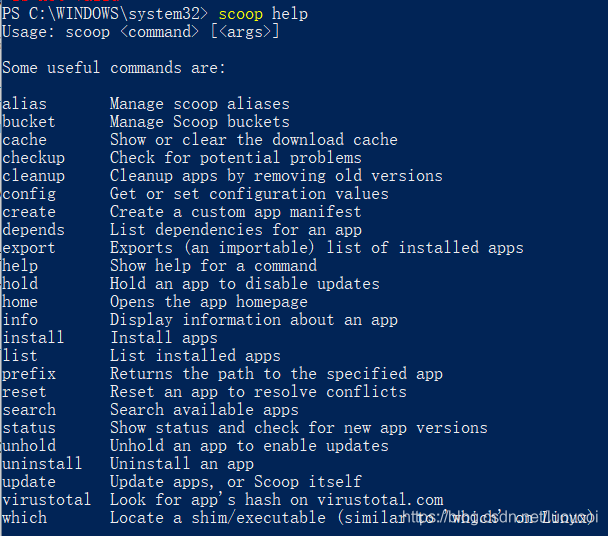
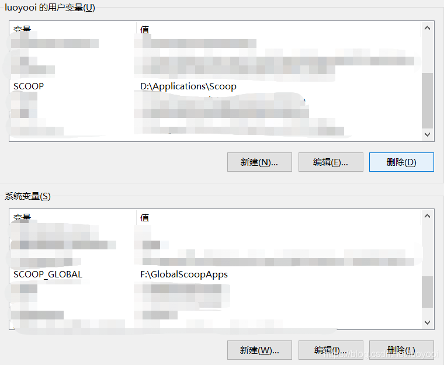
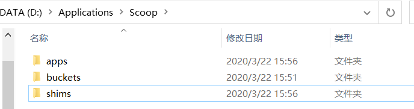

# windows scoop配置

# Windows Scoop 配置


## 定义

注意，github 加速访问可以参考==[git加速访问](./../git/git加速访问.md)==.

### Scoop 简介

Scoop 是 Windows 的命令行安装程序，是一个强大的包管理工具。可以在 github 上找到其项目的相关信息，[项目网址](https://github.com/lukesampson/scoop)。

安装的起因：在平常生活中如果要安装像 gcc、git 等一些需要手动配置相关参数的工具，需要先去官网下载安装程序，点击安装，之后还需要配置，不仅过程麻烦，而且工具多了之后整理起来也相当不容易，配置也很杂，整个电脑就像被污染了一样。而 scoop 可以很好地解决这一问题，安装 scoop 后，只需要在命令行输入简单的一串命令即可安装你想要的软件。比如我想安装 gcc，只需要输入

```
scoop install gcc
```

scoop 会把软件下载、安装、配置等步骤全部帮你做完。

### Scoop 安装

##### 环境需求

1、Windows 7 SP1 + / Windows Server 2008+
2、 PowerShell 5（或更高版本，包括 PowerShell Core）和. NET Framework 4.5（或更高版本）
3、必须为您的用户帐户启用 PowerShell，例如 Set-ExecutionPolicy -ExecutionPolicy RemoteSigned -Scope CurrentUser

##### 安装

在 PowerShell 中运行以下命令，将 scoop 安装到其默认位置 `(C:\Users<user>\scoop)`

```
Invoke-Expression (New-Object System.Net.WebClient).DownloadString('https://get.scoop.sh')
# 或
iwr -useb get.scoop.sh | iex
```

安装完成后，输入 scoop help 验证是否成功（常见的命令可以通过此方法来查看）。

用户安装的程序和 scoop 本身位于 ` C:\Users<user>\scoop`。全局安装的程序（–global) 位于 `C:\ProgramData\scoop`。可以通过环境变量更改这些设置。具体步骤如下：

##### 将 Scoop 安装到自定义目录 (命令行方式)

```
$env:SCOOP='D:\Applications\Scoop'
[Environment]::SetEnvironmentVariable('SCOOP', $env:SCOOP, 'User')
```

##### 将 Scoop 配置为将全局程序安装到自定义目录 SCOOP_GLOBAL(命令行方式)

```
$env:SCOOP_GLOBAL='F:\GlobalScoopApps'
[Environment]::SetEnvironmentVariable('SCOOP_GLOBAL', $env:SCOOP_GLOBAL, 'Machine')
```

##### 上面两句运行的结果 (环境变量)


如果不想运行命令行，直接添加环境变量也可。设置完安装位置后，建议将默认目录下的所有文件复制到新目录下 

##### 安装 aria2 以加快 Scoop 下载软件的速度

Scoop 可以利用 aria2 来使用多连接下载。通过 Scoop 安装后，可用于以后的所有下载，命令如下:

```
scoop install aria2
```

aria2 相关配置

```
aria2-enabled (默认值: true)
aria2-retry-wait (默认值: 2)
aria2-split (默认值: 5)
aria2-max-connection-per-server (默认值: 5)
aria2-min-split-size (默认值: 5M)
```

设置安装位置后 aria2 安装到了新位置


### 软件下载

输入如下命令即可安装需要的软件

```
scoop install <软件名>
```

如果是安装到 global 目录，命令如下：

```
scoop install -g <软件名>
```

##### 软件搜索

```
scoop search <软件名>
```

##### 添加软件库

因为并不是所有的软件都有，所以可以通过添加 “软件库” 来找到自己想要的软件，例如下列：
1、main - Default bucket for the most common (mostly CLI) apps
2、extras - Apps that don’t fit the main bucket’s criteria
3、games - Open source/freeware games and game-related tools
4、nerd-fonts - Nerd Fonts
5、nirsoft - A subset of the 250 Nirsoft apps
6、java - Installers for Oracle Java, OpenJDK, Zulu, ojdkbuild, AdoptOpenJDK, 7、Amazon Corretto, BellSoft Liberica & SapMachine
8、jetbrains - Installers for all JetBrains utilities and IDEs
9、nonportable - Non-portable apps (may require UAC)
10、php - Installers for most versions of PHP
11、versions - Alternative versions of apps found in other buckets
添加方式：

```
scoop bucket add bucketname
```

更多仓库可以参考：

[Scoop buckets by bucket name | scoop-directory (rasa.github.io)](https://rasa.github.io/scoop-directory/by-bucket.html)

### 一步到位

```
# 安装scoop
Set-ExecutionPolicy -ExecutionPolicy RemoteSigned -Scope CurrentUser
Invoke-Expression (New-Object System.Net.WebClient).DownloadString('https://get.scoop.sh')

# 设置环境变量
$env:SCOOP='D:\Applications\Scoop'
[Environment]::SetEnvironmentVariable('SCOOP', $env:SCOOP, 'User')
$env:SCOOP_GLOBAL='F:\GlobalScoopApps'
[Environment]::SetEnvironmentVariable('SCOOP_GLOBAL', $env:SCOOP_GLOBAL, 'Machine')

# 设置环境变量之后，建议将默认目录下的所有文件复制到新目录下

# 开始安装软件
scoop install aria2
# scoop install <软件名>
# global目录下安装：scoop install -g <软件名>

# 找不到软件？添加软件库
scoop bucket add <bucketname>
```

## 参考

- [(19条消息) Windows下Scoop安装、配置与使用_luoyooi的博客-CSDN博客_scoop](https://blog.csdn.net/luoyooi/article/details/102990113)
- [Scoop buckets by number of stars | scoop-directory (rasa.github.io)](https://rasa.github.io/scoop-directory/by-stars.html)
