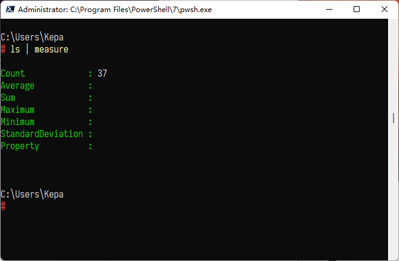

# 01-powershell- 对象和管道


> [PowerShell 教程 №1：对象，管道与四个重要命令 - 少数派](https://sspai.com/post/72518)
## 定义

Powershell 是一个很强的工具，特别是在入坑 C#之后，感觉其中对象的思想很浓厚，但一直没有很好的接触过Powershell，这里给一个介绍

## 安装

首先需要做的是让 PowerShell 运行起来，不然什么都干不了。要是你搜索「Windows PowerShell」的话，能发现 Windows 预置了 PowerShell。但是，我不建议使用这个，因为这是旧版本 PowerShell，版本为 5，微软近期也不准备更新它

你真正需要的是一个合适的新 PowerShell：访问此 [GitHub 链接](https://github.com/PowerShell/PowerShell)，你能找到适用于 Windows、Linux 等全平台的 PowerShell 下载地址。找时间下载并安装好 PowerShell。我们正式开始探索它。

::: note note
译者注：这个新 PowerShell 当前版本号为 7.x，又被称为 PowerShell Core。读者可直接从 [微软应用商店](https://www.microsoft.com/store/apps/9MZ1SNWT0N5D) 中下载。

输入 $PSVersionTable 可以获取 PowerShell 的版本信息


:::


## 基本思想——对象

首先要讲的是 PowerShell 最基础的概念, 它也是构筑 PowerShell 大厦的砖瓦。

在其他的命令行程序中，比如说 bash，每一个命令都会返回一个东西。那就是文本，每个命令都是如此。例如，你执行了 ls，它输出了文本然后交付给你，之后你可以用管道将文本传给另一个命令，确实，这很简单，但也有很大的局限性。

然而，PowerShell 采用了另一种方案，命令输出的不是文本，它们给出的是 **对象**，每一个对象都代表着一些东西。以 PowerShell 中同样存在 ls 为例，不像在 bash 中输出文本，PowerShell 给了我们许多对象，每一个对象都代表着某个文件或者目录。深入研究其中一个对象，能发现每个对象都由更小的部分组成，我们就叫它们 **属性**

### 管道

从命令中获得了对象后，但要是不能操作这些对象，一切没有意义。我们需要能将 ls 给出的对象们交给另一个命令去处理。类似于 bash，这里需要用到管道（符号：竖杠 |）。

接下来，使用名为「Format-List」的命令。这个命令的作用是，一个接着一个地列出对象和它们的属性。我们要运行 ls 命令，然后将 ls 的输出传给 Format-List，Format-List 会把对象转换为文本展示给我们。就像这样。


你能看到它已经列出了所有的对象和对象的每一个属性。

此外还有一个命令叫 Format-Table，它实际上是早先 PowerShell 自动运行的，像我们之前看到的那样，它能将对象以表格的形式列出来。

::: note note
这就是为什么默认打印是一个table

:::


PowerShell 会自动选择最好的视图展示给我们：列表或者是表格。

接下来我们看另一个命令：Get-Process。它能给出计算机运行的所有进程，Process 并不是复数形式，这很奇怪，但 PowerShell 命令大多如此。比如说，获得 Windows 上所有运行的服务，命令是 Get-Service，也不是复数形式。其他命令也是如此。

::: note note
译者注：后面我们会学到，PowerShell cmdlet 命令的基本构成是：*表示动作的词 + 连字符 + 单数名词*。尽管 PowerShell 对大小写不敏感，但习惯遵循**单词首字母大写**的原则，这也被称为 Pascal 命名法。
:::


### Measure

接下来学习另一个短小的命令： measure（Measure-Object 的简写），它能告诉我们对象的数据。我们把 ls 输出的对象交给 measure，看看这里的 Count，它告诉了我们一共有多少数量的对象：



你可能注意到，measure 也能活动平均数和总和。对上面的情况中，我们没有请求它这么做，所以 measure 不会去尝试。要是我们硬是要求它去做的话，在上面的案例中也不会有效，因为你显然不能求得目录的平均数。不过如果我们给的是一系列数字对象，我们就能用 measure 去算出这些数字的统计数据。

另外，也你能注意到这一次 PowerShell 选择了列表视图，这大概是因为 measure 命令只输出了一个对象，而这一个对象仅有 7 个属性。不过如果我们就是想让它用表格的形式的话，我们可以把输出的一个对象，传递给 Format-Table：


### Where

第一个要介绍的是 Where 命令，这个命令极其重要：**Where 可以让我们能够根据某些条件，过滤对象。**

::: note comment
实际上有点像数据库里面的where，或者说是C#里LINQ的部分，包括其中的模式匹配
:::


```powershell
ls | where { $_.Extension -eq ".txt" }
```

其中 ` $_` 代表一个匹配的对象模式，而 `-eq` 代表相等运算

### Sort

下面，我们不用 measure，换用另一个命令。上面的看起来还行，但它们不是按顺序排列的。我想获得一个按 ID 排序的进程列表，这就要用到 sort 命令。使用方法也很简单：写下 sort，在大括号中，告诉它要按哪种属性排列。在这个例子中，就是 ID。

命令就这么多，现在的结果已经是按序排列的了：


### Foreach

::: note comment
就是C#中的 `foreach`

:::


ForEach 的作用是遍历给定的每一个对象，对每一个对象执行给定的操作。

比如说，运行 ls 命令，得到了三个文件，这里有三个对象，每个对象表示了一个文件。如果我想要针对每一个文件都打印出「I found a file」，这就用到了 ForEach。首先，我们要获得全部的文件，然后将文件传递给 ForEach。

ForEach 的用法是，打出 ForEach，后面跟上一个大括号。括号中的命令会对每一个对象生效。和其他的命令行一样，打印一个信息命令是 echo，我们需要做的是：每有一个对象，就打印出「I found a file」：


### 案例

下面我们要获得所有 ID 大于 4000 的进程，然后计算出它们 CPU 时间的平均数和总数。读者可以首先自己尝试一下，所有的知识都在前面讲过了。

命令如下：

```powershell
Get-Process | where {$_.Id -gt 4000} | foreach {$_.CPU} | measure -All -Average
```


::: note note

在5.x版本中运行效果如上，只能说确实不太行
:::


## 参考

##### 引文

- [PowerShell 教程 №1：对象，管道与四个重要命令 - 少数派](https://sspai.com/post/72518)

##### 脚注
