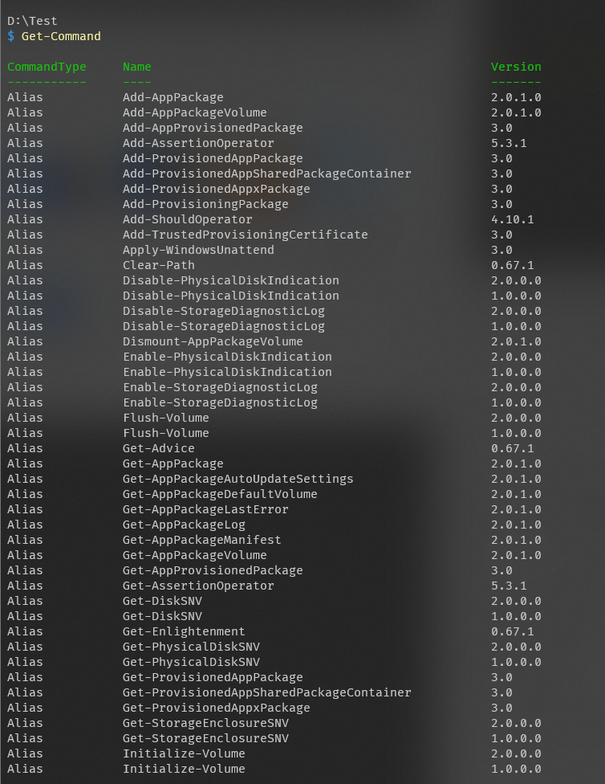
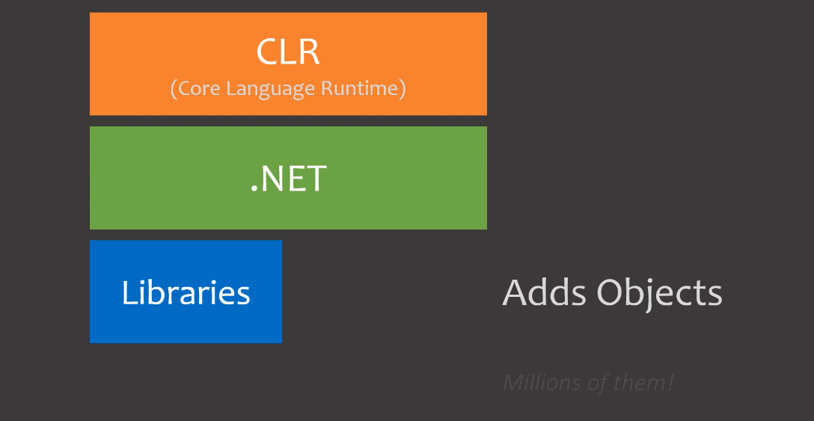
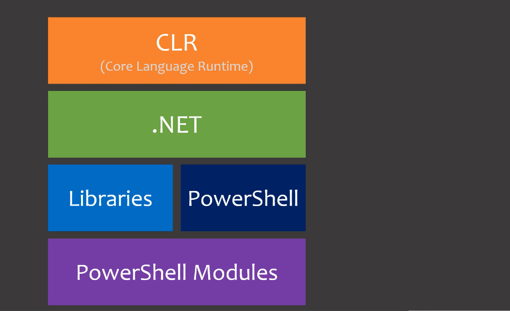

# 02-powershell-命令和参数

# 02-powershell- 命令和参数

> [PowerShell 教程 №2：命令，参数，别名和内部架构 - 少数派](https://sspai.com/post/72578)

## 别名

那么，我们开头还以文件为例。当你在使用 PowerShell 的时候，角括号后面的这个路径就是目前所在的目录，当前目录会影响许多命令，这些命令常常和文件相关。目前我在 Test 目录中，如果我运行 「ls」，我们可以看到这个文件夹里的所有东西，这里有一个 「Inner」文件夹：

如果我想进入此目录，可以使用一个叫做 「Set-Location」 的命令，它能设置我们当前所处的目录，只要告诉它我们要进入哪个文件夹即可

很明显，每次你想要改变当前位置时，都要写 「Set-Location」，很麻烦。这就是为什么 PowerShell 有一个叫做 「别名」 的东西。**一个别名基本上就是一个命令的简单的写法**。实际上我们已经用了不少别名：例如，「Where」这个命令实际上并不是一条命令，而是一个别名，全称是：「Where-Object」；「ls 」，它也不是一个命令，它实际上是「Get-ChildItem」。

你可能想，这算个什么命令（为什么不是 Get-Files 之类）？它叫这个实际上有一个非常重要的原因，这就引出了下一个部分内容。

## 驱动器

在 PowerShell 中，「cd」能把你的位置设置为不是文件夹的地方，然后自然地浏览其中的内容。例如，在一台 Windows 机器上，你可以 cd 进入注册表。PowerShell 能像文件和文件夹一样，从命令行中浏览注册表。

这就是为什么这个命令被称为 「Get-ChildItem」，因为它是子项，是我们所在位置的就是一小部分，可以是注册表项，也可以是文件和文件夹，也可以是其他的一些东西，一切取决于我们在哪。那么，这究竟是如何实现的。

*PowerShell 把所有的条目都组织成 「驱动器」，这是它处理项目的方式*。而我们通常表示一个驱动器的方式是：写上名字，后面加一个冒号（有例外）。如果你使用的是 Windows 系统，你有很多硬盘和设备，它们都将显示为一个驱动器，就类似于它们在文件资源管理器和和路径中显示的那样，因而，你能看到 「C:」 和 「D:」 等驱动器。另外，Windows 中，PowerShell 也会把注册表的某些部分看作是一个驱动器，所以，你也可以导航到那些地方。如果你用的是 Linux，你可能只有一个驱动器，那就是根目录。

那么，就以 Windows 系统上的驱动器为例。要在 PowerShell 中看到我们目前拥有的所有驱动器，可以使用 「Get-PSDrive」 命令，就像这样：

你会注意到，有一个用于注册表的驱动器。像这样写上它的名字，并在后面加上一个冒号，那么我就能 cd 进入此驱动器，我现在就在注册表里了，要是我用 「ls」，我就会得到一份所有注册表项目的列表：

::: note comment
试着进入 Alias: 驱动器，使用 ls 看看会发生什么
:::

## 命令

**一个命令就是一个对象**

这是我个人最喜欢 PowerShell 的地方之一：一切都和对象相关——一切。只要你理解了这些对象（将在这个系列中逐渐深入讲解），你就学会了 PowerShell，所有东西构建在同一个系统之上，这个系列会帮助你学好这个对象系统，之后你就知道一切是如何工作的，

话说回来，试着假想一下这个问题：如果你要做一个用于表示 PowerShell 命令的对象，你会给它加上什么属性？一个命令应该由哪些东西组成的？

好吧，首先得有一个名称。每个命令都有一个名字，你要输入这个名称然后才能运行，对吧？那么就把 Name 属性加上去。

这个命名实际上是由两部分组成的。在 PowerShell 中，几乎每个命令都是由 「动词 - 名词 」构成的，其中的 「名词 」是单数。例如，「Get-Process 」和 「Get-Service」，以及 「Set-TimeZone 」等等。要是这些动词名词也有相应的属性就好了，如此一来我们就可以轻松地获得这些属性，以备不时之需。

此外，命令还能由什么构成？当你写命令的时候，你在命令后面写什么？命令后面应该是参数。例如，当我输入 「mkdir」时，要建立一个文件夹，我输入的是 「mkdir」 加上一个文件夹名称，那个文件夹的名字就是一个参数，所以，我们也应该将命令所拥有的各种参数作为属性。

## 参数

接着，我想实际谈一谈参数。什么是参数？参数本质上是给一个命令提供更多细节的方式。

假设，我们有一个的想象中的命令，就叫它 「Subscrib-Channel」吧。这个命令会订阅你输入给它的任何频道。那么，你告诉它你想订阅什么频道就是在使用参数。这个参数是必要的——你必须给它这个参数，因为它得知道你要订阅什么频道才能运行。我们还能设置一个参数，用于选择是不是要打开某些通知，这是可选的，如果你不提供这个参数，那么它就假定你想要开启所有的通知。

我在 PowerShell 中写了这个脚本，这个命令功能只是输出我输入给它的参数，后面会介绍如何做到这一点，现在用这个命令来演示上面的例子。

我们有两种方法可以提供参数：我们可以按顺序键入，在这种情况下，我知道第一个参数是频道名称，所以就输入 「ABMedia」；我知道第二个参数是订阅通知，就像这样：

如果想要更精确一点，或者键入一个不能按顺序提供的参数，我们可以准确地告诉命令我们想改变哪个参数。也就是说，假如我想先写 「NotificationLevel」，再输入 「ChannelName」，我们需要明确指定每次想改变的参数名称。指定参数的方法是先写一个「-」（短横杠），后面跟上参数名称。因而，把 「NotificationLevel」 设置为 「None」的话，需要写「-NotificationLevel」，也就是该参数的名称，接着是一个空格，在这里写上我想设置的内容。输入 「Some」，然后再把「-ChannelName 」设置为 「ABMedia」。运行后，它仍然按预期工作——命令接收到了这两个参数。此外，一个有用的小技巧是：按 「Tab 」键 PowerShell 会自动填充参数名称。

不过，如果我不提供参数，会发生什么？会运行错误吗？我们试着在没有参数的情况下运行命令，看看会发生什么。能看到，PowerShell 没有直接运行，它清楚地告诉我们说：「啊，你没有填 'ChannelName' 参数，请在这里补充」。所以，如果我们没有写必须的参数，PowerShell 会给我们补充输入的选项。

::: note note
PowerShell 使用命令的方式为：命令 -参数名参数值 -参数名2 参数值2 ... 必须提供必要参数的值，可选参数则选填。参数名没有必要打出全称，例如 ls -fo 和 ls -Force 的功能是一样的，只要 PowerShell 能通过前几个字母辨认出参数即可

:::

## 发现参数

不过，有个问题：我们怎么知道一个命令有哪些参数？也就是说，我刚刚是告诉你了这个命令有这两个参数，但你不可能天生就知道一个命令有哪些参数，所以该如何去查找参数呢？

此时需要用到 「Get-Help」 命令。其用法是：先写 「Get-Help」，然后在第一个参数中，告诉 Get-Help 我们想要什么命令的帮助文档。在上面的例子中，我就输入我自制的命令 「Subscrib-Channel」，就像这样，高亮的部分是需要关注的主要内容：

::: note comment
尝试使用 `Get-Help Get-Help` 来获取 Get-Help 的帮助文档。使用 `Get-Help 命令 -online` 可以打开在线的帮助文档
:::

**方括号里的参数是可选的，除此之外的是必须填充的**，因而，我可以指定参数名称来设置参数，也能完全不写参数名，仅需要遵循参数顺序即可。我还可以完全不写「CommonParameters」这个参数，其他参数道理类似。

回到我在第一集中举的例子：获取所有以 「txt 」为后缀的文件，当时我们的做法是先用 「ls」，然后使用 「Where」 来筛选出 txt 后缀的文件。我个人很喜欢 「Where」：因为它对所有的东西都有用，不管你运行的是什么命令，也不管它输出的是什么对象，只要给定意图限定条件的属性，就能进行筛选；ForEach 也是这样，不管是什么对象，我都能轻松地将它们过滤到一个属性。然而，在 bash 之类的地方，情况就不一样了。

过滤筛选的能力是由命令自己提供的，例如去筛选出那些 「txt」 文件的能力。对，虽然在通常情况下，命令们都用法大致相同，但是很难保证所有命令都一样，很多时候，用法就是不一样，命令间缺乏一致性。

在 PowerShell 中，大多数命令实际上自己也提供了更直接的过滤方式。例如，如果我想要找出所有后缀为 「txt」 的文件，我可以用前面提到的方式，也就是标准的 「Where」，它适用于所有对象；或者，「ls」 也提供了直接筛选的方法，其大致和 bash 中类似。

所以记住：命令常常也提供自己的过滤筛选功能，我在第一节故意没有提及。类似于 bash，不能保证有这样的机制，也不能保证各个命令的操作是完全一致的。但机制确实存在，而且用起来也简约方便。

参数和过滤筛选机制就讲到这里。

## 发现命令

就算理解了命令如何工作，如果找不到要用命令的话，一切都是白搭。PowerShell 好就好在：不仅命令的名字是有意义的，而且有很多方法在你需要的时候，帮你找到命令，甚至不需要离开 PowerShell 窗口，你就可以发现新的命令。

命令的名称是有含义的。讲真的，「htop」 是什么意思，嗯？在 PowerShell 中，对应的是 「Get-Process」，如你所见，至少对我们这些用户来讲，这个名字更有逻辑。这种命名方式就很有帮助。比方说，想要获取日期，你认为这个命令是什么？别忘了，所有的命令都遵循 「动词 - 名词」 结构，所以，我们要获取（Get）日期（Date），看起来，就是这个命令：

此外，Tab 使这个命名体系更加好用。比方说，我想获得和网络相关的信息，我们不完全知道这个命令是什么，因而只想遍览一下 PowerShell 提供的网络相关的命令。那么，先写 「Get-Network」，我也不知道后面该写什么，所以就在这里按 Tab 键，看看 PowerShell 有什么。嗯，好的，你能看到，我可以通过多按 Tab 键来浏览命令，可能就会找到我想要的那个：

::: note note
Tab / Shift+Tab 可以向前向后切换补全的结果
:::

不过，单就这么一个特性还不是那么有用，只有我们把命令名称的开头写对，Tab 才会真正发挥作用，如果写不对，那么提示的东西也不会有什么帮助。要是有一种方法可以获取所有的命令就好了，那样的话，我们也许可以 「where」 它们，或者使用一些参数……要是能把所有的命令当成对象，我们就可以轻松地搜索到想要的东西。

等一下，等一下，获取（Get）……命令（Command），看，所有的命令都在这里了

呃，显然这个结果不太友好。我们可以用 「Where」查找，举个例子： 查找「Get-Process」 命令：

成功了，可惜这样找不太实用，还好，我们能在 「Where」 命令中使用另一个运算符：「like」，可以用 「-like」（近似）来代替「-eq」（相等），这么用我们就能使用通配符了。通配符用星号 * 表示，大致的意思是：「这里可以是任何东西」，举个例子吧，要是我想获取所有以 「Get-」开头的命令，我可以写 「Get-\*」。这么写的意思是，开头必须有 「Get-」，后面则可以是任何东西，以此类推，如果我想获取名字中含有 「process」 的命令，我可以直接写 `*process*`，就像这样，我们得到了所有和进程有关的命令：

::: note note
关于通配符的知识可以参考 PowerShell 的此 [文档](https://docs.microsoft.com/en-us/powershell/module/microsoft.powershell.core/about/about_wildcards)。常用的只有两个：* 匹配任何字符，? 匹配单个字符
:::

每次写出这一整条命令有点麻烦，不过，你猜怎么着？「Get-Command」 自己就有一个参数，接受通配符，因此，我也可以像这样写，这样就好多了，很简短：

我们还可以写得更短，PowerShell 允许我们在写单字文本（不含空格）时去掉引号，因而实际上可以直接写命令名，就像这样：

## Powershell 内部架构

好了，在结尾，我来解释一下 PowerShell 的内部架构。这是非常有用的背景知识，我会在未来的章节中反复引述。接下来要讲的内容，你没必要去理解记忆，我只是想给带你看看 PowerShell 的内部原理，以及是如何被构建的。目前，对你而言，PowerShell 是大黑箱，我认为是时候打开黑箱，看看 PowerShell 内部的不同组成部分。

话不多说，从 PowerShell 的最底层开始讲起，PowerShell 最基本最核心的，是一个叫做 「CLR」 的东西。意思是 「通用语言运行时」，我们不会自己去和它打交道，但是，整个对象系统滥觞于此。

::: note note
* CLR 为 Common Language Runtime 的缩写，视频中有误
:::

你看到的所有对象，对象赖以工作、赖以存在的所有东西，都在 CLR 中定义。CLR 也负责许多更复杂的事情，这里简要列举一些。它提供了 「即时编译器」，让 PowerShell 能够真正运行命令；它提供了 「垃圾回收」 功能，让 PowerShell 有效地使用内存。诸如此类还有很多，但远远超出了本系列所要教授的范围。你不需要理解这些东西，提及它们只是为了让你明白，CLR 是一切的基础。

不过，要是只有一个 CLR，那什么事也干不了，也就是说，通过 CLR 我们能新建对象，能运行跨平台的代码，能使用内存，这些东西很有必要，但如果无法用于实践，它提供了什么都没有意义，因此，在 CLR 之上，还有与它紧密结合的 .NET 库。

.NET 的大致作用是：提供用于各类事物上的，大量对象和代码。还记得前文中我们获取了那些代表文件的对象的吗？那些 「文件」 对象是在 .NET 中定义的，所有让这些对象可以被使用的代码，所有处理这些对象的代码，也是在 .NET 中定义的。

我前面说 CLR 和 .NET 「紧密结合」，我是说两者真的是紧密集成的，当人们说到 .NET 的时候，他们通常指的是 CLR 和 .NET。要是看一下它们的代码，你能看到 CLR 的代码和 .NET 的代码甚至放在同一个地方，尽管分别由不同的团队维护，它们为彼此而生，完美结合在一起。如果说 CLR 提供了基础功能，那么 .NET 就提供了我们实际上需要的东西，比如处理文件的方法，以及处理文本编码的方法，如此等等。

另外，有时你也会用到 .NET 库。库本质上是在 .NET 的基础上，额外增加的对象和代码。在 Windows 中，看到过那些 DLL 文件吗？每个 DLL 都是一个库，.NET DLL 则是一个使用 .NET 和 CLR 构建的库。只需你需要，就能在任何事情上添加库，数以百万计的 .NET 库可以让你访问各种对象和系统，你几乎能做到任何想象的到的事情，在这个系列中，我也会教大家如何在 PowerShell 中使用 .NET 库。

言归正传，我们终于说到 PowerShell 了，PowerShell 构建在 . NET 的基础之上，这个架构就是 PowerShell 的核心要义，它定义了 PowerShell：

简要地说，PowerShell 是从 .NET 中由库构建出来的，这些库新增了 PowerShell 使用的特殊对象，运行 PowerShell 所需的代码、用户界面等等。

最后，在整个架构之上，还有一个可以调用其他部分的东西：PowerShell 模块。它大致上与库相同，但是专门用于扩展 PowerShell 的，也就是说，PowerShell 模块能添加自定义 PowerShell 命令，并在其中使用 PowerShell 的对象等等。

整个架构就是这样，现在，你已经学习到了目前所需了解的 PowerShell 内部原理的一切。

讲完了这个，是时候结束本文了，不要忘了练习一下 PowerShell，使用 「Get-Command」和一些通配符来查找命令。再见！下一节我们将会学习到变量、属性的相关知识。

## 参考

##### 引文

- [PowerShell 教程 №2：命令，参数，别名和内部架构 - 少数派](https://sspai.com/post/72578)

##### 脚注
