# 03-powershell-变量和属性

# 03-powershell- 变量和属性


> [PowerShell 教程 №3：变量、CSV 文件处理和 NoteProperty - 少数派](https://sspai.com/post/72820)

## 变量

首先，变量，本质上是我们可以存储对象的地方。每个变量有一个独一无二的名字，我们用变量名来区分它们。

举个例子，想象一下这种情况：我想获取所有 CPU 时间超过 20 的进程，然后多次处理这些进程。假设我获取了这些进程，然后想求出其平均值；我还想遍历每个进程后再进行一次过滤；我也想对它们进行排序。我需要分别获得这三个结果，它们各有用处。那么，这就需要我们每次都写完全相同的东西。

如果我们能将事情干一遍后，记住它输出了什么对象，然后反复利用这些相同的对象就好了，这样写更加方便，而且对于计算机 CPU 和内存而言，也更有效率。

事实上，这是能做到的，变量（Variable）正为此而生。变量能记下对象，以便重复使用。我们来打开 PowerShell，看看具体怎么回事。

使用变量的方式是先写一个 `$`，接着写上一个独一无二的名字。不妨就用上面提到的例子，我要获取所有进程，然后筛选出那些 CPU 大于 20 的对象。现在，我们要做的是将这些对象存储在一个变量里面。首先选一个变量名，就叫它 `$expensiveProcesses` 吧。名字实际上无所谓，它只是方便我们之后使用该变量，只要确保它和其他变量不一样，就不会有问题。

然后，要将这些对象放入变量中，需要使用 `=`（赋值符号），这句命令意思是：将后面命令的输出的值赋给 `$expensiveProcesses`。

```powershell
$expensiveProcesses = Get-Process | Where { $_.CPU -gt 20}
```

运行之后，好像什么也没有发生？失败了吗？实际上，并没有。所有对象现在已经放到变量中。因为它们已经在变量中了，PowerShell 选择不显示任何东西，对象已经存储到正确的地方了。

不过，该怎么使用变量呢？该怎么获取变量中的内容并操作它们呢？也很简单：写出变量的名字就可以了，就像这样：

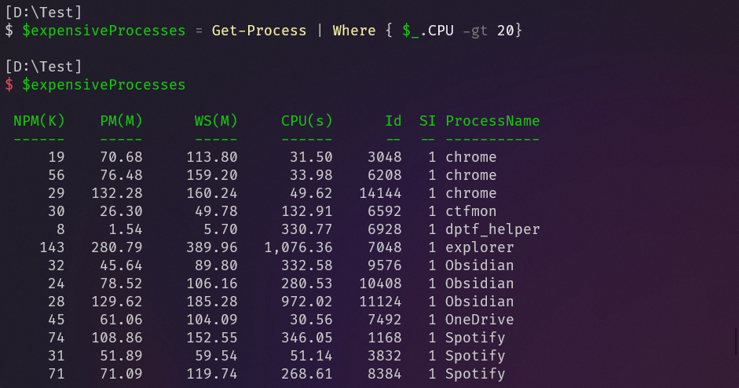

如果我只是简单地写出变量名，不用它做任何其他事情，它会获取其中的所有对象，并且由于我们没有操作这些对象，PowerShell 将它们输出在终端中。

在上述案例中，我们要做的第一件事是获取变量中的内容，并将其 CPU 时间过滤出来，算出平均值。因此，首先获取变量中的内容，然后将其中的数据通过管道传输到 `ForEach` 中，然后从中计算出平均值。

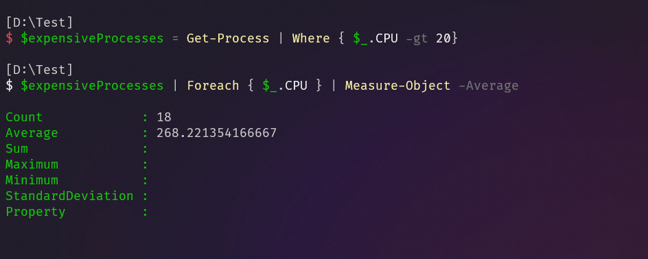

这就是变量的使用方式。这还解释了我们在第 1 集中没有详述的一个问题：使用 `ForEach` 时，`$_` 是什么意思？答案很简单，`$_` 是一个特殊的变量，它会被 `ForEach` 根据管道中的对象，自动替换。它只是一个变量，每有一个对象，就会被 `ForEach` 更换。

::: note note
`$_` 还有一种写法：`$PSItem`
:::


在 `ForEach` 中，我们在这个被换出的变量后面加上一个点，还记得在第 1 集中我们说，这个点意味着我们将访问对象内部的某个东西。那么假设变量 `person` 中含有一个对象，它包含三个属性：`Name`、`Birthday` 和 `Organisation`。

现在，如果想单独获取这个人的名字，可以先写 `$person`，然后写 . Name，也就是将人放进这个变量，仅从变量获取人名：


另外，设置/更改变量非常简单，方法是写一个等号，接着写需要存入其中的值，比如说 `Mike` ：

```powershell
$person.Name = "Mike"
```


## CSV 文件

我们从一个假想的场景开始讲起，现在有一个 `csv` 文件，其中是学校里面 100 名学生的名单，和它们的（假的）数学、英语成绩：

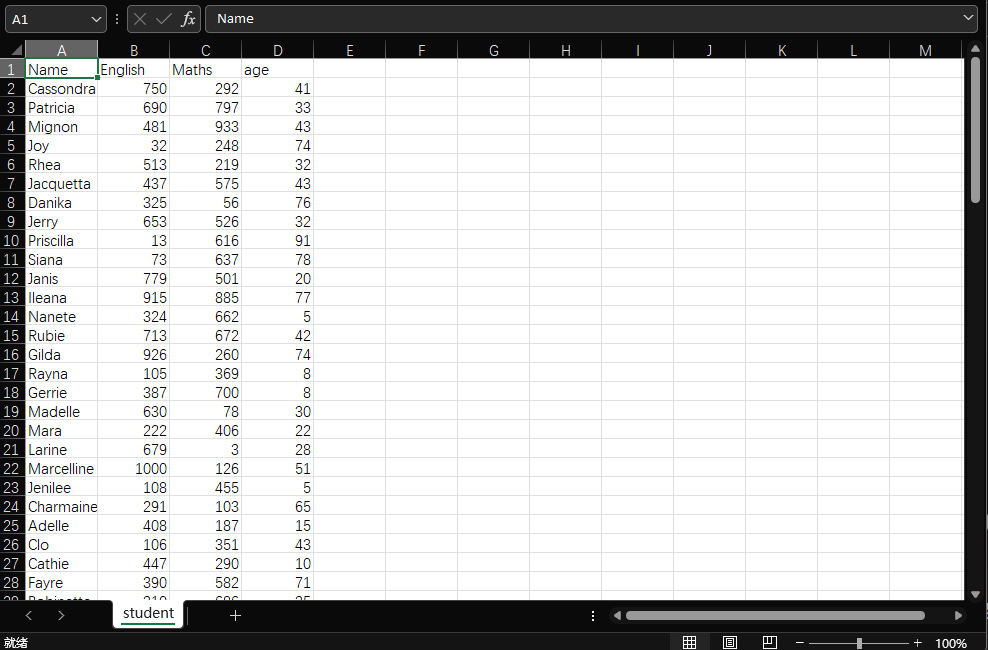

> 本文 [CSV 文件地址](https://raw.githubusercontent.com/wendoufu/surl/main/powershell-ep3-students.csv)

我们需要：从文件中求出学生们英文和数学的平均成绩，用 PowerShell 完成这个任务很容易，下面演示具体步骤。

首先要介绍 PowerShell 中一个非常有用的命令：`Import-Csv`，其作用是接收一个 CSV 文件，将其中的所有数据转换为对象。也就是说，我们会获得 100 个对象，每个对象都有 `Name`、`Age`、`Maths` 以及 `English` 属性。执行一个命令后加载所有数据。对于其他格式，PowerShell 中也有 XML 和 JSON 的等效命令。

我们来为 `Import-Csv` 运行 `Get-Help`，稍微了解一下它的用法，看这一行，很简单，我们只需要提供一个东西：文件路径：

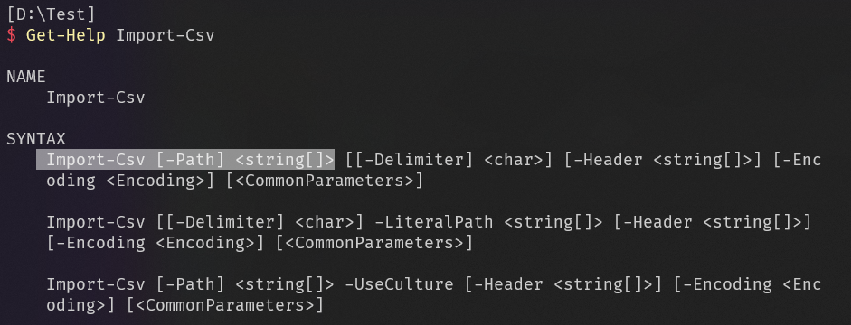

来试试看，运行 `Import-Csv`，将 `Path` 设置为 CSV 文件的路径，之后再将把命令的输出放进一个叫为 `students` 的变量中，这样才能轻松地操作这些对象，运行试试


## 类型转换 Cast

有了这个变量，现在可以求平均值了，但是，还有一件事要做。

CSV 文件有一个根本性缺陷，它们无法区分数值是文本还是数字。也就是说，读取 CSV 文件时，CSV 没有办法知道是把属性当作文本，还是当作其他类型。对于计算机来说，数字 `12` 和文字 `12` 是有区别的，前者是数字，可以进行数学运算，后者只是只是字母或符号，CSV 无法区分文本和其他类型，这意味着任何读取 CSV 的内容的应用，会将所有属性视为文本。对于其他格式，比如 XML 和 JSON，这不是个问题，因为它们实际上有办法区分属性的类型，但 CSV 格式没有办法，所以每个属性都会被当成字面意义上的符号，视为文本。PowerShell 也不例外，在这里看到的所有属性，它们的值实际上都是文本类型：

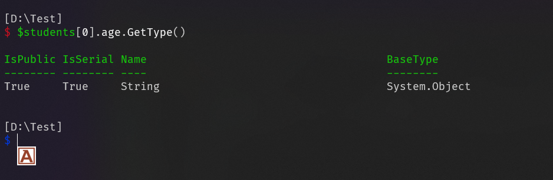

::: note comment
不愧是基于CLR的，和C#没什么区别
:::


大多数时候，这种情况对我们来说不构成麻烦。但是，现在我们要进行一些数学运算，求出平均值，就必须要把值转换为数字类型。

在 PowerShell 中将文本转换为数字很简单，假设有一个名为 `t` 的变量，我将文本 123 放入其中，请注意引号意味着放入的是文本：

```powershell
$t = "123"
```

要是想把变量中的内容变成一个数字，很简单，我们像获取变量一样写出变量名，在变量之前输入 `[int]`：

```powershell
[int]$t
```

`int` 是 integer 的缩写，意思是 `整数`，这种方法会输出一个数字类型。我们是在获取变量中的内容后，将其变成，或者说，` 转换 ` 成数字。那么，按 ENTER，就会看到转换过数字。

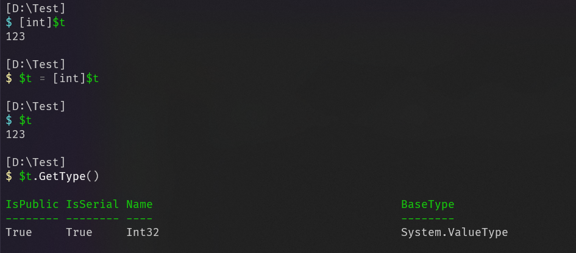

那么，下面对获取的学生列表执行这一操作。我们要把 `Maths` 和 `English` 转换为数字，实现起来很简单。输入 `学生` 变量，将它的每一行中的 `数学` 改成转换为整数的 `数学`，每有一个学生，我们将其 ` 数学` 属性转换为数字，再把转换后的放回去，英语属性也是同样的道理：


好了，它们现在都变成数字了。现在，要求得数学平均成绩，像之前一样，用 `ForEach` 将其过滤到仅剩 `数学` 属性，再用 `Measure -Average` 来得到平均值，执行命令后，便得到了平均成绩：

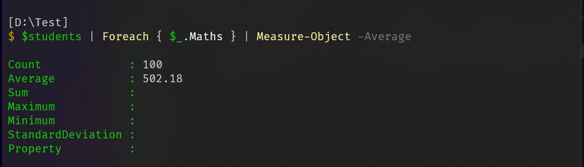

## NoteProperty

每个对象都是由属性组成的，我说过除属性之外，没有别的了，这种说法不太准确。属性并非对象中的唯一内容，对象里还有其他成分。

这些东西中的大部分都……无足轻重。其实，对象的大部分组成部分都很直白，能顾名思义。比如 `ScriptProperty`，它会在你获取或者修改属性时，运行一个小脚本，也就是说，它还是一个属性，只是为了更加方便而设计。还有很多顾名思义的东西，我就不费口舌了。但 NoteProperty 这个属性确实需要展开诠释。

属性有一个很重要的特点：假设我们有一个代表进程的对象，它有三个属性。那么，这三个属性是无法更改的。


它们实际上存储在 .NET 代码中，进一步说，你能获取的各种不同类型的对象，` 进程 `对象也好，` 文件 `对象也罢，你看到的所有` 属性 `都是从 .NET 的代码中生成的。它们甚至在我们启动 PowerShell 之前就已经存在了，这同时意味着，我们无法更改他们。那些属性已经在代码中预先定义好了，因而，它们永远保持不变，无法删除也无法添加。

但是，**NoteProperty 是一种特殊的属性**。我们可以随时向任何对象添加 `NoteProperty`。`NoteProperty` **能让我们将任何额外信息附加到某些东西上**，所以可以被用来做很多事情。

还记得 `Import-Csv` 输出的的对象吗？这些对象上的所有属性实际上都是 `NoteProperties` ：

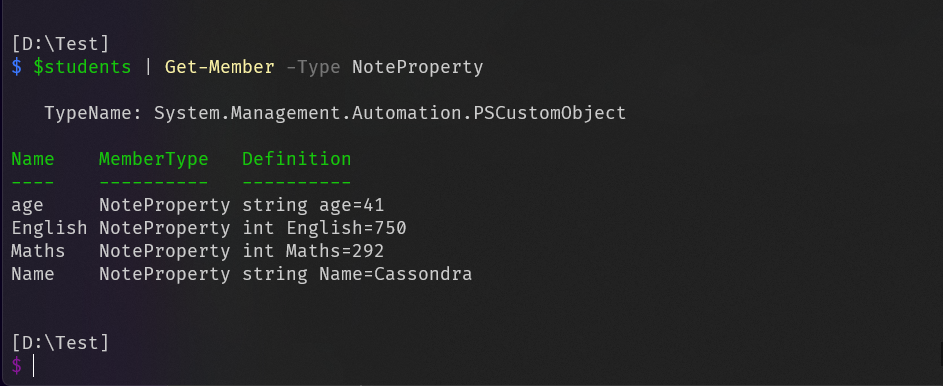

因为 `Import-Csv` 不能在它读取 CSV 文件之前就知道需要什么属性，这显然是在 PowerShell 运行时才发生的，也就是说，它输出的所有对象的每个属性都是 NoteProperty。

我们可以把 NoteProperty 用于我们新任务。

::: note comment
和C#的扩展方法思路很像
:::


## Add-Member

我们已经求得出了分数的平均值，但现在，我们要实际修改 CSV 文件：我们先添加一个全新的 `Sum` 列，其包含每个学生的英语和数学成绩的 `总和`。做到这一点非常简单，像之前那样，我们要先加载 CSV 文件，然后我们要从该文件中获取所有对象，并将我们自己的 `Sum` 属性添加到每个对象中。之后，每个对象都有一个 `Sum` 属性了。再然后，就要填写所有这些 `Sum` 属性。最后，用名为 `Export-Csv` 的命令，将对象及其所有属性保存回 CSV 中。

那么，我们来试试。

首先，要搞清楚该怎么去给对象添加属性，比如说，在这个 $file 变量中，有一个非常简单的文件对象，是通过运行 `ls`，再用 `Where` 将其过滤到仅此一个文件得到的：

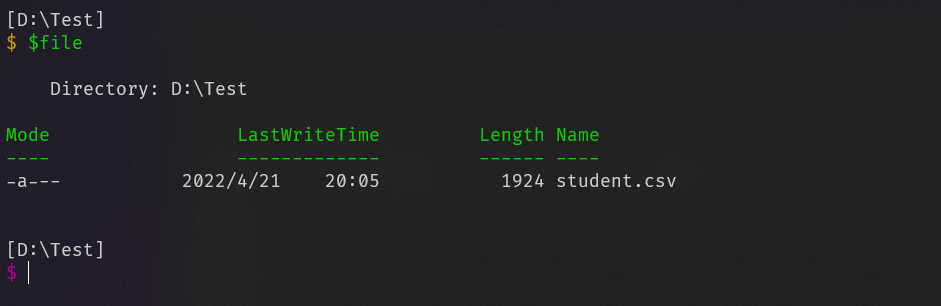

现在，我要把自己的属性添加到此对象中，我要把这个属性叫做 `Importance`，用来标识文件的重要性。那么，这就要使用本节要学习的最后一个命令，`**Add-Member**`**，它允许用户向对象添加一个小部分**。

首先，我们需要准确地告诉它想要给什么对象添加属性，`InputObject` 参数值就是 `file`，因为我想将属性添加到这个文件中：

```powershell
Add-Member -InputObject $file 
```
``
之后，我们要准确地告诉它我要添加什么样的成员：`MemberType`，在此例中，我们希望它是一个 `NoteProperty` ：

```powershell
Add-Member -InputObject $file -MemberType NoteProperty
```

现在我们要输入名称，我想称之为 `Importance`，你会注意到，由于 `Name` 是文本，我把它放在引号中，再说一次，从技术上讲，我可以不用引号，因为如果只有一个单词，PowerShell 确实可以让你使用不带引号的文本，但严格的说，这是不符合规范的：

```powershell
Add-Member -InputObject $file -MemberType NoteProperty -Name "Importance"
```

最后，我们要告诉它我们希望设定属性的初始值，使用 `Value`，就数字 `0` 吧：

```powershell
Add-Member -InputObject $file -MemberType NoteProperty -Name "Importance" -Value 0
```

但是，PowerShell 认为我们的属性不够重要，所以不把它显示在表格视图中：
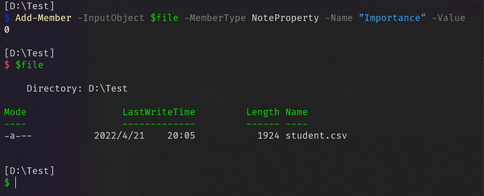

不过也没关系，专门告诉 `Format-Table` 我们希望它也向展示这个属性即可，方案是使用 `Property` 参数，告诉表格我们希望它向我们显示哪些属性。假设我们想看到 `Name`、`Length`，和我们添加的 `Importance`，就像这样：


当然，在这个案例中，我们确实需要稍微调整一下 `Format-Table` 来向我们显示它，因为命令认为该属性不值得展示，但无论如何我们成功了，能看到这个属性的值是 0。

该如何修改这个值呢：方法也很简单，获取我们的文件变量，进入其中更深一层的 `Importance` 属性，将其设置为 `5`，完成：

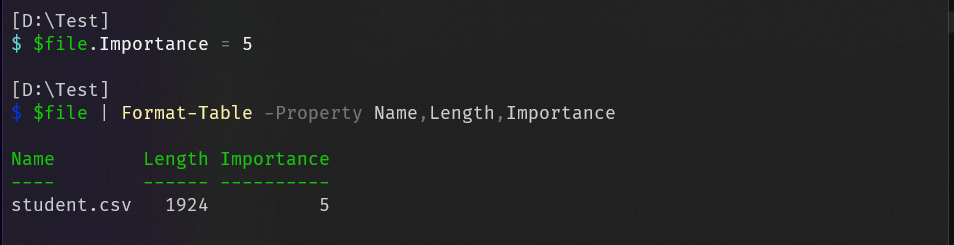

好的，来总结一下，不像常规的预设的属性，NoteProperties 可以自行添加，添加的方式是使用 `Add-Member`。输入对象；告诉它我们想要一个 `NoteProperty`，然后告诉它该属性的名称以及放入其中的内容，最后，一旦我们属性添加完成，我们就可以通过变量、一个点和属性值来修改它。

现在，让我们把所有知识都应用到实例。

## 实例

我想要做的是为每一个 CSV 文件中的对象添加 `Sum` 属性，以此来保存存数学和英语的总和。

为此，需要使用 `ForEach`。我们先获取所有对象，然后在 `ForEach` 中运行 `Add-Member` 为每个对象添加 `Sum` 属性。InputObject 将是 ` $_ `，我们希望每次都将属性添加到我们当前所在的对象中。当然，这里还需要 ` NoteProperty`，而不是其他的能读取的属性。Name 为 「Sum」。

```powershell
$students | ForEach { Add-Member -InputObject $_ -MemberType NoteProperty -Name "Sum"}
```

`Sum`，之后是 `Sum` 属性的值。此时有两种思路：你可以把它们全部设为 0，然后执行第二个 `ForEach`，遍历每个对象再将属性设置为正确的值。不过，这样做意义不大，因为它们就在这里，我们可以直接赋值，做法如下：

我们希望其属性值为：当前对象的 ` 数学` 加上当前对象的 ` 英语`，对吧？那么我们如何将两个数字相加呢？退一步讲，假设有一个名为 `singleStudent` 的变量，其中只包含一个学生，该怎么把 `数学` 和 `英语` 分数加在一起？


很简单，首先要获取 `Maths` 的值，因而我们要获取变量，并访问其中的 `Maths`；然后我们要把它和 `English` 相加，所以我们在变量中获取 English 属性。它们加在一起后，因为我们没有把结果存储到任何地方，PowerShell 直接将它们显示了出来：


因为想把我们当前对象的数学添加到当前对象的英语中，我们需要对 ForEach 中的 $_ 做同样的事情：

```powershell
$students | ForEach { Add-Member -InputObject $_ -MemberType NoteProperty -Name "Sum" -Value $_.Maths + $_.English}
```

不过，有一个小问题：当 PowerShell 看到这个表达时，它实际上看到的是 `运行 Add-Member`，然后获取其输出并将其和 `English` 相加，那……没有任何意义。因此，我们需要明确表示让它一次性完成相加这个指令，把它放进括号就可以了：

```powershell
$students | ForEach { Add-Member -InputObject $_ -MemberType NoteProperty -Name "Sum" -Value ($_.Maths + $_.English)}
```

这些括号基本功能是让 PowerShell `先做这件事 `，然后再使用这个表达式的结果。运行命令后，如果我们查看变量中的内容，是我们预期的结果：

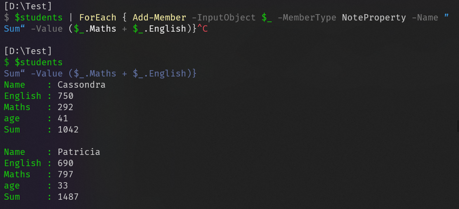

所有的 ` 总和 ` 都已填写完毕。如果想把它保存为 CSV 文件，就将其通过管道传输到 `Export-Csv` 中，提供一个文件名，就像这样：

```powershell
$students | ForEach { Add-Member -InputObject $_ -MemberType NoteProperty -Name "Sum" -Value ($_.Maths + $_.English)} | Export-Csv sum.csv
```


## 参考

##### 引文

- [PowerShell 教程 №3：变量、CSV 文件处理和 NoteProperty - 少数派](https://sspai.com/post/72820)

##### 脚注
