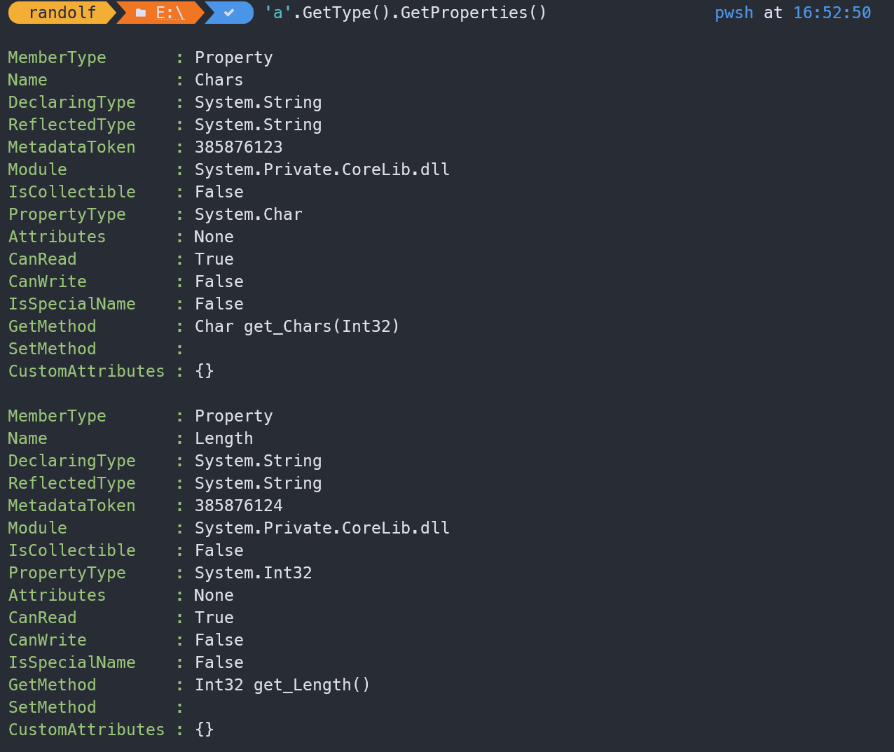

# 04-powershell- 类和方法


> [PowerShell 教程 №4：类和方法 - 少数派](https://sspai.com/post/72845)

::: note note
由于[02-powershell-命令和参数](./02-powershell-命令和参数.md)中提到了其基于. Net和CLR，这里的类其实就是C#中的类
:::


可以通过 `GetType()` 获取类名，`GetPropertise()` 获取属性，`Get-Member` 获取对象的方法



更详细的内容可以参考 [Everything you wanted to know about arrays - PowerShell | Microsoft Docs](https://docs.microsoft.com/en-us/powershell/scripting/learn/deep-dives/everything-about-arrays?view=powershell-7.2)

这一段使用正则的很巧妙：

```powershell
PS> $data = @('red','green','blue')
PS> 'green' -in $data
True
```

```powershell
PS> $data = @('red','green','blue')
PS> $pattern = "^({0})$" -f ($data -join '|')
PS> $pattern
^(red|green|blue)$

PS> 'green' -match $pattern
True
```

## 参考

##### 引文

- [PowerShell 教程 №4：类和方法 - 少数派](https://sspai.com/post/72845)
- [Everything you wanted to know about arrays - PowerShell | Microsoft Docs](https://docs.microsoft.com/en-us/powershell/scripting/learn/deep-dives/everything-about-arrays?view=powershell-7.2)

##### 脚注
