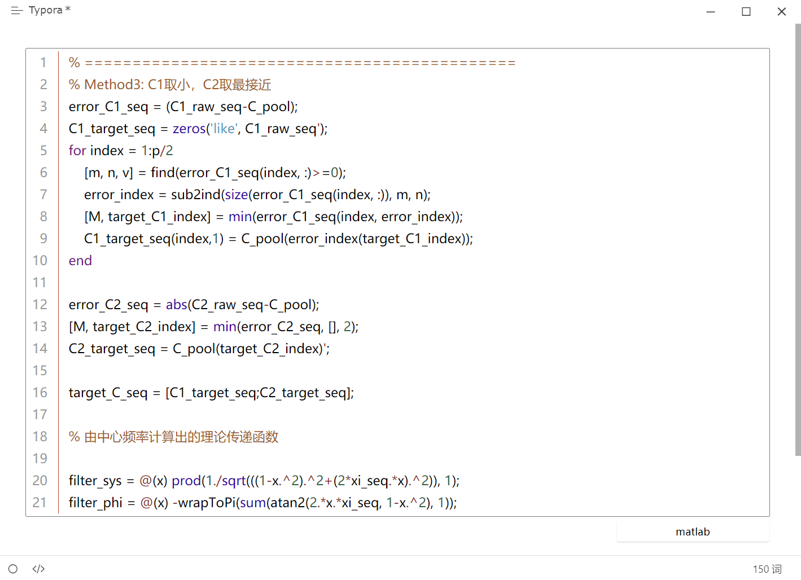
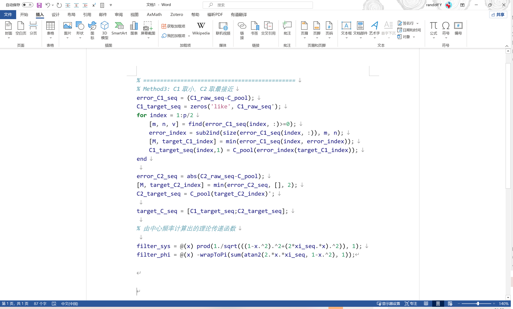

# word插入代码块

# Word 插入代码块

## 定义

有时写代码，需要在 word 中插入写好的代码，这里提供一个简单的方法。

### Typora 中插入代码块

在 typora 中使用代码块功能插入代码块，如下图：

这里插入了 matlab 代码。

在完成插入后，将文件导出为 word 格式，比如文件名为 `test.docx`

### Word 中插入代码块

打开 word，进入插入 ->对象 ->文本中的文字

从而打开对应的导出 word 文件，插入为：

效果还是挺不错的。

## 参考

- None
