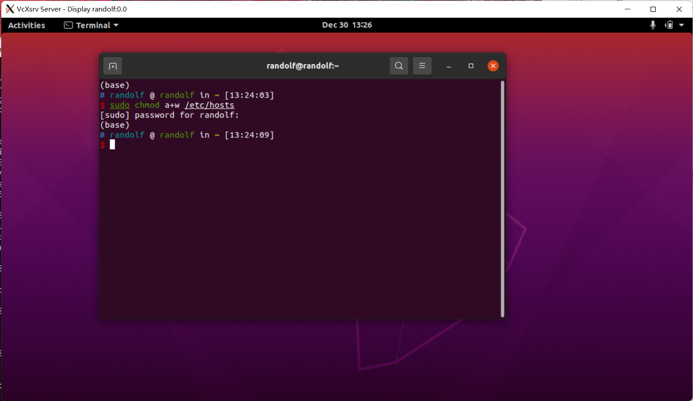

# wsl 基本配置

# Wsl 基本配置


## 定义

### ZSH

```shell
sh -c "$(curl -fsSL https://gitee.com/shmhlsy/oh-my-zsh-install.sh/raw/master/install.sh)"
```

```shell
git clone https://github.com/zsh-users/zsh-autosuggestions ${ZSH_CUSTOM:-~/.oh-my-zsh/custom}/plugins/zsh-autosuggestions
```

```shell
git clone https://github.com/zsh-users/zsh-syntax-highlighting.git ${ZSH_CUSTOM:-~/.oh-my-zsh/custom}/plugins/zsh-syntax-highlighting
```

```shell
plugins=(其他插件名 autojump zsh-autosuggestions zsh-syntax-highlighting)
```

### Gnome 界面

[My WSL2 Ubuntu 20.04 Environment · GitHub](https://gist.github.com/SlvrEagle23/ce9e28adcec55504f3ed7d1fdc8ef573)

- 使用 Xlaunch(Vrscv) 即可
	- [VcXsrv Windows X Server download | SourceForge.net](https://sourceforge.net/projects/vcxsrv/)
- 下载 Genie 可以参考
	- [wsl-transdebian | A repository for WSL-only apt packages.](https://arkane-systems.github.io/wsl-transdebian/)
	- [GitHub - arkane-systems/genie: A quick way into a systemd "bottle" for WSL](https://github.com/arkane-systems/genie#debian)

最终效果


## 参考

- [(17 条消息) [Ubuntu\] 关于ohmyzsh下载被443拒绝连接_Stephen Ling-CSDN博客](https://blog.csdn.net/qq_35104586/article/details/103604964)
